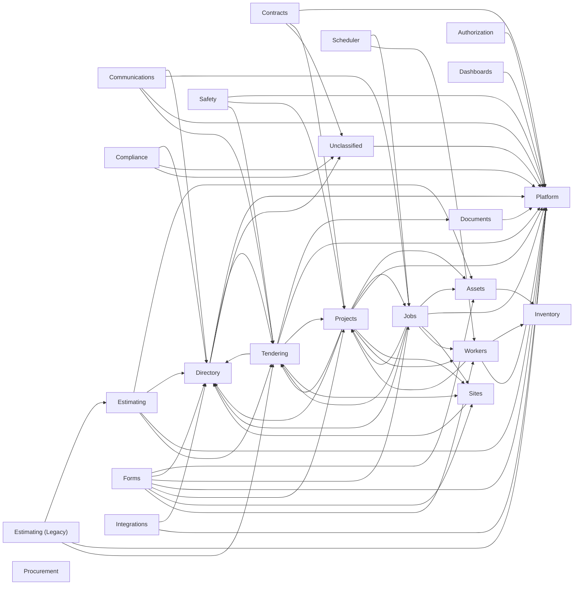

# ProjectOperations - Data Model Relationship Map

> SOURCE OF TRUTH. Auto-generated - do not hand-edit this file.
> Regenerate with `node scripts/data-model/build-relationship-map.mjs`.
> Business meaning (domains, field roles) is curated in `metadata-catalog.json`.

- Last updated: 2026-07-13 23:44 UTC
- Generated from: `apps/api/prisma/schema.prisma` (sha256 `dd365e9f105f`)
- Models: 193 | Enums: 23 | FK edges: 288 | Domains: 23

## Table of Contents

1. [How to read this document](#how-to-read-this-document)
2. [Domain dependency overview](#domain-dependency-overview)
3. [Domain index](#domain-index)
    1. [Assets (7)](#domain-assets)
    2. [Authorization (2)](#domain-authorization)
    3. [Communications (6)](#domain-communications)
    4. [Compliance (4)](#domain-compliance)
    5. [Contracts (7)](#domain-contracts)
    6. [Dashboards (3)](#domain-dashboards)
    7. [Directory (8)](#domain-directory)
    8. [Documents (5)](#domain-documents)
    9. [Estimating (15)](#domain-estimating)
    10. [Estimating (Legacy) (18)](#domain-estimating-legacy)
    11. [Forms (13)](#domain-forms)
    12. [Integrations (5)](#domain-integrations)
    13. [Inventory (6)](#domain-inventory)
    14. [Jobs (17)](#domain-jobs)
    15. [Platform (23)](#domain-platform)
    16. [Procurement (4)](#domain-procurement)
    17. [Projects (8)](#domain-projects)
    18. [Safety (4)](#domain-safety)
    19. [Scheduler (2)](#domain-scheduler)
    20. [Sites (1)](#domain-sites)
    21. [Tendering (21)](#domain-tendering)
    22. [Unclassified (2)](#domain-unclassified)
    23. [Workers (12)](#domain-workers)
4. [Enums](#enums)
5. [Full model index (A-Z)](#full-model-index-a-z)

### Model quick-jump

[ApprovalDecision](#model-approvaldecision) | [Asset](#model-asset) | [AssetBreakdown](#model-assetbreakdown) | [AssetCategory](#model-assetcategory) | [AssetInspection](#model-assetinspection) | [AssetMaintenanceEvent](#model-assetmaintenanceevent) | [AssetMaintenancePlan](#model-assetmaintenanceplan) | [AssetStatusHistory](#model-assetstatushistory) | [AuditLog](#model-auditlog) | [AuthorityRule](#model-authorityrule) | [AvailabilityWindow](#model-availabilitywindow) | [CalendarSyncedEvent](#model-calendarsyncedevent) | [ClaimLineItem](#model-claimlineitem) | [ClaimNumberSequence](#model-claimnumbersequence) | [Client](#model-client) | [ClientPortalUser](#model-clientportaluser) | [ClientQuote](#model-clientquote) | [ClientSession](#model-clientsession) | [CompanyLegalDocument](#model-companylegaldocument) | [CompanyProfile](#model-companyprofile) | [Competency](#model-competency) | [CompetencyOverride](#model-competencyoverride) | [ComplianceAlert](#model-compliancealert) | [Contact](#model-contact) | [Contract](#model-contract) | [ContractNumberSequence](#model-contractnumbersequence) | [Conversation](#model-conversation) | [ConversationMessage](#model-conversationmessage) | [CorrespondenceMessage](#model-correspondencemessage) | [CorrespondenceThread](#model-correspondencethread) | [CreditApplication](#model-creditapplication) | [Crew](#model-crew) | [CrewWorker](#model-crewworker) | [CuttingOtherRate](#model-cuttingotherrate) | [CuttingSheetItem](#model-cuttingsheetitem) | [Dashboard](#model-dashboard) | [DashboardWidget](#model-dashboardwidget) | [DocumentAccessRule](#model-documentaccessrule) | [DocumentLink](#model-documentlink) | [DocumentTag](#model-documenttag) | [EmailProviderConfig](#model-emailproviderconfig) | [EntityInsurance](#model-entityinsurance) | [EntityLicence](#model-entitylicence) | [EstimateAssumption](#model-estimateassumption) | [EstimateCoreHoleRate](#model-estimatecoreholerate) | [EstimateCuttingLine](#model-estimatecuttingline) | [EstimateCuttingRate](#model-estimatecuttingrate) | [EstimateEnclosureRate](#model-estimateenclosurerate) | [EstimateEquipLine](#model-estimateequipline) | [EstimateExport](#model-estimateexport) | [EstimateFuelRate](#model-estimatefuelrate) | [EstimateItem](#model-estimateitem) | [EstimateLabourLine](#model-estimatelabourline) | [EstimateLabourRate](#model-estimatelabourrate) | [EstimateMaterialDensity](#model-estimatematerialdensity) | [EstimatePlantLine](#model-estimateplantline) | [EstimatePlantRate](#model-estimateplantrate) | [EstimateWasteLine](#model-estimatewasteline) | [EstimateWasteRate](#model-estimatewasterate) | [FormApproval](#model-formapproval) | [FormAttachment](#model-formattachment) | [FormField](#model-formfield) | [FormRule](#model-formrule) | [FormSchedule](#model-formschedule) | [FormSection](#model-formsection) | [FormSignature](#model-formsignature) | [FormSubmission](#model-formsubmission) | [FormSubmissionValue](#model-formsubmissionvalue) | [FormTemplate](#model-formtemplate) | [FormTemplateVersion](#model-formtemplateversion) | [FormTriggeredRecord](#model-formtriggeredrecord) | [GanttTask](#model-gantttask) | [GlobalAISettings](#model-globalaisettings) | [GlobalList](#model-globallist) | [GlobalListItem](#model-globallistitem) | [HazardNumberSequence](#model-hazardnumbersequence) | [HazardObservation](#model-hazardobservation) | [HealthcheckSeedMarker](#model-healthcheckseedmarker) | [InternalMessage](#model-internalmessage) | [Job](#model-job) | [JobActivity](#model-jobactivity) | [JobCloseout](#model-jobcloseout) | [JobConversion](#model-jobconversion) | [JobIssue](#model-jobissue) | [JobNumberSequence](#model-jobnumbersequence) | [JobProgressEntry](#model-jobprogressentry) | [JobRole](#model-jobrole) | [JobRoleRequirement](#model-jobrolerequirement) | [JobStage](#model-jobstage) | [JobStatusHistory](#model-jobstatushistory) | [JobVariation](#model-jobvariation) | [ListBinding](#model-listbinding) | [LookupValue](#model-lookupvalue) | [Notification](#model-notification) | [NotificationTriggerConfig](#model-notificationtriggerconfig) | [Permission](#model-permission) | [PermissionModule](#model-permissionmodule) | [Persona](#model-persona) | [PersonaCompanyInstruction](#model-personacompanyinstruction) | [PilotFeedback](#model-pilotfeedback) | [PlatformConfig](#model-platformconfig) | [PortalInvite](#model-portalinvite) | [PortalSession](#model-portalsession) | [PreStartChecklist](#model-prestartchecklist) | [ProcurementConfig](#model-procurementconfig) | [ProcurementLine](#model-procurementline) | [ProcurementRequest](#model-procurementrequest) | [ProgressClaim](#model-progressclaim) | [Project](#model-project) | [ProjectActivityLog](#model-projectactivitylog) | [ProjectAllocation](#model-projectallocation) | [ProjectMilestone](#model-projectmilestone) | [ProjectNumberSequence](#model-projectnumbersequence) | [ProjectScopeItem](#model-projectscopeitem) | [PublicHoliday](#model-publicholiday) | [PurchaseOrder](#model-purchaseorder) | [QuoteAssumption](#model-quoteassumption) | [QuoteCostLine](#model-quotecostline) | [QuoteCostOption](#model-quotecostoption) | [QuoteEmail](#model-quoteemail) | [QuoteExclusion](#model-quoteexclusion) | [QuoteProvisionalLine](#model-quoteprovisionalline) | [QuoteScopeItem](#model-quotescopeitem) | [RateColumn](#model-ratecolumn) | [RateRow](#model-raterow) | [RateTable](#model-ratetable) | [RefreshToken](#model-refreshtoken) | [ResourceType](#model-resourcetype) | [Role](#model-role) | [RolePermission](#model-rolepermission) | [SafetyIncident](#model-safetyincident) | [SafetyIncidentNumberSequence](#model-safetyincidentnumbersequence) | [ScheduleAllocation](#model-scheduleallocation) | [SchedulingConflict](#model-schedulingconflict) | [ScopeCard](#model-scopecard) | [ScopeOfWorksHeader](#model-scopeofworksheader) | [ScopeOfWorksItem](#model-scopeofworksitem) | [ScopeViewConfig](#model-scopeviewconfig) | [ScopeWasteItem](#model-scopewasteitem) | [SearchEntry](#model-searchentry) | [SharePointFileLink](#model-sharepointfilelink) | [SharePointFolderLink](#model-sharepointfolderlink) | [Shift](#model-shift) | [ShiftAssetAssignment](#model-shiftassetassignment) | [ShiftRoleRequirement](#model-shiftrolerequirement) | [ShiftWorkerAssignment](#model-shiftworkerassignment) | [Site](#model-site) | [StockCategory](#model-stockcategory) | [StockItem](#model-stockitem) | [StockMovement](#model-stockmovement) | [StocktakeCount](#model-stocktakecount) | [StocktakeSession](#model-stocktakesession) | [SubcontractorDocument](#model-subcontractordocument) | [SubcontractorSupplier](#model-subcontractorsupplier) | [SupplierCreditEntry](#model-suppliercreditentry) | [Tender](#model-tender) | [TenderAssumption](#model-tenderassumption) | [TenderClarification](#model-tenderclarification) | [TenderClarificationNote](#model-tenderclarificationnote) | [TenderClient](#model-tenderclient) | [TenderClientNote](#model-tenderclientnote) | [TenderClientPackage](#model-tenderclientpackage) | [TenderDocumentLink](#model-tenderdocumentlink) | [TenderEntry](#model-tenderentry) | [TenderEstimate](#model-tenderestimate) | [TenderExclusion](#model-tenderexclusion) | [TenderFilterPreset](#model-tenderfilterpreset) | [TenderFollowUp](#model-tenderfollowup) | [TenderNote](#model-tendernote) | [TenderOutcome](#model-tenderoutcome) | [TenderPackage](#model-tenderpackage) | [TenderPricingSnapshot](#model-tenderpricingsnapshot) | [TenderRateEntry](#model-tenderrateentry) | [TenderRateSet](#model-tenderrateset) | [TenderScopeRevision](#model-tenderscoperevision) | [TenderTandC](#model-tendertandc) | [Timesheet](#model-timesheet) | [User](#model-user) | [UserDashboard](#model-userdashboard) | [UserPersonaSettings](#model-userpersonasettings) | [UserRole](#model-userrole) | [Variation](#model-variation) | [VariationNumberSequence](#model-variationnumbersequence) | [Worker](#model-worker) | [WorkerCompetency](#model-workercompetency) | [WorkerLeave](#model-workerleave) | [WorkerLocationLog](#model-workerlocationlog) | [WorkerProfile](#model-workerprofile) | [WorkerQualification](#model-workerqualification) | [WorkerRoleSuitability](#model-workerrolesuitability) | [WorkerUnavailability](#model-workerunavailability) | [XeroConnection](#model-xeroconnection) | [XeroSyncLog](#model-xerosynclog)

## How to read this document

Each model lists: its DB table, the domain it belongs to, the records it
**belongs to** (outgoing foreign keys - "this row points at one X"), and what
**references it** (incoming foreign keys - "these rows point back at me").
Field roles (measure / dimension / filter / time) are suggestions consumed by
the Smart Wizard; the authoritative, human-reviewed roles live in
`metadata-catalog.json`.

## Domain dependency overview

How the domains reference each other (arrow = "holds a foreign key into").

## Domain index

- **Assets** (7): Asset, AssetBreakdown, AssetCategory, AssetInspection, AssetMaintenanceEvent, AssetMaintenancePlan, AssetStatusHistory
- **Authorization** (2): ApprovalDecision, AuthorityRule
- **Communications** (6): Conversation, ConversationMessage, CorrespondenceMessage, CorrespondenceThread, EmailProviderConfig, InternalMessage
- **Compliance** (4): ComplianceAlert, CreditApplication, EntityInsurance, EntityLicence
- **Contracts** (7): ClaimLineItem, ClaimNumberSequence, Contract, ContractNumberSequence, ProgressClaim, Variation, VariationNumberSequence
- **Dashboards** (3): Dashboard, DashboardWidget, UserDashboard
- **Directory** (8): Client, ClientPortalUser, ClientQuote, ClientSession, Contact, SubcontractorDocument, SubcontractorSupplier, SupplierCreditEntry
- **Documents** (5): DocumentAccessRule, DocumentLink, DocumentTag, SharePointFileLink, SharePointFolderLink
- **Estimating** (15): QuoteAssumption, QuoteCostLine, QuoteCostOption, QuoteEmail, QuoteExclusion, QuoteProvisionalLine, QuoteScopeItem, RateColumn, RateRow, RateTable, ScopeCard, ScopeOfWorksHeader, ScopeOfWorksItem, ScopeViewConfig, ScopeWasteItem
- **Estimating (Legacy)** (18): CuttingOtherRate, CuttingSheetItem, EstimateAssumption, EstimateCoreHoleRate, EstimateCuttingLine, EstimateCuttingRate, EstimateEnclosureRate, EstimateEquipLine, EstimateExport, EstimateFuelRate, EstimateItem, EstimateLabourLine, EstimateLabourRate, EstimateMaterialDensity, EstimatePlantLine, EstimatePlantRate, EstimateWasteLine, EstimateWasteRate
- **Forms** (13): FormApproval, FormAttachment, FormField, FormRule, FormSchedule, FormSection, FormSignature, FormSubmission, FormSubmissionValue, FormTemplate, FormTemplateVersion, FormTriggeredRecord, PreStartChecklist
- **Integrations** (5): CalendarSyncedEvent, PortalInvite, PortalSession, XeroConnection, XeroSyncLog
- **Inventory** (6): ResourceType, StockCategory, StockItem, StockMovement, StocktakeCount, StocktakeSession
- **Jobs** (17): Job, JobActivity, JobCloseout, JobConversion, JobIssue, JobNumberSequence, JobProgressEntry, JobRole, JobRoleRequirement, JobStage, JobStatusHistory, JobVariation, Shift, ShiftAssetAssignment, ShiftRoleRequirement, ShiftWorkerAssignment, Timesheet
- **Platform** (23): AuditLog, GlobalAISettings, GlobalList, GlobalListItem, HealthcheckSeedMarker, ListBinding, LookupValue, Notification, NotificationTriggerConfig, Permission, PermissionModule, Persona, PersonaCompanyInstruction, PilotFeedback, PlatformConfig, PublicHoliday, RefreshToken, Role, RolePermission, SearchEntry, User, UserPersonaSettings, UserRole
- **Procurement** (4): ProcurementConfig, ProcurementLine, ProcurementRequest, PurchaseOrder
- **Projects** (8): GanttTask, Project, ProjectActivityLog, ProjectAllocation, ProjectMilestone, ProjectNumberSequence, ProjectScopeItem, ScheduleAllocation
- **Safety** (4): HazardNumberSequence, HazardObservation, SafetyIncident, SafetyIncidentNumberSequence
- **Scheduler** (2): AvailabilityWindow, SchedulingConflict
- **Sites** (1): Site
- **Tendering** (21): Tender, TenderAssumption, TenderClarification, TenderClarificationNote, TenderClient, TenderClientNote, TenderClientPackage, TenderDocumentLink, TenderEntry, TenderEstimate, TenderExclusion, TenderFilterPreset, TenderFollowUp, TenderNote, TenderOutcome, TenderPackage, TenderPricingSnapshot, TenderRateEntry, TenderRateSet, TenderScopeRevision, TenderTandC
- **Unclassified** (2): CompanyLegalDocument, CompanyProfile
- **Workers** (12): Competency, CompetencyOverride, Crew, CrewWorker, Worker, WorkerCompetency, WorkerLeave, WorkerLocationLog, WorkerProfile, WorkerQualification, WorkerRoleSuitability, WorkerUnavailability

## Domain: Assets

### Model: Asset

- Table: `assets` | Domain: Assets | Fields: 24
- Belongs to (FK out):
  - `category` -> **AssetCategory** (assetCategoryId, onDelete SetNull)
  - `resourceType` -> **ResourceType** (resourceTypeId, onDelete SetNull)
- Has many:
  - `shiftAssignments` -> **ShiftAssetAssignment**[]
  - `maintenancePlans` -> **AssetMaintenancePlan**[]
  - `maintenanceEvents` -> **AssetMaintenanceEvent**[]
  - `inspections` -> **AssetInspection**[]
  - `breakdowns` -> **AssetBreakdown**[]
  - `statusHistory` -> **AssetStatusHistory**[]
  - `formSubmissions` -> **FormSubmission**[]
  - `allocations` -> **ProjectAllocation**[]
  - `scheduleAllocations` -> **ScheduleAllocation**[]
  - `scopePlantRefs` -> **ScopeOfWorksItem**[]
- Referenced by: **AssetBreakdown**, **AssetInspection**, **AssetMaintenanceEvent**, **AssetMaintenancePlan**, **AssetStatusHistory**, **FormSubmission**, **ProjectAllocation**, **ScheduleAllocation**, **ScopeOfWorksItem**, **ShiftAssetAssignment**
- Suggested dimensions: assetCategoryId, resourceTypeId, status, category, resourceType

### Model: AssetBreakdown

- Table: `asset_breakdowns` | Domain: Assets | Fields: 11
- Belongs to (FK out):
  - `asset` -> **Asset** (assetId, onDelete Cascade)
- Suggested dimensions: status, asset
- Time fields: reportedAt, resolvedAt

### Model: AssetCategory

- Table: `asset_categories` | Domain: Assets | Fields: 8
- Has many:
  - `assets` -> **Asset**[]
- Referenced by: **Asset**

### Model: AssetInspection

- Table: `asset_inspections` | Domain: Assets | Fields: 9
- Belongs to (FK out):
  - `asset` -> **Asset** (assetId, onDelete Cascade)
- Suggested dimensions: inspectionType, status, asset
- Time fields: inspectedAt

### Model: AssetMaintenanceEvent

- Table: `asset_maintenance_events` | Domain: Assets | Fields: 12
- Belongs to (FK out):
  - `asset` -> **Asset** (assetId, onDelete Cascade)
  - `plan` -> **AssetMaintenancePlan** (maintenancePlanId, onDelete SetNull)
- Suggested dimensions: eventType, status, asset, plan
- Time fields: scheduledAt, completedAt

### Model: AssetMaintenancePlan

- Table: `asset_maintenance_plans` | Domain: Assets | Fields: 14
- Belongs to (FK out):
  - `asset` -> **Asset** (assetId, onDelete Cascade)
- Has many:
  - `events` -> **AssetMaintenanceEvent**[]
- Referenced by: **AssetMaintenanceEvent**
- Suggested measures: intervalDays, warningDays
- Suggested dimensions: status, asset
- Time fields: lastCompletedAt, nextDueAt

### Model: AssetStatusHistory

- Table: `asset_status_history` | Domain: Assets | Fields: 8
- Belongs to (FK out):
  - `asset` -> **Asset** (assetId, onDelete Cascade)
- Suggested dimensions: fromStatus, toStatus, asset
- Time fields: changedAt

## Domain: Authorization

### Model: ApprovalDecision

- Table: `approval_decisions` | Domain: Authorization | Fields: 14
- Belongs to (FK out):
  - `decidedBy` -> **User** (decidedById, onDelete Cascade)
  - `overrules` -> **ApprovalDecision** (overrulesId)
- Has one (back-relation):
  - `overruledBy` -> **ApprovalDecision**
- Referenced by: **ApprovalDecision**
- Suggested measures: amount
- Suggested dimensions: entityType, decision, decidedBy, overrules

### Model: AuthorityRule

- Table: `authority_rules` | Domain: Authorization | Fields: 11
- Suggested measures: limitAmount
- Suggested dimensions: scopeType, scopeId

## Domain: Communications

### Model: Conversation

- Table: `conversations` | Domain: Communications | Fields: 9
- Belongs to (FK out):
  - `user` -> **User** (userId, onDelete Cascade)
- Has many:
  - `messages` -> **ConversationMessage**[]
- Referenced by: **ConversationMessage**
- Suggested dimensions: user

### Model: ConversationMessage

- Table: `conversation_messages` | Domain: Communications | Fields: 10
- Belongs to (FK out):
  - `conversation` -> **Conversation** (conversationId, onDelete Cascade)
- Suggested dimensions: role, conversation

### Model: CorrespondenceMessage

- Table: `correspondence_messages` | Domain: Communications | Fields: 16
- Belongs to (FK out):
  - `thread` -> **CorrespondenceThread** (threadId, onDelete Cascade)
  - `sentBy` -> **User** (sentById, onDelete SetNull)
- Suggested dimensions: thread, sentBy
- Time fields: sentAt, receivedAt

### Model: CorrespondenceThread

- Table: `correspondence_threads` | Domain: Communications | Fields: 14
- Belongs to (FK out):
  - `client` -> **Client** (clientId, onDelete Cascade)
  - `tender` -> **Tender** (tenderId, onDelete Cascade)
  - `job` -> **Job** (jobId, onDelete Cascade)
- Has many:
  - `messages` -> **CorrespondenceMessage**[]
- Referenced by: **CorrespondenceMessage**
- Suggested dimensions: client, tender, job
- Time fields: lastMessageAt

### Model: EmailProviderConfig

- Table: `email_provider_config` | Domain: Communications | Fields: 8
- Belongs to (FK out):
  - `updatedBy` -> **User** (updatedById, onDelete SetNull)
- Suggested dimensions: updatedBy

### Model: InternalMessage

- Table: `internal_messages` | Domain: Communications | Fields: 12
- Belongs to (FK out):
  - `sender` -> **User** (senderId, onDelete Cascade)
  - `recipient` -> **User** (recipientId, onDelete Cascade)
- Suggested dimensions: entityType, status, sender, recipient
- Time fields: readAt

## Domain: Compliance

### Model: ComplianceAlert

- Table: `compliance_alerts` | Domain: Compliance | Fields: 9
- Belongs to (FK out):
  - `sentToUser` -> **User** (sentToUserId)
- Suggested dimensions: entityType, itemType, alertType, sentToUser
- Time fields: sentAt

### Model: CreditApplication

- Table: `credit_applications` | Domain: Compliance | Fields: 21
- Belongs to (FK out):
  - `reviewedBy` -> **User** (reviewedById)
  - `client` -> **Client** (clientId, onDelete Cascade)
  - `subcontractor` -> **SubcontractorSupplier** (subcontractorId, onDelete Cascade)
  - `createdBy` -> **User** (createdById)
- Suggested dimensions: status, reviewedBy, client, subcontractor, createdBy
- Time fields: applicationDate, approvedDate, rejectedDate

### Model: EntityInsurance

- Table: `entity_insurances` | Domain: Compliance | Fields: 17
- Belongs to (FK out):
  - `client` -> **Client** (clientId, onDelete Cascade)
  - `subcontractor` -> **SubcontractorSupplier** (subcontractorId, onDelete Cascade)
  - `companyProfile` -> **CompanyProfile** (companyProfileId, onDelete Cascade)
- Suggested measures: coverageAmount
- Suggested dimensions: insuranceType, status, client, subcontractor, companyProfile
- Time fields: expiryDate

### Model: EntityLicence

- Table: `entity_licences` | Domain: Compliance | Fields: 17
- Belongs to (FK out):
  - `client` -> **Client** (clientId, onDelete Cascade)
  - `subcontractor` -> **SubcontractorSupplier** (subcontractorId, onDelete Cascade)
  - `companyProfile` -> **CompanyProfile** (companyProfileId, onDelete Cascade)
- Suggested dimensions: licenceType, status, client, subcontractor, companyProfile
- Time fields: issueDate, expiryDate

## Domain: Contracts

### Model: ClaimLineItem

- Table: `claim_line_items` | Domain: Contracts | Fields: 12
- Belongs to (FK out):
  - `claim` -> **ProgressClaim** (claimId, onDelete Cascade)
  - `variation` -> **Variation** (variationId, onDelete SetNull)
- Suggested measures: contractValue, thisClaimPct, thisClaimAmount
- Suggested dimensions: claim, discipline, variation

### Model: ClaimNumberSequence

- Table: `claim_number_sequences` | Domain: Contracts | Fields: 2
- Suggested measures: lastNumber

### Model: Contract

- Table: `contracts` | Domain: Contracts | Fields: 19
- Belongs to (FK out):
  - `project` -> **Project** (projectId, onDelete Cascade)
  - `createdBy` -> **User** (createdById, onDelete Restrict)
  - `issuedTerms` -> **CompanyLegalDocument** (issuedTermsDocumentId, onDelete SetNull)
- Has many:
  - `variations` -> **Variation**[]
  - `progressClaims` -> **ProgressClaim**[]
- Referenced by: **ProgressClaim**, **Variation**
- Suggested measures: contractValue, retentionPct, retentionAmount
- Suggested dimensions: project, status, createdBy, issuedTerms
- Time fields: startDate, endDate

### Model: ContractNumberSequence

- Table: `contract_number_sequences` | Domain: Contracts | Fields: 2
- Suggested measures: lastNumber

### Model: ProgressClaim

- Table: `progress_claims` | Domain: Contracts | Fields: 18
- Belongs to (FK out):
  - `contract` -> **Contract** (contractId, onDelete Cascade)
  - `createdBy` -> **User** (createdById, onDelete Restrict)
- Has many:
  - `lineItems` -> **ClaimLineItem**[]
- Referenced by: **ClaimLineItem**
- Suggested measures: totalClaimed, totalApproved, totalPaid
- Suggested dimensions: contract, status, createdBy
- Time fields: claimMonth, submissionDate, paidDate

### Model: Variation

- Table: `variations` | Domain: Contracts | Fields: 19
- Belongs to (FK out):
  - `contract` -> **Contract** (contractId, onDelete Cascade)
  - `createdBy` -> **User** (createdById, onDelete Restrict)
- Has many:
  - `claimLineItems` -> **ClaimLineItem**[]
- Referenced by: **ClaimLineItem**
- Suggested measures: pricedAmount, approvedAmount
- Suggested dimensions: contract, status, createdBy
- Time fields: receivedDate, pricedDate, submittedDate, approvedDate

### Model: VariationNumberSequence

- Table: `variation_number_sequences` | Domain: Contracts | Fields: 2
- Suggested measures: lastNumber

## Domain: Dashboards

### Model: Dashboard

- Table: `dashboards` | Domain: Dashboards | Fields: 12
- Belongs to (FK out):
  - `ownerUser` -> **User** (ownerUserId, onDelete SetNull)
  - `ownerRole` -> **Role** (ownerRoleId, onDelete SetNull)
- Has many:
  - `widgets` -> **DashboardWidget**[]
- Referenced by: **DashboardWidget**
- Suggested dimensions: scope, ownerRoleId, ownerUser, ownerRole

### Model: DashboardWidget

- Table: `dashboard_widgets` | Domain: Dashboards | Fields: 12
- Belongs to (FK out):
  - `dashboard` -> **Dashboard** (dashboardId, onDelete Cascade)
- Suggested dimensions: type, dashboard

### Model: UserDashboard

- Table: `user_dashboards` | Domain: Dashboards | Fields: 10
- Belongs to (FK out):
  - `user` -> **User** (userId, onDelete Cascade)
- Suggested dimensions: user

## Domain: Directory

### Model: Client

- Table: `clients` | Domain: Directory | Fields: 66
- Belongs to (FK out):
  - `claimReminderUser` -> **User** (claimReminderUserId, onDelete SetNull)
- Has many:
  - `sites` -> **Site**[]
  - `tenderClients` -> **TenderClient**[]
  - `jobs` -> **Job**[]
  - `projects` -> **Project**[]
  - `formSubmissions` -> **FormSubmission**[]
  - `tenderClientNotes` -> **TenderClientNote**[]
  - `clientQuotes` -> **ClientQuote**[]
  - `licences` -> **EntityLicence**[]
  - `insurances` -> **EntityInsurance**[]
  - `creditApplications` -> **CreditApplication**[]
  - `portalUsers` -> **ClientPortalUser**[]
  - `portalInvites` -> **PortalInvite**[]
  - `clarificationNotes` -> **TenderClarificationNote**[]
  - `correspondences` -> **CorrespondenceThread**[]
- Referenced by: **ClientPortalUser**, **ClientQuote**, **CorrespondenceThread**, **CreditApplication**, **EntityInsurance**, **EntityLicence**, **FormSubmission**, **Job**, **PortalInvite**, **Project**, **Site**, **TenderClarificationNote**, **TenderClient**, **TenderClientNote**
- Suggested measures: paymentTermsDays, preferenceScore, winCount, tenderCount, winRate
- Suggested dimensions: status, businessType, paymentTermsType, physicalState, postalState, claimReminderUser
- Time fields: lastTenderAt, lastWonAt

### Model: ClientPortalUser

- Table: `client_portal_users` | Domain: Directory | Fields: 14
- Belongs to (FK out):
  - `client` -> **Client** (clientId, onDelete Cascade)
- Has many:
  - `sessions` -> **PortalSession**[]
- Referenced by: **PortalSession**
- Suggested dimensions: client
- Time fields: lastLoginAt

### Model: ClientQuote

- Table: `client_quotes` | Domain: Directory | Fields: 38
- Belongs to (FK out):
  - `tender` -> **Tender** (tenderId, onDelete Cascade)
  - `client` -> **Client** (clientId)
  - `sourceTenderEstimate` -> **TenderEstimate** (sourceTenderEstimateId, onDelete SetNull)
  - `sentBy` -> **User** (sentById)
  - `issuedTerms` -> **CompanyLegalDocument** (issuedTermsDocumentId, onDelete SetNull)
  - `createdBy` -> **User** (createdById)
- Has many:
  - `costLines` -> **QuoteCostLine**[]
  - `provisionalLines` -> **QuoteProvisionalLine**[]
  - `costOptions` -> **QuoteCostOption**[]
  - `assumptions` -> **QuoteAssumption**[]
  - `exclusions` -> **QuoteExclusion**[]
  - `emails` -> **QuoteEmail**[]
  - `scopeItems` -> **QuoteScopeItem**[]
- Referenced by: **QuoteAssumption**, **QuoteCostLine**, **QuoteCostOption**, **QuoteEmail**, **QuoteExclusion**, **QuoteProvisionalLine**, **QuoteScopeItem**
- Suggested measures: adjustmentPct
- Suggested dimensions: tender, client, sourceTenderEstimate, status, sentBy, issuedTerms, createdBy
- Time fields: sentAt

### Model: ClientSession

- Table: `client_sessions` | Domain: Directory | Fields: 7
- Belongs to (FK out):
  - `user` -> **User** (userId, onDelete Cascade)
- Suggested dimensions: user
- Time fields: firstSeenAt, lastSeenAt

### Model: Contact

- Table: `contacts` | Domain: Directory | Fields: 20
- Belongs to (FK out):
  - `createdBy` -> **User** (createdById, onDelete SetNull)
- Has many:
  - `tenderClients` -> **TenderClient**[]
- Referenced by: **TenderClient**
- Suggested dimensions: organisationType, role, createdBy

### Model: SubcontractorDocument

- Table: `subcontractor_documents` | Domain: Directory | Fields: 10
- Belongs to (FK out):
  - `subcontractor` -> **SubcontractorSupplier** (subcontractorId, onDelete Cascade)
  - `uploadedBy` -> **User** (uploadedById)
- Suggested dimensions: subcontractor, documentType, uploadedBy
- Time fields: uploadedAt

### Model: SubcontractorSupplier

- Table: `subcontractor_suppliers` | Domain: Directory | Fields: 59
- Belongs to (FK out):
  - `createdBy` -> **User** (createdById)
- Has many:
  - `documents` -> **SubcontractorDocument**[]
  - `licences` -> **EntityLicence**[]
  - `insurances` -> **EntityInsurance**[]
  - `creditApplications` -> **CreditApplication**[]
  - `creditEntries` -> **SupplierCreditEntry**[]
  - `rateTables` -> **RateTable**[]
- Referenced by: **CreditApplication**, **EntityInsurance**, **EntityLicence**, **RateTable**, **SubcontractorDocument**, **SupplierCreditEntry**
- Suggested measures: paymentTermsDays
- Suggested dimensions: businessType, paymentTermsType, entityType, prequalStatus, physicalState, postalState, createdBy
- Time fields: prequalReviewedAt, swmsReviewedAt, complianceBlockedAt

### Model: SupplierCreditEntry

- Table: `supplier_credit_entries` | Domain: Directory | Fields: 11
- Belongs to (FK out):
  - `subcontractor` -> **SubcontractorSupplier** (subcontractorId, onDelete Cascade)
  - `createdBy` -> **User** (createdById)
- Suggested measures: amount
- Suggested dimensions: subcontractor, entryType, createdBy
- Time fields: entryDate

## Domain: Documents

### Model: DocumentAccessRule

- Table: `document_access_rules` | Domain: Documents | Fields: 10
- Belongs to (FK out):
  - `document` -> **DocumentLink** (documentLinkId, onDelete Cascade)
- Suggested dimensions: accessType, roleName, document

### Model: DocumentLink

- Table: `document_links` | Domain: Documents | Fields: 26
- Belongs to (FK out):
  - `folderLink` -> **SharePointFolderLink** (folderLinkId, onDelete SetNull)
  - `fileLink` -> **SharePointFileLink** (fileLinkId, onDelete SetNull)
  - `createdBy` -> **User** (createdById, onDelete SetNull)
  - `updatedBy` -> **User** (updatedById, onDelete SetNull)
- Has many:
  - `tags` -> **DocumentTag**[]
  - `accessRules` -> **DocumentAccessRule**[]
- Referenced by: **DocumentAccessRule**, **DocumentTag**
- Suggested measures: versionNumber
- Suggested dimensions: linkedEntityType, category, status, folderLink, fileLink, createdBy, updatedBy
- Time fields: supersededAt

### Model: DocumentTag

- Table: `document_tags` | Domain: Documents | Fields: 5
- Belongs to (FK out):
  - `document` -> **DocumentLink** (documentLinkId, onDelete Cascade)
- Suggested dimensions: document

### Model: SharePointFileLink

- Table: `sharepoint_file_links` | Domain: Documents | Fields: 20
- Belongs to (FK out):
  - `folderLink` -> **SharePointFolderLink** (folderLinkId, onDelete SetNull)
- Has many:
  - `documents` -> **DocumentLink**[]
  - `tenderDocuments` -> **TenderDocumentLink**[]
- Referenced by: **DocumentLink**, **TenderDocumentLink**
- Suggested measures: versionNumber
- Suggested dimensions: mimeType, linkedEntityType, folderLink

### Model: SharePointFolderLink

- Table: `sharepoint_folder_links` | Domain: Documents | Fields: 15
- Has many:
  - `files` -> **SharePointFileLink**[]
  - `documents` -> **DocumentLink**[]
  - `tenderDocuments` -> **TenderDocumentLink**[]
- Referenced by: **DocumentLink**, **SharePointFileLink**, **TenderDocumentLink**
- Suggested dimensions: linkedEntityType

## Domain: Estimating

### Model: QuoteAssumption

- Table: `quote_assumptions` | Domain: Estimating | Fields: 7
- Belongs to (FK out):
  - `quote` -> **ClientQuote** (quoteId, onDelete Cascade)
  - `costLine` -> **QuoteCostLine** (costLineId, onDelete SetNull)
- Suggested dimensions: quote, costLine

### Model: QuoteCostLine

- Table: `quote_cost_lines` | Domain: Estimating | Fields: 14
- Belongs to (FK out):
  - `quote` -> **ClientQuote** (quoteId, onDelete Cascade)
- Has many:
  - `assumptions` -> **QuoteAssumption**[]
- Referenced by: **QuoteAssumption**
- Suggested measures: price, baseValue, overrideAmount
- Suggested dimensions: quote, sourceEstimateLineType

### Model: QuoteCostOption

- Table: `quote_cost_options` | Domain: Estimating | Fields: 8
- Belongs to (FK out):
  - `quote` -> **ClientQuote** (quoteId, onDelete Cascade)
- Suggested measures: price
- Suggested dimensions: quote

### Model: QuoteEmail

- Table: `quote_emails` | Domain: Estimating | Fields: 9
- Belongs to (FK out):
  - `quote` -> **ClientQuote** (quoteId, onDelete Cascade)
  - `sentBy` -> **User** (sentById)
- Suggested dimensions: quote, sentBy
- Time fields: sentAt

### Model: QuoteExclusion

- Table: `quote_exclusions` | Domain: Estimating | Fields: 5
- Belongs to (FK out):
  - `quote` -> **ClientQuote** (quoteId, onDelete Cascade)
- Suggested dimensions: quote

### Model: QuoteProvisionalLine

- Table: `quote_provisional_lines` | Domain: Estimating | Fields: 7
- Belongs to (FK out):
  - `quote` -> **ClientQuote** (quoteId, onDelete Cascade)
- Suggested measures: price
- Suggested dimensions: quote

### Model: QuoteScopeItem

- Table: `quote_scope_items` | Domain: Estimating | Fields: 15
- Belongs to (FK out):
  - `quote` -> **ClientQuote** (quoteId, onDelete Cascade)
- Suggested dimensions: quote, sourceItemType, quoteDiscipline

### Model: RateColumn

- Table: `rate_columns` | Domain: Estimating | Fields: 14
- Belongs to (FK out):
  - `rateTable` -> **RateTable** (rateTableId, onDelete Cascade)
- Suggested dimensions: rateTable, dataType, role

### Model: RateRow

- Table: `rate_rows` | Domain: Estimating | Fields: 12
- Belongs to (FK out):
  - `rateTable` -> **RateTable** (rateTableId, onDelete Cascade)
- Suggested dimensions: rateTable
- Time fields: effectiveFrom, effectiveTo

### Model: RateTable

- Table: `rate_tables` | Domain: Estimating | Fields: 16
- Belongs to (FK out):
  - `supplier` -> **SubcontractorSupplier** (supplierId)
- Has many:
  - `columns` -> **RateColumn**[]
  - `rows` -> **RateRow**[]
- Referenced by: **RateColumn**, **RateRow**
- Suggested dimensions: category, subcontractorType, supplier

### Model: ScopeCard

- Table: `scope_cards` | Domain: Estimating | Fields: 24
- Belongs to (FK out):
  - `tender` -> **Tender** (tenderId, onDelete Cascade)
  - `createdBy` -> **User** (createdById, onDelete Restrict)
- Has many:
  - `scopeItems` -> **ScopeOfWorksItem**[]
  - `wasteItems` -> **ScopeWasteItem**[]
  - `cuttingItems` -> **CuttingSheetItem**[]
- Referenced by: **CuttingSheetItem**, **ScopeOfWorksItem**, **ScopeWasteItem**
- Suggested measures: cardNumber, plantColumnCount, markupOverride, wasteMarkupOverride, cuttingMarkupOverride, labourDaysOverride
- Suggested dimensions: tender, discipline, createdBy

### Model: ScopeOfWorksHeader

- Table: `scope_of_works_headers` | Domain: Estimating | Fields: 11
- Belongs to (FK out):
  - `tender` -> **Tender** (tenderId, onDelete Cascade)
- Suggested dimensions: tender
- Time fields: proposedStartDate

### Model: ScopeOfWorksItem

- Table: `scope_of_works_items` | Domain: Estimating | Fields: 70
- Belongs to (FK out):
  - `tender` -> **Tender** (tenderId, onDelete Cascade)
  - `card` -> **ScopeCard** (cardId, onDelete SetNull)
  - `plantAsset` -> **Asset** (plantAssetId, onDelete SetNull)
  - `createdBy` -> **User** (createdById, onDelete Restrict)
- Suggested measures: itemNumber, days, value, tonnes, coreHoleQty, wasteTonnes, wasteLoads, measurementQty, provisionalAmount, excavatorDays, bobcatDays, ewpDays, hookTruckDays, semiTipperDays
- Suggested dimensions: tender, card, rowType, status, materialType, elevation, acmType, acmMaterial, excavationMaterial, wasteType, material, plantAsset, createdBy

### Model: ScopeViewConfig

- Table: `scope_view_configs` | Domain: Estimating | Fields: 7
- Belongs to (FK out):
  - `tender` -> **Tender** (tenderId, onDelete Cascade)
- Suggested dimensions: tender, discipline

### Model: ScopeWasteItem

- Table: `scope_waste_items` | Domain: Estimating | Fields: 26
- Belongs to (FK out):
  - `tender` -> **Tender** (tenderId, onDelete Cascade)
  - `card` -> **ScopeCard** (cardId, onDelete Cascade)
  - `createdBy` -> **User** (createdById, onDelete Restrict)
- Suggested measures: qty, wasteLoads, truckDays, ratePerTonne, ratePerLoad, lineTotal
- Suggested dimensions: tender, card, discipline, wasteType, createdBy

## Domain: Estimating (Legacy)

### Model: CuttingOtherRate

- Table: `cutting_other_rates` | Domain: Estimating (Legacy) | Fields: 9
- Has many:
  - `cuttingItems` -> **CuttingSheetItem**[]
- Referenced by: **CuttingSheetItem**
- Suggested measures: rate

### Model: CuttingSheetItem

- Table: `cutting_sheet_items` | Domain: Estimating (Legacy) | Fields: 30
- Belongs to (FK out):
  - `tender` -> **Tender** (tenderId, onDelete Cascade)
  - `card` -> **ScopeCard** (cardId, onDelete Cascade)
  - `otherRate` -> **CuttingOtherRate** (otherRateId, onDelete SetNull)
  - `createdBy` -> **User** (createdById, onDelete Restrict)
- Suggested measures: quantityLm, quantityEach, ratePerM, ratePerHole, lineTotal
- Suggested dimensions: tender, card, itemType, elevation, material, method, otherRate, createdBy

### Model: EstimateAssumption

- Table: `estimate_assumptions` | Domain: Estimating (Legacy) | Fields: 5
- Belongs to (FK out):
  - `item` -> **EstimateItem** (itemId, onDelete Cascade)
- Suggested dimensions: item

### Model: EstimateCoreHoleRate

- Table: `estimate_core_hole_rates` | Domain: Estimating (Legacy) | Fields: 6
- Suggested measures: ratePerHole

### Model: EstimateCuttingLine

- Table: `estimate_cutting_lines` | Domain: Estimating (Legacy) | Fields: 14
- Belongs to (FK out):
  - `item` -> **EstimateItem** (itemId, onDelete Cascade)
- Suggested measures: qty, rate
- Suggested dimensions: item, cuttingType, elevation, material

### Model: EstimateCuttingRate

- Table: `estimate_cutting_rates` | Domain: Estimating (Legacy) | Fields: 10
- Suggested measures: ratePerM
- Suggested dimensions: elevation, material

### Model: EstimateEnclosureRate

- Table: `estimate_enclosure_rates` | Domain: Estimating (Legacy) | Fields: 8
- Suggested measures: rate
- Suggested dimensions: enclosureType

### Model: EstimateEquipLine

- Table: `estimate_equip_lines` | Domain: Estimating (Legacy) | Fields: 9
- Belongs to (FK out):
  - `item` -> **EstimateItem** (itemId, onDelete Cascade)
- Suggested measures: qty, rate
- Suggested dimensions: item

### Model: EstimateExport

- Table: `estimate_exports` | Domain: Estimating (Legacy) | Fields: 9
- Belongs to (FK out):
  - `tender` -> **Tender** (tenderId, onDelete Cascade)
  - `user` -> **User** (generatedBy, onDelete Restrict)
- Suggested dimensions: tender, type, user
- Time fields: generatedAt

### Model: EstimateFuelRate

- Table: `estimate_fuel_rates` | Domain: Estimating (Legacy) | Fields: 8
- Suggested measures: rate

### Model: EstimateItem

- Table: `estimate_items` | Domain: Estimating (Legacy) | Fields: 19
- Belongs to (FK out):
  - `estimate` -> **TenderEstimate** (estimateId, onDelete Cascade)
- Has many:
  - `labourLines` -> **EstimateLabourLine**[]
  - `equipLines` -> **EstimateEquipLine**[]
  - `plantLines` -> **EstimatePlantLine**[]
  - `wasteLines` -> **EstimateWasteLine**[]
  - `cuttingLines` -> **EstimateCuttingLine**[]
  - `assumptions` -> **EstimateAssumption**[]
- Referenced by: **EstimateAssumption**, **EstimateCuttingLine**, **EstimateEquipLine**, **EstimateLabourLine**, **EstimatePlantLine**, **EstimateWasteLine**
- Suggested measures: itemNumber, markup, provisionalAmount
- Suggested dimensions: estimate

### Model: EstimateLabourLine

- Table: `estimate_labour_lines` | Domain: Estimating (Legacy) | Fields: 9
- Belongs to (FK out):
  - `item` -> **EstimateItem** (itemId, onDelete Cascade)
- Suggested measures: qty, days, rate
- Suggested dimensions: item, role

### Model: EstimateLabourRate

- Table: `estimate_labour_rates` | Domain: Estimating (Legacy) | Fields: 9
- Suggested measures: dayRate, nightRate, weekendRate
- Suggested dimensions: role

### Model: EstimateMaterialDensity

- Table: `estimate_material_density` | Domain: Estimating (Legacy) | Fields: 10
- Suggested dimensions: materialName, category

### Model: EstimatePlantLine

- Table: `estimate_plant_lines` | Domain: Estimating (Legacy) | Fields: 9
- Belongs to (FK out):
  - `item` -> **EstimateItem** (itemId, onDelete Cascade)
- Suggested measures: qty, days, rate
- Suggested dimensions: item

### Model: EstimatePlantRate

- Table: `estimate_plant_rates` | Domain: Estimating (Legacy) | Fields: 10
- Suggested measures: rate, fuelRate
- Suggested dimensions: category

### Model: EstimateWasteLine

- Table: `estimate_waste_lines` | Domain: Estimating (Legacy) | Fields: 11
- Belongs to (FK out):
  - `item` -> **EstimateItem** (itemId, onDelete Cascade)
- Suggested measures: qtyTonnes, tonRate, loads, loadRate
- Suggested dimensions: item, wasteType

### Model: EstimateWasteRate

- Table: `estimate_waste_rates` | Domain: Estimating (Legacy) | Fields: 11
- Suggested measures: tonRate, loadRate
- Suggested dimensions: wasteType

## Domain: Forms

### Model: FormApproval

- Table: `form_approvals` | Domain: Forms | Fields: 12
- Belongs to (FK out):
  - `submission` -> **FormSubmission** (submissionId, onDelete Cascade)
  - `assignedTo` -> **User** (assignedToId, onDelete SetNull)
- Suggested measures: stepNumber
- Suggested dimensions: submission, assignedTo, assignedToRole, status
- Time fields: decidedAt, dueAt

### Model: FormAttachment

- Table: `form_attachments` | Domain: Forms | Fields: 7
- Belongs to (FK out):
  - `submission` -> **FormSubmission** (submissionId, onDelete Cascade)
- Suggested dimensions: submission

### Model: FormField

- Table: `form_fields` | Domain: Forms | Fields: 19
- Belongs to (FK out):
  - `section` -> **FormSection** (sectionId, onDelete Cascade)
- Has many:
  - `values` -> **FormSubmissionValue**[]
- Referenced by: **FormSubmissionValue**
- Suggested dimensions: fieldType, section

### Model: FormRule

- Table: `form_rules` | Domain: Forms | Fields: 9
- Belongs to (FK out):
  - `version` -> **FormTemplateVersion** (versionId, onDelete Cascade)
- Suggested dimensions: version

### Model: FormSchedule

- Table: `form_schedules` | Domain: Forms | Fields: 13
- Belongs to (FK out):
  - `template` -> **FormTemplate** (templateId, onDelete Cascade)
  - `assignToUser` -> **User** (assignToUserId, onDelete SetNull)
- Suggested dimensions: template, scheduleType, assignToRole, assignToUser
- Time fields: lastRunAt, nextRunAt

### Model: FormSection

- Table: `form_sections` | Domain: Forms | Fields: 12
- Belongs to (FK out):
  - `version` -> **FormTemplateVersion** (versionId, onDelete Cascade)
- Has many:
  - `fields` -> **FormField**[]
- Referenced by: **FormField**
- Suggested dimensions: version

### Model: FormSignature

- Table: `form_signatures` | Domain: Forms | Fields: 7
- Belongs to (FK out):
  - `submission` -> **FormSubmission** (submissionId, onDelete Cascade)
- Suggested dimensions: submission
- Time fields: signedAt

### Model: FormSubmission

- Table: `form_submissions` | Domain: Forms | Fields: 32
- Belongs to (FK out):
  - `templateVersion` -> **FormTemplateVersion** (templateVersionId, onDelete Restrict)
  - `submittedBy` -> **User** (submittedById, onDelete SetNull)
  - `job` -> **Job** (jobId, onDelete SetNull)
  - `client` -> **Client** (clientId, onDelete SetNull)
  - `asset` -> **Asset** (assetId, onDelete SetNull)
  - `worker` -> **Worker** (workerId, onDelete SetNull)
  - `site` -> **Site** (siteId, onDelete SetNull)
  - `shift` -> **Shift** (shiftId, onDelete SetNull)
- Has many:
  - `values` -> **FormSubmissionValue**[]
  - `attachments` -> **FormAttachment**[]
  - `signatures` -> **FormSignature**[]
  - `approvals` -> **FormApproval**[]
  - `triggeredRecords` -> **FormTriggeredRecord**[]
- Referenced by: **FormApproval**, **FormAttachment**, **FormSignature**, **FormSubmissionValue**, **FormTriggeredRecord**
- Suggested dimensions: status, templateVersion, submittedBy, job, client, asset, worker, site, shift
- Time fields: submittedAt

### Model: FormSubmissionValue

- Table: `form_submission_values` | Domain: Forms | Fields: 13
- Belongs to (FK out):
  - `submission` -> **FormSubmission** (submissionId, onDelete Cascade)
  - `field` -> **FormField** (fieldId, onDelete SetNull)
- Suggested measures: valueNumber
- Suggested dimensions: submission, field
- Time fields: valueDateTime

### Model: FormTemplate

- Table: `form_templates` | Domain: Forms | Fields: 14
- Has many:
  - `versions` -> **FormTemplateVersion**[]
  - `schedules` -> **FormSchedule**[]
- Referenced by: **FormSchedule**, **FormTemplateVersion**
- Suggested dimensions: status, category

### Model: FormTemplateVersion

- Table: `form_template_versions` | Domain: Forms | Fields: 9
- Belongs to (FK out):
  - `template` -> **FormTemplate** (templateId, onDelete Cascade)
- Has many:
  - `sections` -> **FormSection**[]
  - `rules` -> **FormRule**[]
  - `submissions` -> **FormSubmission**[]
- Referenced by: **FormRule**, **FormSection**, **FormSubmission**
- Suggested measures: versionNumber
- Suggested dimensions: status, template

### Model: FormTriggeredRecord

- Table: `form_triggered_records` | Domain: Forms | Fields: 6
- Belongs to (FK out):
  - `submission` -> **FormSubmission** (submissionId, onDelete Cascade)
- Suggested dimensions: submission, recordType

### Model: PreStartChecklist

- Table: `pre_start_checklists` | Domain: Forms | Fields: 33
- Belongs to (FK out):
  - `project` -> **Project** (projectId, onDelete Cascade)
  - `workerProfile` -> **WorkerProfile** (workerProfileId, onDelete Cascade)
  - `allocation` -> **ProjectAllocation** (allocationId, onDelete Cascade)
- Suggested dimensions: project, workerProfile, allocation, status
- Time fields: date, supervisorSignedAt, workerSignedAt, submittedAt

## Domain: Integrations

### Model: CalendarSyncedEvent

- Table: `calendar_synced_events` | Domain: Integrations | Fields: 14
- Belongs to (FK out):
  - `user` -> **User** (userId, onDelete Cascade)
- Suggested dimensions: sourceType, status, user
- Time fields: startAt, endAt, lastSyncedAt

### Model: PortalInvite

- Table: `portal_invites` | Domain: Integrations | Fields: 12
- Belongs to (FK out):
  - `client` -> **Client** (clientId, onDelete Cascade)
- Suggested dimensions: client
- Time fields: expiresAt, acceptedAt

### Model: PortalSession

- Table: `portal_sessions` | Domain: Integrations | Fields: 7
- Belongs to (FK out):
  - `portalUser` -> **ClientPortalUser** (portalUserId, onDelete Cascade)
- Suggested dimensions: portalUser
- Time fields: expiresAt, revokedAt

### Model: XeroConnection

- Table: `xero_connections` | Domain: Integrations | Fields: 10
- Suggested dimensions: scopes
- Time fields: expiresAt, connectedAt

### Model: XeroSyncLog

- Table: `xero_sync_logs` | Domain: Integrations | Fields: 9
- Suggested dimensions: entityType, status

## Domain: Inventory

### Model: ResourceType

- Table: `resource_types` | Domain: Inventory | Fields: 9
- Has many:
  - `workers` -> **Worker**[]
  - `assets` -> **Asset**[]
- Referenced by: **Asset**, **Worker**
- Suggested dimensions: category

### Model: StockCategory

- Table: `stock_categories` | Domain: Inventory | Fields: 8
- Has many:
  - `stockItems` -> **StockItem**[]
- Referenced by: **StockItem**

### Model: StockItem

- Table: `stock_items` | Domain: Inventory | Fields: 14
- Belongs to (FK out):
  - `category` -> **StockCategory** (categoryId, onDelete SetNull)
- Has many:
  - `movements` -> **StockMovement**[]
  - `stocktakeCounts` -> **StocktakeCount**[]
- Referenced by: **StockMovement**, **StocktakeCount**
- Suggested measures: quantityOnHand
- Suggested dimensions: categoryId, category

### Model: StockMovement

- Table: `stock_movements` | Domain: Inventory | Fields: 10
- Belongs to (FK out):
  - `stockItem` -> **StockItem** (stockItemId, onDelete Cascade)
- Suggested measures: quantity
- Suggested dimensions: type, refType, stockItem

### Model: StocktakeCount

- Table: `stocktake_counts` | Domain: Inventory | Fields: 8
- Belongs to (FK out):
  - `session` -> **StocktakeSession** (sessionId, onDelete Cascade)
  - `stockItem` -> **StockItem** (stockItemId, onDelete Cascade)
- Suggested measures: systemQty, countedQty
- Suggested dimensions: session, stockItem

### Model: StocktakeSession

- Table: `stocktake_sessions` | Domain: Inventory | Fields: 9
- Has many:
  - `counts` -> **StocktakeCount**[]
- Referenced by: **StocktakeCount**
- Suggested dimensions: status
- Time fields: startedAt, committedAt

## Domain: Jobs

### Model: Job

- Table: `jobs` | Domain: Jobs | Fields: 32
- Belongs to (FK out):
  - `client` -> **Client** (clientId, onDelete Restrict)
  - `site` -> **Site** (siteId, onDelete SetNull)
  - `sourceTender` -> **Tender** (sourceTenderId, onDelete SetNull)
  - `survivingProject` -> **Project** (survivingProjectId, onDelete SetNull)
  - `projectManager` -> **User** (projectManagerId, onDelete SetNull)
  - `supervisor` -> **User** (supervisorId, onDelete SetNull)
- Has many:
  - `stages` -> **JobStage**[]
  - `activities` -> **JobActivity**[]
  - `shifts` -> **Shift**[]
  - `issues` -> **JobIssue**[]
  - `variations` -> **JobVariation**[]
  - `progressEntries` -> **JobProgressEntry**[]
  - `statusHistory` -> **JobStatusHistory**[]
  - `formSubmissions` -> **FormSubmission**[]
  - `correspondences` -> **CorrespondenceThread**[]
- Has one (back-relation):
  - `reverseSourceOf` -> **Project**
  - `conversion` -> **JobConversion**
  - `closeout` -> **JobCloseout**
- Referenced by: **CorrespondenceThread**, **FormSubmission**, **JobActivity**, **JobCloseout**, **JobConversion**, **JobIssue**, **JobProgressEntry**, **JobStage**, **JobStatusHistory**, **JobVariation**, **Project**, **Shift**
- Suggested dimensions: status, client, site, sourceTender, survivingProject, projectManager, supervisor

### Model: JobActivity

- Table: `job_activities` | Domain: Jobs | Fields: 16
- Belongs to (FK out):
  - `job` -> **Job** (jobId, onDelete Cascade)
  - `stage` -> **JobStage** (jobStageId, onDelete Cascade)
  - `owner` -> **User** (ownerUserId, onDelete SetNull)
- Has many:
  - `shifts` -> **Shift**[]
- Referenced by: **Shift**
- Suggested dimensions: jobStageId, status, job, stage, owner
- Time fields: plannedDate

### Model: JobCloseout

- Table: `job_closeouts` | Domain: Jobs | Fields: 12
- Belongs to (FK out):
  - `job` -> **Job** (jobId, onDelete Cascade)
  - `archivedBy` -> **User** (archivedById, onDelete SetNull)
- Suggested dimensions: status, job, archivedBy
- Time fields: archivedAt, readOnlyFrom

### Model: JobConversion

- Table: `job_conversions` | Domain: Jobs | Fields: 9
- Belongs to (FK out):
  - `tender` -> **Tender** (tenderId, onDelete Cascade)
  - `tenderClient` -> **TenderClient** (tenderClientId, onDelete Cascade)
  - `job` -> **Job** (jobId, onDelete Cascade)
- Suggested dimensions: tender, tenderClient, job

### Model: JobIssue

- Table: `job_issues` | Domain: Jobs | Fields: 13
- Belongs to (FK out):
  - `job` -> **Job** (jobId, onDelete Cascade)
  - `reportedBy` -> **User** (reportedById, onDelete SetNull)
- Suggested dimensions: status, job, reportedBy
- Time fields: reportedAt, dueDate

### Model: JobNumberSequence

- Table: `job_number_sequences` | Domain: Jobs | Fields: 2
- Suggested measures: lastNumber

### Model: JobProgressEntry

- Table: `job_progress_entries` | Domain: Jobs | Fields: 12
- Belongs to (FK out):
  - `job` -> **Job** (jobId, onDelete Cascade)
  - `author` -> **User** (authorUserId, onDelete SetNull)
- Suggested measures: percentComplete
- Suggested dimensions: entryType, job, author
- Time fields: entryDate

### Model: JobRole

- Table: `job_roles` | Domain: Jobs | Fields: 10
- Has many:
  - `requirements` -> **JobRoleRequirement**[]
  - `scheduleAllocations` -> **ScheduleAllocation**[]
- Referenced by: **JobRoleRequirement**, **ScheduleAllocation**

### Model: JobRoleRequirement

- Table: `job_role_requirements` | Domain: Jobs | Fields: 8
- Belongs to (FK out):
  - `jobRole` -> **JobRole** (jobRoleId, onDelete Cascade)
  - `competency` -> **Competency** (competencyId, onDelete Restrict)
- Suggested dimensions: jobRoleId, jobRole, competency

### Model: JobStage

- Table: `job_stages` | Domain: Jobs | Fields: 13
- Belongs to (FK out):
  - `job` -> **Job** (jobId, onDelete Cascade)
- Has many:
  - `activities` -> **JobActivity**[]
  - `shifts` -> **Shift**[]
- Referenced by: **JobActivity**, **Shift**
- Suggested dimensions: status, job
- Time fields: startDate, endDate

### Model: JobStatusHistory

- Table: `job_status_history` | Domain: Jobs | Fields: 9
- Belongs to (FK out):
  - `job` -> **Job** (jobId, onDelete Cascade)
  - `changedBy` -> **User** (changedById, onDelete SetNull)
- Suggested dimensions: fromStatus, toStatus, job, changedBy
- Time fields: changedAt

### Model: JobVariation

- Table: `job_variations` | Domain: Jobs | Fields: 13
- Belongs to (FK out):
  - `job` -> **Job** (jobId, onDelete Cascade)
  - `approvedBy` -> **User** (approvedById, onDelete SetNull)
- Suggested measures: amount
- Suggested dimensions: status, job, approvedBy
- Time fields: approvedAt

### Model: Shift

- Table: `shifts` | Domain: Jobs | Fields: 22
- Belongs to (FK out):
  - `job` -> **Job** (jobId, onDelete Cascade)
  - `stage` -> **JobStage** (jobStageId, onDelete SetNull)
  - `activity` -> **JobActivity** (jobActivityId, onDelete Cascade)
  - `lead` -> **User** (leadUserId, onDelete SetNull)
- Has many:
  - `workerAssignments` -> **ShiftWorkerAssignment**[]
  - `assetAssignments` -> **ShiftAssetAssignment**[]
  - `roleRequirements` -> **ShiftRoleRequirement**[]
  - `conflicts` -> **SchedulingConflict**[]
  - `formSubmissions` -> **FormSubmission**[]
- Referenced by: **FormSubmission**, **SchedulingConflict**, **ShiftAssetAssignment**, **ShiftRoleRequirement**, **ShiftWorkerAssignment**
- Suggested dimensions: jobStageId, status, job, stage, activity, lead
- Time fields: startAt, endAt

### Model: ShiftAssetAssignment

- Table: `shift_asset_assignments` | Domain: Jobs | Fields: 6
- Belongs to (FK out):
  - `shift` -> **Shift** (shiftId, onDelete Cascade)
  - `asset` -> **Asset** (assetId, onDelete Cascade)
- Suggested dimensions: shift, asset
- Time fields: assignedAt

### Model: ShiftRoleRequirement

- Table: `shift_role_requirements` | Domain: Jobs | Fields: 8
- Belongs to (FK out):
  - `shift` -> **Shift** (shiftId, onDelete Cascade)
  - `competency` -> **Competency** (competencyId, onDelete SetNull)
- Suggested measures: requiredCount
- Suggested dimensions: roleLabel, shift, competency

### Model: ShiftWorkerAssignment

- Table: `shift_worker_assignments` | Domain: Jobs | Fields: 7
- Belongs to (FK out):
  - `shift` -> **Shift** (shiftId, onDelete Cascade)
  - `worker` -> **Worker** (workerId, onDelete Cascade)
- Suggested dimensions: roleLabel, shift, worker
- Time fields: assignedAt

### Model: Timesheet

- Table: `timesheets` | Domain: Jobs | Fields: 30
- Belongs to (FK out):
  - `project` -> **Project** (projectId, onDelete Cascade)
  - `workerProfile` -> **WorkerProfile** (workerProfileId, onDelete Cascade)
  - `allocation` -> **ProjectAllocation** (allocationId, onDelete Cascade)
  - `approvedBy` -> **User** (approvedById, onDelete SetNull)
  - `rejectedBy` -> **User** (rejectedById, onDelete SetNull)
- Suggested measures: hoursWorked
- Suggested dimensions: project, workerProfile, allocation, status, approvedBy, rejectedBy
- Time fields: date, clockOnTime, clockOffTime, submittedAt, approvedAt, rejectedAt

## Domain: Platform

### Model: AuditLog

- Table: `audit_logs` | Domain: Platform | Fields: 8
- Belongs to (FK out):
  - `actor` -> **User** (actorId, onDelete SetNull)
- Suggested dimensions: entityType, actor

### Model: GlobalAISettings

- Table: `global_ai_settings` | Domain: Platform | Fields: 6

### Model: GlobalList

- Table: `global_lists` | Domain: Platform | Fields: 12
- Belongs to (FK out):
  - `createdBy` -> **User** (createdById)
- Has many:
  - `items` -> **GlobalListItem**[]
- Referenced by: **GlobalListItem**
- Suggested dimensions: type, createdBy

### Model: GlobalListItem

- Table: `global_list_items` | Domain: Platform | Fields: 13
- Belongs to (FK out):
  - `list` -> **GlobalList** (listId, onDelete Cascade)
  - `createdBy` -> **User** (createdById)
- Has many:
  - `tenderPackages` -> **TenderPackage**[]
- Referenced by: **TenderPackage**
- Suggested dimensions: list, createdBy

### Model: HealthcheckSeedMarker

- Table: `healthcheck_seed_markers` | Domain: Platform | Fields: 3

### Model: ListBinding

- Table: `list_bindings` | Domain: Platform | Fields: 7
- Suggested dimensions: consumerType

### Model: LookupValue

- Table: `lookup_values` | Domain: Platform | Fields: 9
- Suggested dimensions: category

### Model: Notification

- Table: `notifications` | Domain: Platform | Fields: 11
- Belongs to (FK out):
  - `user` -> **User** (userId, onDelete Cascade)
- Suggested dimensions: status, user
- Time fields: readAt

### Model: NotificationTriggerConfig

- Table: `notification_trigger_configs` | Domain: Platform | Fields: 10
- Suggested dimensions: deliveryMethod, recipientRoles

### Model: Permission

- Table: `permissions` | Domain: Platform | Fields: 9
- Has many:
  - `rolePermissions` -> **RolePermission**[]
- Referenced by: **RolePermission**

### Model: PermissionModule

- Table: `permission_modules` | Domain: Platform | Fields: 4

### Model: Persona

- Table: `personas` | Domain: Platform | Fields: 8
- Has many:
  - `userSettings` -> **UserPersonaSettings**[]
- Has one (back-relation):
  - `companyInstruction` -> **PersonaCompanyInstruction**
- Referenced by: **PersonaCompanyInstruction**, **UserPersonaSettings**

### Model: PersonaCompanyInstruction

- Table: `persona_company_instructions` | Domain: Platform | Fields: 8
- Belongs to (FK out):
  - `persona` -> **Persona** (personaId, onDelete Cascade)
  - `updatedBy` -> **User** (updatedById)
- Suggested dimensions: persona, updatedBy

### Model: PilotFeedback

- Table: `pilot_feedback` | Domain: Platform | Fields: 8
- Belongs to (FK out):
  - `user` -> **User** (userId, onDelete Cascade)
- Suggested dimensions: user, category, status

### Model: PlatformConfig

- Table: `platform_config` | Domain: Platform | Fields: 16
- Time fields: anthropicKeyValidatedAt, openaiKeyValidatedAt, geminiKeyValidatedAt, groqKeyValidatedAt

### Model: PublicHoliday

- Table: `public_holidays` | Domain: Platform | Fields: 6
- Time fields: date

### Model: RefreshToken

- Table: `refresh_tokens` | Domain: Platform | Fields: 7
- Belongs to (FK out):
  - `user` -> **User** (userId, onDelete Cascade)
- Suggested dimensions: user
- Time fields: expiresAt, revokedAt

### Model: Role

- Table: `roles` | Domain: Platform | Fields: 9
- Has many:
  - `userRoles` -> **UserRole**[]
  - `rolePermissions` -> **RolePermission**[]
  - `dashboards` -> **Dashboard**[]
- Referenced by: **Dashboard**, **RolePermission**, **UserRole**

### Model: RolePermission

- Table: `role_permissions` | Domain: Platform | Fields: 6
- Belongs to (FK out):
  - `role` -> **Role** (roleId, onDelete Cascade)
  - `permission` -> **Permission** (permissionId, onDelete Cascade)
- Suggested dimensions: roleId, role, permission
- Time fields: assignedAt

### Model: SearchEntry

- Table: `search_entries` | Domain: Platform | Fields: 11
- Suggested dimensions: entityType

### Model: User

- Table: `users` | Domain: Platform | Fields: 115
- Belongs to (FK out):
  - `createdBy` -> **User** (createdById)
  - `updatedBy` -> **User** (updatedById)
  - `manager` -> **User** (managerId, onDelete SetNull)
- Has many:
  - `createdUsers` -> **User**[]
  - `updatedUsers` -> **User**[]
  - `directReports` -> **User**[]
  - `userRoles` -> **UserRole**[]
  - `refreshTokens` -> **RefreshToken**[]
  - `auditLogs` -> **AuditLog**[]
  - `notifications` -> **Notification**[]
  - `dashboards` -> **Dashboard**[]
  - `userDashboards` -> **UserDashboard**[]
  - `estimatedTenders` -> **Tender**[]
  - `assignedTenders` -> **Tender**[]
  - `tenderNotes` -> **TenderNote**[]
  - `tenderFollowUps` -> **TenderFollowUp**[]
  - `tenderEntriesAuthored` -> **TenderEntry**[]
  - `tenderEntriesAssigned` -> **TenderEntry**[]
  - `lockedTenderRateSets` -> **TenderRateSet**[]
  - `managedJobs` -> **Job**[]
  - `supervisedJobs` -> **Job**[]
  - `ownedActivities` -> **JobActivity**[]
  - `ledShifts` -> **Shift**[]
  - `reportedJobIssues` -> **JobIssue**[]
  - `approvedVariations` -> **JobVariation**[]
  - `progressEntries` -> **JobProgressEntry**[]
  - `statusChanges` -> **JobStatusHistory**[]
  - `formSubmissions` -> **FormSubmission**[]
  - `createdDocuments` -> **DocumentLink**[]
  - `updatedDocuments` -> **DocumentLink**[]
  - `archivedCloseouts` -> **JobCloseout**[]
  - `tenderClientNotes` -> **TenderClientNote**[]
  - `tenderScopeRevisions` -> **TenderScopeRevision**[]
  - `projectsManaged` -> **Project**[]
  - `projectsSupervised` -> **Project**[]
  - `projectsEstimated` -> **Project**[]
  - `projectsWhs` -> **Project**[]
  - `projectsCreated` -> **Project**[]
  - `projectActivityLogs` -> **ProjectActivityLog**[]
  - `projectAllocationsCreated` -> **ProjectAllocation**[]
  - `scheduleAllocationsCreated` -> **ScheduleAllocation**[]
  - `competencyOverrides` -> **CompetencyOverride**[]
  - `approvedTimesheets` -> **Timesheet**[]
  - `rejectedTimesheets` -> **Timesheet**[]
  - `approvedWorkerLeaves` -> **WorkerLeave**[]
  - `requestedWorkerLeaves` -> **WorkerLeave**[]
  - `formApprovalAssignments` -> **FormApproval**[]
  - `formScheduleAssignments` -> **FormSchedule**[]
  - `scopeItemsCreated` -> **ScopeOfWorksItem**[]
  - `estimateExports` -> **EstimateExport**[]
  - `globalListsCreated` -> **GlobalList**[]
  - `listItemsCreated` -> **GlobalListItem**[]
  - `clarificationNotesCreated` -> **TenderClarificationNote**[]
  - `cuttingSheetItemsCreated` -> **CuttingSheetItem**[]
  - `emailProviderConfigUpdates` -> **EmailProviderConfig**[]
  - `contractsCreated` -> **Contract**[]
  - `variationsCreated` -> **Variation**[]
  - `progressClaimsCreated` -> **ProgressClaim**[]
  - `createdQuotes` -> **ClientQuote**[]
  - `sentQuotes` -> **ClientQuote**[]
  - `sentQuoteEmails` -> **QuoteEmail**[]
  - `sentCorrespondence` -> **CorrespondenceMessage**[]
  - `tenderFilterPresets` -> **TenderFilterPreset**[]
  - `scopeWasteItemsCreated` -> **ScopeWasteItem**[]
  - `scopeCardsCreated` -> **ScopeCard**[]
  - `subcontractorsCreated` -> **SubcontractorSupplier**[]
  - `subcontractorDocsUploaded` -> **SubcontractorDocument**[]
  - `creditAppsCreated` -> **CreditApplication**[]
  - `creditAppsReviewed` -> **CreditApplication**[]
  - `supplierCreditEntries` -> **SupplierCreditEntry**[]
  - `contactsCreated` -> **Contact**[]
  - `clientsAsClaimReminder` -> **Client**[]
  - `qualificationsCreated` -> **WorkerQualification**[]
  - `complianceAlertsSent` -> **ComplianceAlert**[]
  - `safetyIncidentsReported` -> **SafetyIncident**[]
  - `safetyIncidentsClosed` -> **SafetyIncident**[]
  - `hazardsReported` -> **HazardObservation**[]
  - `hazardsAssigned` -> **HazardObservation**[]
  - `personaInstructionUpdates` -> **PersonaCompanyInstruction**[]
  - `personaSettings` -> **UserPersonaSettings**[]
  - `pilotFeedback` -> **PilotFeedback**[]
  - `sentInternalMessages` -> **InternalMessage**[]
  - `receivedInternalMessages` -> **InternalMessage**[]
  - `approvalDecisions` -> **ApprovalDecision**[]
  - `conversations` -> **Conversation**[]
  - `calendarSyncedEvents` -> **CalendarSyncedEvent**[]
  - `clientSessions` -> **ClientSession**[]
  - `companyProfilesAsWhs` -> **CompanyProfile**[]
  - `companyLegalDocsCreated` -> **CompanyLegalDocument**[]
- Has one (back-relation):
  - `worker` -> **Worker**
  - `workerProfile` -> **WorkerProfile**
- Referenced by: **ApprovalDecision**, **AuditLog**, **CalendarSyncedEvent**, **Client**, **ClientQuote**, **ClientSession**, **CompanyLegalDocument**, **CompanyProfile**, **CompetencyOverride**, **ComplianceAlert**, **Contact**, **Contract**, **Conversation**, **CorrespondenceMessage**, **CreditApplication**, **CuttingSheetItem**, **Dashboard**, **DocumentLink**, **EmailProviderConfig**, **EstimateExport**, **FormApproval**, **FormSchedule**, **FormSubmission**, **GlobalList**, **GlobalListItem**, **HazardObservation**, **InternalMessage**, **Job**, **JobActivity**, **JobCloseout**, **JobIssue**, **JobProgressEntry**, **JobStatusHistory**, **JobVariation**, **Notification**, **PersonaCompanyInstruction**, **PilotFeedback**, **ProgressClaim**, **Project**, **ProjectActivityLog**, **ProjectAllocation**, **QuoteEmail**, **RefreshToken**, **SafetyIncident**, **ScheduleAllocation**, **ScopeCard**, **ScopeOfWorksItem**, **ScopeWasteItem**, **Shift**, **SubcontractorDocument**, **SubcontractorSupplier**, **SupplierCreditEntry**, **Tender**, **TenderClarificationNote**, **TenderClientNote**, **TenderEntry**, **TenderFilterPreset**, **TenderFollowUp**, **TenderNote**, **TenderRateSet**, **TenderScopeRevision**, **Timesheet**, **User**, **UserDashboard**, **UserPersonaSettings**, **UserRole**, **Variation**, **Worker**, **WorkerLeave**, **WorkerProfile**, **WorkerQualification**
- Suggested dimensions: createdBy, updatedBy, manager
- Time fields: lastLoginAt, anthropicKeyValidatedAt, openaiKeyValidatedAt, geminiKeyValidatedAt, groqKeyValidatedAt, updateRequestedAt

### Model: UserPersonaSettings

- Table: `user_persona_settings` | Domain: Platform | Fields: 10
- Belongs to (FK out):
  - `user` -> **User** (userId, onDelete Cascade)
  - `persona` -> **Persona** (personaId, onDelete Cascade)
- Suggested dimensions: user, persona

### Model: UserRole

- Table: `user_roles` | Domain: Platform | Fields: 6
- Belongs to (FK out):
  - `user` -> **User** (userId, onDelete Cascade)
  - `role` -> **Role** (roleId, onDelete Cascade)
- Suggested dimensions: roleId, user, role
- Time fields: assignedAt

## Domain: Procurement

### Model: ProcurementConfig

- Table: `procurement_config` | Domain: Procurement | Fields: 5

### Model: ProcurementLine

- Table: `procurement_lines` | Domain: Procurement | Fields: 12
- Belongs to (FK out):
  - `request` -> **ProcurementRequest** (requestId, onDelete Cascade)
- Suggested measures: quantity, unitPrice, lineTotal
- Suggested dimensions: category, request

### Model: ProcurementRequest

- Table: `procurement_requests` | Domain: Procurement | Fields: 21
- Has many:
  - `lines` -> **ProcurementLine**[]
  - `purchaseOrders` -> **PurchaseOrder**[]
- Referenced by: **ProcurementLine**, **PurchaseOrder**
- Suggested dimensions: status
- Time fields: submittedAt, approvedAt, issuedAt, receivedAt, cancelledAt

### Model: PurchaseOrder

- Table: `purchase_orders` | Domain: Procurement | Fields: 10
- Belongs to (FK out):
  - `request` -> **ProcurementRequest** (requestId, onDelete Cascade)
- Suggested dimensions: request
- Time fields: issuedAt, emailSentAt

## Domain: Projects

### Model: GanttTask

- Table: `gantt_tasks` | Domain: Projects | Fields: 15
- Belongs to (FK out):
  - `project` -> **Project** (projectId, onDelete Cascade)
  - `assignedTo` -> **WorkerProfile** (assignedToId, onDelete SetNull)
- Suggested dimensions: project, discipline, assignedTo
- Time fields: startDate, endDate

### Model: Project

- Table: `projects` | Domain: Projects | Fields: 55
- Belongs to (FK out):
  - `sourceTender` -> **Tender** (sourceTenderId, onDelete SetNull)
  - `sourceJob` -> **Job** (sourceJobId, onDelete SetNull)
  - `client` -> **Client** (clientId, onDelete Restrict)
  - `site` -> **Site** (siteId, onDelete SetNull)
  - `projectManager` -> **User** (projectManagerId, onDelete SetNull)
  - `supervisor` -> **User** (supervisorId, onDelete SetNull)
  - `estimator` -> **User** (estimatorId, onDelete SetNull)
  - `whsOfficer` -> **User** (whsOfficerId, onDelete SetNull)
  - `createdBy` -> **User** (createdById, onDelete Restrict)
- Has many:
  - `scopeItems` -> **ProjectScopeItem**[]
  - `milestones` -> **ProjectMilestone**[]
  - `activityLog` -> **ProjectActivityLog**[]
  - `documents` -> **TenderDocumentLink**[]
  - `allocations` -> **ProjectAllocation**[]
  - `scheduleAllocations` -> **ScheduleAllocation**[]
  - `preStartChecklists` -> **PreStartChecklist**[]
  - `timesheets` -> **Timesheet**[]
  - `safetyIncidents` -> **SafetyIncident**[]
  - `hazardObservations` -> **HazardObservation**[]
  - `ganttTasks` -> **GanttTask**[]
- Has one (back-relation):
  - `reverseSurvivorOf` -> **Job**
  - `contract` -> **Contract**
- Referenced by: **Contract**, **GanttTask**, **HazardObservation**, **Job**, **PreStartChecklist**, **ProjectActivityLog**, **ProjectAllocation**, **ProjectMilestone**, **ProjectScopeItem**, **SafetyIncident**, **ScheduleAllocation**, **TenderDocumentLink**, **Timesheet**
- Suggested measures: contractValue, actualCost
- Suggested dimensions: status, sourceTender, sourceJob, client, site, siteAddressState, projectManager, supervisor, estimator, whsOfficer, createdBy
- Time fields: proposedStartDate, actualStartDate, practicalCompletionDate, closedDate, plannedStartDate, plannedEndDate

### Model: ProjectActivityLog

- Table: `project_activity_logs` | Domain: Projects | Fields: 8
- Belongs to (FK out):
  - `project` -> **Project** (projectId, onDelete Cascade)
  - `user` -> **User** (userId, onDelete Restrict)
- Suggested dimensions: project, user, action

### Model: ProjectAllocation

- Table: `project_allocations` | Domain: Projects | Fields: 19
- Belongs to (FK out):
  - `project` -> **Project** (projectId, onDelete Cascade)
  - `workerProfile` -> **WorkerProfile** (workerProfileId, onDelete Cascade)
  - `asset` -> **Asset** (assetId, onDelete Cascade)
  - `createdBy` -> **User** (createdById, onDelete Restrict)
- Has many:
  - `preStartChecklists` -> **PreStartChecklist**[]
  - `timesheets` -> **Timesheet**[]
  - `competencyOverrides` -> **CompetencyOverride**[]
- Referenced by: **CompetencyOverride**, **PreStartChecklist**, **Timesheet**
- Suggested dimensions: project, type, workerProfile, asset, roleOnProject, createdBy
- Time fields: startDate, endDate

### Model: ProjectMilestone

- Table: `project_milestones` | Domain: Projects | Fields: 8
- Belongs to (FK out):
  - `project` -> **Project** (projectId, onDelete Cascade)
- Suggested dimensions: project, status
- Time fields: plannedDate, actualDate

### Model: ProjectNumberSequence

- Table: `project_number_sequences` | Domain: Projects | Fields: 2
- Suggested measures: lastNumber

### Model: ProjectScopeItem

- Table: `project_scope_items` | Domain: Projects | Fields: 8
- Belongs to (FK out):
  - `project` -> **Project** (projectId, onDelete Cascade)
- Suggested measures: quantity
- Suggested dimensions: project, scopeCode

### Model: ScheduleAllocation

- Table: `schedule_allocations` | Domain: Projects | Fields: 17
- Belongs to (FK out):
  - `project` -> **Project** (projectId, onDelete Cascade)
  - `workerProfile` -> **WorkerProfile** (workerProfileId, onDelete Cascade)
  - `asset` -> **Asset** (assetId, onDelete Cascade)
  - `jobRole` -> **JobRole** (jobRoleId, onDelete SetNull)
  - `createdBy` -> **User** (createdById, onDelete Restrict)
- Suggested dimensions: project, targetType, workerProfile, asset, jobRoleId, jobRole, createdBy
- Time fields: date

## Domain: Safety

### Model: HazardNumberSequence

- Table: `hazard_number_sequences` | Domain: Safety | Fields: 2
- Suggested measures: lastNumber

### Model: HazardObservation

- Table: `hazard_observations` | Domain: Safety | Fields: 22
- Belongs to (FK out):
  - `tender` -> **Tender** (tenderId, onDelete SetNull)
  - `project` -> **Project** (projectId)
  - `reportedBy` -> **User** (reportedById)
  - `assignedTo` -> **User** (assignedToId)
- Suggested dimensions: tender, project, reportedBy, hazardType, assignedTo, status
- Time fields: observationDate, dueDate, closedAt

### Model: SafetyIncident

- Table: `safety_incidents` | Domain: Safety | Fields: 24
- Belongs to (FK out):
  - `tender` -> **Tender** (tenderId, onDelete SetNull)
  - `project` -> **Project** (projectId)
  - `reportedBy` -> **User** (reportedById)
  - `closedBy` -> **User** (closedById)
- Suggested dimensions: tender, project, reportedBy, incidentType, status, closedBy
- Time fields: incidentDate, closedAt

### Model: SafetyIncidentNumberSequence

- Table: `safety_incident_number_sequences` | Domain: Safety | Fields: 2
- Suggested measures: lastNumber

## Domain: Scheduler

### Model: AvailabilityWindow

- Table: `availability_windows` | Domain: Scheduler | Fields: 9
- Belongs to (FK out):
  - `worker` -> **Worker** (workerId, onDelete Cascade)
- Suggested dimensions: status, worker
- Time fields: startAt, endAt

### Model: SchedulingConflict

- Table: `scheduling_conflicts` | Domain: Scheduler | Fields: 7
- Belongs to (FK out):
  - `shift` -> **Shift** (shiftId, onDelete Cascade)
- Suggested dimensions: shift

## Domain: Sites

### Model: Site

- Table: `sites` | Domain: Sites | Fields: 16
- Belongs to (FK out):
  - `client` -> **Client** (clientId, onDelete SetNull)
- Has many:
  - `jobs` -> **Job**[]
  - `projects` -> **Project**[]
  - `formSubmissions` -> **FormSubmission**[]
  - `tenders` -> **Tender**[]
- Referenced by: **FormSubmission**, **Job**, **Project**, **Tender**
- Suggested dimensions: state, client

## Domain: Tendering

### Model: Tender

- Table: `tenders` | Domain: Tendering | Fields: 57
- Belongs to (FK out):
  - `estimator` -> **User** (estimatorUserId, onDelete SetNull)
  - `assignedEstimator` -> **User** (assignedEstimatorId, onDelete SetNull)
  - `site` -> **Site** (siteId, onDelete SetNull)
- Has many:
  - `tenderClients` -> **TenderClient**[]
  - `tenderNotes` -> **TenderNote**[]
  - `clarifications` -> **TenderClarification**[]
  - `pricingSnapshots` -> **TenderPricingSnapshot**[]
  - `followUps` -> **TenderFollowUp**[]
  - `outcomes` -> **TenderOutcome**[]
  - `tenderDocuments` -> **TenderDocumentLink**[]
  - `clientNotes` -> **TenderClientNote**[]
  - `scopeRevisions` -> **TenderScopeRevision**[]
  - `scopeItems` -> **ScopeOfWorksItem**[]
  - `scopeCards` -> **ScopeCard**[]
  - `estimateExports` -> **EstimateExport**[]
  - `projects` -> **Project**[]
  - `clarificationNotes` -> **TenderClarificationNote**[]
  - `entries` -> **TenderEntry**[]
  - `cuttingSheetItems` -> **CuttingSheetItem**[]
  - `scopeViewConfigs` -> **ScopeViewConfig**[]
  - `assumptions` -> **TenderAssumption**[]
  - `exclusions` -> **TenderExclusion**[]
  - `clientQuotes` -> **ClientQuote**[]
  - `packages` -> **TenderPackage**[]
  - `wasteItems` -> **ScopeWasteItem**[]
  - `safetyIncidents` -> **SafetyIncident**[]
  - `hazardObservations` -> **HazardObservation**[]
  - `correspondences` -> **CorrespondenceThread**[]
- Has one (back-relation):
  - `sourceJob` -> **Job**
  - `jobConversion` -> **JobConversion**
  - `estimate` -> **TenderEstimate**
  - `scopeHeader` -> **ScopeOfWorksHeader**
  - `tandC` -> **TenderTandC**
  - `rateSet` -> **TenderRateSet**
- Referenced by: **ClientQuote**, **CorrespondenceThread**, **CuttingSheetItem**, **EstimateExport**, **HazardObservation**, **Job**, **JobConversion**, **Project**, **SafetyIncident**, **ScopeCard**, **ScopeOfWorksHeader**, **ScopeOfWorksItem**, **ScopeViewConfig**, **ScopeWasteItem**, **TenderAssumption**, **TenderClarification**, **TenderClarificationNote**, **TenderClient**, **TenderClientNote**, **TenderDocumentLink**, **TenderEntry**, **TenderEstimate**, **TenderExclusion**, **TenderFollowUp**, **TenderNote**, **TenderOutcome**, **TenderPackage**, **TenderPricingSnapshot**, **TenderRateSet**, **TenderScopeRevision**, **TenderTandC**
- Suggested measures: revisionNumber, leadTimeDays, estimatedValue
- Suggested dimensions: status, estimator, assignedEstimator, site
- Time fields: dueDate, proposedStartDate, submittedAt, ratesSnapshotAt, wonAt, lostAt

### Model: TenderAssumption

- Table: `tender_assumptions` | Domain: Tendering | Fields: 7
- Belongs to (FK out):
  - `tender` -> **Tender** (tenderId, onDelete Cascade)
- Suggested dimensions: tender

### Model: TenderClarification

- Table: `tender_clarifications` | Domain: Tendering | Fields: 9
- Belongs to (FK out):
  - `tender` -> **Tender** (tenderId, onDelete Cascade)
- Suggested dimensions: status, tender
- Time fields: dueDate

### Model: TenderClarificationNote

- Table: `tender_clarification_notes` | Domain: Tendering | Fields: 12
- Belongs to (FK out):
  - `tender` -> **Tender** (tenderId, onDelete Cascade)
  - `createdBy` -> **User** (createdById)
  - `client` -> **Client** (clientId, onDelete SetNull)
- Suggested dimensions: tender, noteType, createdBy, client
- Time fields: occurredAt

### Model: TenderClient

- Table: `tender_clients` | Domain: Tendering | Fields: 17
- Belongs to (FK out):
  - `tender` -> **Tender** (tenderId, onDelete Cascade)
  - `client` -> **Client** (clientId, onDelete Restrict)
  - `contact` -> **Contact** (contactId, onDelete SetNull)
- Has many:
  - `clientPackages` -> **TenderClientPackage**[]
- Has one (back-relation):
  - `jobConversion` -> **JobConversion**
- Referenced by: **JobConversion**, **TenderClientPackage**
- Suggested dimensions: relationshipType, tender, client, contact
- Time fields: contractIssuedAt, submissionDate

### Model: TenderClientNote

- Table: `tender_client_notes` | Domain: Tendering | Fields: 12
- Belongs to (FK out):
  - `tender` -> **Tender** (tenderId, onDelete Cascade)
  - `client` -> **Client** (clientId, onDelete Cascade)
  - `createdBy` -> **User** (createdById, onDelete SetNull)
- Suggested dimensions: tender, client, noteType, createdBy
- Time fields: occurredAt

### Model: TenderClientPackage

- Table: `tender_client_packages` | Domain: Tendering | Fields: 9
- Belongs to (FK out):
  - `tenderClient` -> **TenderClient** (tenderClientId, onDelete Cascade)
  - `tenderPackage` -> **TenderPackage** (tenderPackageId, onDelete Cascade)
- Suggested dimensions: pricingBasis, basisNote, tenderClient, tenderPackage

### Model: TenderDocumentLink

- Table: `tender_document_links` | Domain: Tendering | Fields: 14
- Belongs to (FK out):
  - `tender` -> **Tender** (tenderId, onDelete Cascade)
  - `project` -> **Project** (projectId, onDelete SetNull)
  - `folderLink` -> **SharePointFolderLink** (folderLinkId, onDelete SetNull)
  - `fileLink` -> **SharePointFileLink** (fileLinkId, onDelete SetNull)
- Suggested dimensions: category, tender, project, folderLink, fileLink

### Model: TenderEntry

- Table: `tender_entries` | Domain: Tendering | Fields: 14
- Belongs to (FK out):
  - `tender` -> **Tender** (tenderId, onDelete Cascade)
  - `assignee` -> **User** (assigneeId, onDelete SetNull)
  - `author` -> **User** (authorId)
- Suggested dimensions: tender, type, assignee, status, author
- Time fields: dueDate

### Model: TenderEstimate

- Table: `tender_estimates` | Domain: Tendering | Fields: 11
- Belongs to (FK out):
  - `tender` -> **Tender** (tenderId, onDelete Cascade)
- Has many:
  - `items` -> **EstimateItem**[]
  - `clientQuotes` -> **ClientQuote**[]
- Referenced by: **ClientQuote**, **EstimateItem**
- Suggested measures: markup
- Suggested dimensions: tender
- Time fields: lockedAt

### Model: TenderExclusion

- Table: `tender_exclusions` | Domain: Tendering | Fields: 7
- Belongs to (FK out):
  - `tender` -> **Tender** (tenderId, onDelete Cascade)
- Suggested dimensions: tender

### Model: TenderFilterPreset

- Table: `tender_filter_presets` | Domain: Tendering | Fields: 8
- Belongs to (FK out):
  - `user` -> **User** (userId, onDelete Cascade)
- Suggested dimensions: user

### Model: TenderFollowUp

- Table: `tender_follow_ups` | Domain: Tendering | Fields: 10
- Belongs to (FK out):
  - `tender` -> **Tender** (tenderId, onDelete Cascade)
  - `assignedUser` -> **User** (assignedUserId, onDelete SetNull)
- Suggested dimensions: status, tender, assignedUser
- Time fields: dueAt

### Model: TenderNote

- Table: `tender_notes` | Domain: Tendering | Fields: 7
- Belongs to (FK out):
  - `tender` -> **Tender** (tenderId, onDelete Cascade)
  - `author` -> **User** (authorUserId, onDelete SetNull)
- Suggested dimensions: tender, author

### Model: TenderOutcome

- Table: `tender_outcomes` | Domain: Tendering | Fields: 6
- Belongs to (FK out):
  - `tender` -> **Tender** (tenderId, onDelete Cascade)
- Suggested dimensions: outcomeType, tender
- Time fields: recordedAt

### Model: TenderPackage

- Table: `tender_packages` | Domain: Tendering | Fields: 8
- Belongs to (FK out):
  - `tender` -> **Tender** (tenderId, onDelete Cascade)
  - `disciplineItem` -> **GlobalListItem** (disciplineItemId, onDelete Restrict)
- Has many:
  - `clientPackages` -> **TenderClientPackage**[]
- Referenced by: **TenderClientPackage**
- Suggested dimensions: disciplineItemId, tender, disciplineItem

### Model: TenderPricingSnapshot

- Table: `tender_pricing_snapshots` | Domain: Tendering | Fields: 8
- Belongs to (FK out):
  - `tender` -> **Tender** (tenderId, onDelete Cascade)
- Suggested measures: estimatedValue, marginPercent
- Suggested dimensions: tender

### Model: TenderRateEntry

- Table: `tender_rate_entries` | Domain: Tendering | Fields: 12
- Belongs to (FK out):
  - `rateSet` -> **TenderRateSet** (tenderRateSetId, onDelete Cascade)
- Suggested measures: originalValue, overrideValue
- Suggested dimensions: rateSet

### Model: TenderRateSet

- Table: `tender_rate_sets` | Domain: Tendering | Fields: 10
- Belongs to (FK out):
  - `tender` -> **Tender** (tenderId, onDelete Cascade)
  - `lockedBy` -> **User** (lockedById, onDelete SetNull)
- Has many:
  - `entries` -> **TenderRateEntry**[]
- Referenced by: **TenderRateEntry**
- Suggested dimensions: tender, lockedBy
- Time fields: lockedAt

### Model: TenderScopeRevision

- Table: `tender_scope_revisions` | Domain: Tendering | Fields: 9
- Belongs to (FK out):
  - `tender` -> **Tender** (tenderId, onDelete Cascade)
  - `createdBy` -> **User** (createdById, onDelete SetNull)
- Suggested dimensions: tender, createdBy

### Model: TenderTandC

- Table: `tender_tandc` | Domain: Tendering | Fields: 6
- Belongs to (FK out):
  - `tender` -> **Tender** (tenderId, onDelete Cascade)
- Suggested dimensions: tender

## Domain: Unclassified

### Model: CompanyLegalDocument

- Table: `company_legal_documents` | Domain: Unclassified | Fields: 15
- Belongs to (FK out):
  - `profile` -> **CompanyProfile** (profileId, onDelete Cascade)
  - `createdBy` -> **User** (createdById, onDelete SetNull)
- Has many:
  - `issuedOnQuotes` -> **ClientQuote**[]
  - `issuedOnContracts` -> **Contract**[]
- Referenced by: **ClientQuote**, **Contract**
- Suggested dimensions: profile, type, createdBy
- Time fields: effectiveFrom, effectiveTo

### Model: CompanyProfile

- Table: `company_profile` | Domain: Unclassified | Fields: 51
- Belongs to (FK out):
  - `whsOfficer` -> **User** (whsOfficerUserId, onDelete SetNull)
- Has many:
  - `licences` -> **EntityLicence**[]
  - `insurances` -> **EntityInsurance**[]
  - `legalDocuments` -> **CompanyLegalDocument**[]
- Referenced by: **CompanyLegalDocument**, **EntityInsurance**, **EntityLicence**
- Suggested measures: gstRate, defaultPaymentTermsDays, defaultQuoteValidityDays, defaultMarkupPercent
- Suggested dimensions: entityType, registeredState, postalState, whsOfficer

## Domain: Workers

### Model: Competency

- Table: `competencies` | Domain: Workers | Fields: 9
- Has many:
  - `workerCompetencies` -> **WorkerCompetency**[]
  - `shiftRoleRequirements` -> **ShiftRoleRequirement**[]
  - `jobRoleRequirements` -> **JobRoleRequirement**[]
- Referenced by: **JobRoleRequirement**, **ShiftRoleRequirement**, **WorkerCompetency**

### Model: CompetencyOverride

- Table: `competency_overrides` | Domain: Workers | Fields: 11
- Belongs to (FK out):
  - `allocation` -> **ProjectAllocation** (allocationId, onDelete Cascade)
  - `overriddenBy` -> **User** (overriddenById, onDelete Restrict)
- Suggested dimensions: allocation, missingQualTypes, expiredQualTypes, overriddenBy

### Model: Crew

- Table: `crews` | Domain: Workers | Fields: 8
- Has many:
  - `members` -> **CrewWorker**[]
- Referenced by: **CrewWorker**
- Suggested dimensions: status

### Model: CrewWorker

- Table: `crew_workers` | Domain: Workers | Fields: 7
- Belongs to (FK out):
  - `crew` -> **Crew** (crewId, onDelete Cascade)
  - `worker` -> **Worker** (workerId, onDelete Cascade)
- Suggested dimensions: roleLabel, crew, worker

### Model: Worker

- Table: `workers` | Domain: Workers | Fields: 21
- Belongs to (FK out):
  - `user` -> **User** (userId, onDelete SetNull)
  - `resourceType` -> **ResourceType** (resourceTypeId, onDelete SetNull)
- Has many:
  - `crewMemberships` -> **CrewWorker**[]
  - `competencies` -> **WorkerCompetency**[]
  - `shiftAssignments` -> **ShiftWorkerAssignment**[]
  - `availabilityWindows` -> **AvailabilityWindow**[]
  - `roleSuitabilities` -> **WorkerRoleSuitability**[]
  - `formSubmissions` -> **FormSubmission**[]
- Referenced by: **AvailabilityWindow**, **CrewWorker**, **FormSubmission**, **ShiftWorkerAssignment**, **WorkerCompetency**, **WorkerRoleSuitability**
- Suggested dimensions: resourceTypeId, employmentType, status, user, resourceType

### Model: WorkerCompetency

- Table: `worker_competencies` | Domain: Workers | Fields: 9
- Belongs to (FK out):
  - `worker` -> **Worker** (workerId, onDelete Cascade)
  - `competency` -> **Competency** (competencyId, onDelete Cascade)
- Suggested dimensions: worker, competency
- Time fields: achievedAt, expiresAt

### Model: WorkerLeave

- Table: `worker_leaves` | Domain: Workers | Fields: 15
- Belongs to (FK out):
  - `workerProfile` -> **WorkerProfile** (workerProfileId, onDelete Cascade)
  - `requestedBy` -> **User** (requestedById, onDelete SetNull)
  - `approvedBy` -> **User** (approvedById, onDelete SetNull)
- Suggested dimensions: workerProfile, leaveType, status, requestedBy, approvedBy
- Time fields: startDate, endDate, approvedAt

### Model: WorkerLocationLog

- Table: `worker_location_logs` | Domain: Workers | Fields: 9
- Belongs to (FK out):
  - `workerProfile` -> **WorkerProfile** (workerProfileId, onDelete Cascade)
- Suggested dimensions: workerProfile, eventType
- Time fields: recordedAt

### Model: WorkerProfile

- Table: `worker_profiles` | Domain: Workers | Fields: 30
- Belongs to (FK out):
  - `internalUser` -> **User** (internalUserId, onDelete SetNull)
- Has many:
  - `allocations` -> **ProjectAllocation**[]
  - `scheduleAllocations` -> **ScheduleAllocation**[]
  - `preStartChecklists` -> **PreStartChecklist**[]
  - `timesheets` -> **Timesheet**[]
  - `qualifications` -> **WorkerQualification**[]
  - `ganttTasks` -> **GanttTask**[]
  - `locationLogs` -> **WorkerLocationLog**[]
  - `leaves` -> **WorkerLeave**[]
  - `unavailabilities` -> **WorkerUnavailability**[]
- Referenced by: **GanttTask**, **PreStartChecklist**, **ProjectAllocation**, **ScheduleAllocation**, **Timesheet**, **WorkerLeave**, **WorkerLocationLog**, **WorkerQualification**, **WorkerUnavailability**
- Suggested dimensions: role, internalUser
- Time fields: locationConsentAt, locationConsentRevokedAt

### Model: WorkerQualification

- Table: `worker_qualifications` | Domain: Workers | Fields: 14
- Belongs to (FK out):
  - `workerProfile` -> **WorkerProfile** (workerProfileId, onDelete Cascade)
  - `createdBy` -> **User** (createdById, onDelete SetNull)
- Suggested dimensions: workerProfile, qualType, createdBy
- Time fields: issueDate, expiryDate

### Model: WorkerRoleSuitability

- Table: `worker_role_suitabilities` | Domain: Workers | Fields: 8
- Belongs to (FK out):
  - `worker` -> **Worker** (workerId, onDelete Cascade)
- Suggested dimensions: roleLabel, worker

### Model: WorkerUnavailability

- Table: `worker_unavailability` | Domain: Workers | Fields: 9
- Belongs to (FK out):
  - `workerProfile` -> **WorkerProfile** (workerProfileId, onDelete Cascade)
- Suggested dimensions: workerProfile
- Time fields: startDate, endDate

## Enums

- **AllocationTargetType**: WORKER, ASSET
- **ApprovalDecisionKind**: APPROVED, REJECTED, OVERRULED
- **AuthorityScopeType**: USER, ROLE, DEPARTMENT, GLOBAL
- **ClaimStatus**: DRAFT, SUBMITTED, APPROVED, PAID
- **ClientQuoteStatus**: DRAFT, SENT, SUPERSEDED
- **CompanyEntityType**: PTY_LTD, SOLE_TRADER, PARTNERSHIP, TRUST, OTHER
- **CompanyLegalDocumentType**: TERMS_AND_CONDITIONS, COVER_LETTER, STANDARD_ASSUMPTIONS, STANDARD_EXCLUSIONS, PROJECT_ALLOWANCES, PRIVACY_NOTICE
- **ContractStatus**: ACTIVE, PRACTICAL_COMPLETION, DEFECTS, CLOSED
- **GlobalListType**: STATIC, DYNAMIC
- **ListBindingConsumerType**: RATE_COLUMN, FORM_FIELD, MODULE_DROPDOWN
- **PreStartStatus**: DRAFT, SUBMITTED
- **ProcurementLineCategory**: CONSUMABLE, EQUIPMENT, HIRE, ASSET, SUBCONTRACT
- **ProcurementRequestStatus**: DRAFT, SUBMITTED, APPROVED, ISSUED, RECEIVED, CANCELLED
- **ProjectActivityAction**: PROJECT_CREATED, STATUS_CHANGED, TEAM_CHANGED, CONTRACT_VALUE_CHANGED, BUDGET_CHANGED, DOCUMENT_ADDED, DOCUMENT_REMOVED, WORKER_ALLOCATED, ASSET_ALLOCATED, TIMESHEET_SUBMITTED, TIMESHEET_REJECTED, PRESTART_SUBMITTED
- **ProjectStatus**: MOBILISING, ACTIVE, PRACTICAL_COMPLETION, DEFECTS, CLOSED
- **RateColumnDataType**: TEXT, NUMBER, CURRENCY, DATE, BOOL, LIST_REF
- **RateColumnRole**: KEY, VALUE, INFO
- **RateTableCategory**: INITIAL_SERVICES, SUBCONTRACTOR
- **ScheduleTargetType**: WORKER, ASSET
- **StockMovementType**: RECEIVE, ISSUE, ADJUST, RETURN
- **TenderPricingBasis**: DOCUMENTS, CLIENT_REQUEST, IDENTIFIED_RISK
- **TimesheetStatus**: DRAFT, SUBMITTED, APPROVED
- **VariationStatus**: RECEIVED, PRICED, SUBMITTED, APPROVED

## Full model index (A-Z)

- **ApprovalDecision** (Authorization) - table `approval_decisions`
- **Asset** (Assets) - table `assets`
- **AssetBreakdown** (Assets) - table `asset_breakdowns`
- **AssetCategory** (Assets) - table `asset_categories`
- **AssetInspection** (Assets) - table `asset_inspections`
- **AssetMaintenanceEvent** (Assets) - table `asset_maintenance_events`
- **AssetMaintenancePlan** (Assets) - table `asset_maintenance_plans`
- **AssetStatusHistory** (Assets) - table `asset_status_history`
- **AuditLog** (Platform) - table `audit_logs`
- **AuthorityRule** (Authorization) - table `authority_rules`
- **AvailabilityWindow** (Scheduler) - table `availability_windows`
- **CalendarSyncedEvent** (Integrations) - table `calendar_synced_events`
- **ClaimLineItem** (Contracts) - table `claim_line_items`
- **ClaimNumberSequence** (Contracts) - table `claim_number_sequences`
- **Client** (Directory) - table `clients`
- **ClientPortalUser** (Directory) - table `client_portal_users`
- **ClientQuote** (Directory) - table `client_quotes`
- **ClientSession** (Directory) - table `client_sessions`
- **CompanyLegalDocument** (Unclassified) - table `company_legal_documents`
- **CompanyProfile** (Unclassified) - table `company_profile`
- **Competency** (Workers) - table `competencies`
- **CompetencyOverride** (Workers) - table `competency_overrides`
- **ComplianceAlert** (Compliance) - table `compliance_alerts`
- **Contact** (Directory) - table `contacts`
- **Contract** (Contracts) - table `contracts`
- **ContractNumberSequence** (Contracts) - table `contract_number_sequences`
- **Conversation** (Communications) - table `conversations`
- **ConversationMessage** (Communications) - table `conversation_messages`
- **CorrespondenceMessage** (Communications) - table `correspondence_messages`
- **CorrespondenceThread** (Communications) - table `correspondence_threads`
- **CreditApplication** (Compliance) - table `credit_applications`
- **Crew** (Workers) - table `crews`
- **CrewWorker** (Workers) - table `crew_workers`
- **CuttingOtherRate** (Estimating (Legacy)) - table `cutting_other_rates`
- **CuttingSheetItem** (Estimating (Legacy)) - table `cutting_sheet_items`
- **Dashboard** (Dashboards) - table `dashboards`
- **DashboardWidget** (Dashboards) - table `dashboard_widgets`
- **DocumentAccessRule** (Documents) - table `document_access_rules`
- **DocumentLink** (Documents) - table `document_links`
- **DocumentTag** (Documents) - table `document_tags`
- **EmailProviderConfig** (Communications) - table `email_provider_config`
- **EntityInsurance** (Compliance) - table `entity_insurances`
- **EntityLicence** (Compliance) - table `entity_licences`
- **EstimateAssumption** (Estimating (Legacy)) - table `estimate_assumptions`
- **EstimateCoreHoleRate** (Estimating (Legacy)) - table `estimate_core_hole_rates`
- **EstimateCuttingLine** (Estimating (Legacy)) - table `estimate_cutting_lines`
- **EstimateCuttingRate** (Estimating (Legacy)) - table `estimate_cutting_rates`
- **EstimateEnclosureRate** (Estimating (Legacy)) - table `estimate_enclosure_rates`
- **EstimateEquipLine** (Estimating (Legacy)) - table `estimate_equip_lines`
- **EstimateExport** (Estimating (Legacy)) - table `estimate_exports`
- **EstimateFuelRate** (Estimating (Legacy)) - table `estimate_fuel_rates`
- **EstimateItem** (Estimating (Legacy)) - table `estimate_items`
- **EstimateLabourLine** (Estimating (Legacy)) - table `estimate_labour_lines`
- **EstimateLabourRate** (Estimating (Legacy)) - table `estimate_labour_rates`
- **EstimateMaterialDensity** (Estimating (Legacy)) - table `estimate_material_density`
- **EstimatePlantLine** (Estimating (Legacy)) - table `estimate_plant_lines`
- **EstimatePlantRate** (Estimating (Legacy)) - table `estimate_plant_rates`
- **EstimateWasteLine** (Estimating (Legacy)) - table `estimate_waste_lines`
- **EstimateWasteRate** (Estimating (Legacy)) - table `estimate_waste_rates`
- **FormApproval** (Forms) - table `form_approvals`
- **FormAttachment** (Forms) - table `form_attachments`
- **FormField** (Forms) - table `form_fields`
- **FormRule** (Forms) - table `form_rules`
- **FormSchedule** (Forms) - table `form_schedules`
- **FormSection** (Forms) - table `form_sections`
- **FormSignature** (Forms) - table `form_signatures`
- **FormSubmission** (Forms) - table `form_submissions`
- **FormSubmissionValue** (Forms) - table `form_submission_values`
- **FormTemplate** (Forms) - table `form_templates`
- **FormTemplateVersion** (Forms) - table `form_template_versions`
- **FormTriggeredRecord** (Forms) - table `form_triggered_records`
- **GanttTask** (Projects) - table `gantt_tasks`
- **GlobalAISettings** (Platform) - table `global_ai_settings`
- **GlobalList** (Platform) - table `global_lists`
- **GlobalListItem** (Platform) - table `global_list_items`
- **HazardNumberSequence** (Safety) - table `hazard_number_sequences`
- **HazardObservation** (Safety) - table `hazard_observations`
- **HealthcheckSeedMarker** (Platform) - table `healthcheck_seed_markers`
- **InternalMessage** (Communications) - table `internal_messages`
- **Job** (Jobs) - table `jobs`
- **JobActivity** (Jobs) - table `job_activities`
- **JobCloseout** (Jobs) - table `job_closeouts`
- **JobConversion** (Jobs) - table `job_conversions`
- **JobIssue** (Jobs) - table `job_issues`
- **JobNumberSequence** (Jobs) - table `job_number_sequences`
- **JobProgressEntry** (Jobs) - table `job_progress_entries`
- **JobRole** (Jobs) - table `job_roles`
- **JobRoleRequirement** (Jobs) - table `job_role_requirements`
- **JobStage** (Jobs) - table `job_stages`
- **JobStatusHistory** (Jobs) - table `job_status_history`
- **JobVariation** (Jobs) - table `job_variations`
- **ListBinding** (Platform) - table `list_bindings`
- **LookupValue** (Platform) - table `lookup_values`
- **Notification** (Platform) - table `notifications`
- **NotificationTriggerConfig** (Platform) - table `notification_trigger_configs`
- **Permission** (Platform) - table `permissions`
- **PermissionModule** (Platform) - table `permission_modules`
- **Persona** (Platform) - table `personas`
- **PersonaCompanyInstruction** (Platform) - table `persona_company_instructions`
- **PilotFeedback** (Platform) - table `pilot_feedback`
- **PlatformConfig** (Platform) - table `platform_config`
- **PortalInvite** (Integrations) - table `portal_invites`
- **PortalSession** (Integrations) - table `portal_sessions`
- **PreStartChecklist** (Forms) - table `pre_start_checklists`
- **ProcurementConfig** (Procurement) - table `procurement_config`
- **ProcurementLine** (Procurement) - table `procurement_lines`
- **ProcurementRequest** (Procurement) - table `procurement_requests`
- **ProgressClaim** (Contracts) - table `progress_claims`
- **Project** (Projects) - table `projects`
- **ProjectActivityLog** (Projects) - table `project_activity_logs`
- **ProjectAllocation** (Projects) - table `project_allocations`
- **ProjectMilestone** (Projects) - table `project_milestones`
- **ProjectNumberSequence** (Projects) - table `project_number_sequences`
- **ProjectScopeItem** (Projects) - table `project_scope_items`
- **PublicHoliday** (Platform) - table `public_holidays`
- **PurchaseOrder** (Procurement) - table `purchase_orders`
- **QuoteAssumption** (Estimating) - table `quote_assumptions`
- **QuoteCostLine** (Estimating) - table `quote_cost_lines`
- **QuoteCostOption** (Estimating) - table `quote_cost_options`
- **QuoteEmail** (Estimating) - table `quote_emails`
- **QuoteExclusion** (Estimating) - table `quote_exclusions`
- **QuoteProvisionalLine** (Estimating) - table `quote_provisional_lines`
- **QuoteScopeItem** (Estimating) - table `quote_scope_items`
- **RateColumn** (Estimating) - table `rate_columns`
- **RateRow** (Estimating) - table `rate_rows`
- **RateTable** (Estimating) - table `rate_tables`
- **RefreshToken** (Platform) - table `refresh_tokens`
- **ResourceType** (Inventory) - table `resource_types`
- **Role** (Platform) - table `roles`
- **RolePermission** (Platform) - table `role_permissions`
- **SafetyIncident** (Safety) - table `safety_incidents`
- **SafetyIncidentNumberSequence** (Safety) - table `safety_incident_number_sequences`
- **ScheduleAllocation** (Projects) - table `schedule_allocations`
- **SchedulingConflict** (Scheduler) - table `scheduling_conflicts`
- **ScopeCard** (Estimating) - table `scope_cards`
- **ScopeOfWorksHeader** (Estimating) - table `scope_of_works_headers`
- **ScopeOfWorksItem** (Estimating) - table `scope_of_works_items`
- **ScopeViewConfig** (Estimating) - table `scope_view_configs`
- **ScopeWasteItem** (Estimating) - table `scope_waste_items`
- **SearchEntry** (Platform) - table `search_entries`
- **SharePointFileLink** (Documents) - table `sharepoint_file_links`
- **SharePointFolderLink** (Documents) - table `sharepoint_folder_links`
- **Shift** (Jobs) - table `shifts`
- **ShiftAssetAssignment** (Jobs) - table `shift_asset_assignments`
- **ShiftRoleRequirement** (Jobs) - table `shift_role_requirements`
- **ShiftWorkerAssignment** (Jobs) - table `shift_worker_assignments`
- **Site** (Sites) - table `sites`
- **StockCategory** (Inventory) - table `stock_categories`
- **StockItem** (Inventory) - table `stock_items`
- **StockMovement** (Inventory) - table `stock_movements`
- **StocktakeCount** (Inventory) - table `stocktake_counts`
- **StocktakeSession** (Inventory) - table `stocktake_sessions`
- **SubcontractorDocument** (Directory) - table `subcontractor_documents`
- **SubcontractorSupplier** (Directory) - table `subcontractor_suppliers`
- **SupplierCreditEntry** (Directory) - table `supplier_credit_entries`
- **Tender** (Tendering) - table `tenders`
- **TenderAssumption** (Tendering) - table `tender_assumptions`
- **TenderClarification** (Tendering) - table `tender_clarifications`
- **TenderClarificationNote** (Tendering) - table `tender_clarification_notes`
- **TenderClient** (Tendering) - table `tender_clients`
- **TenderClientNote** (Tendering) - table `tender_client_notes`
- **TenderClientPackage** (Tendering) - table `tender_client_packages`
- **TenderDocumentLink** (Tendering) - table `tender_document_links`
- **TenderEntry** (Tendering) - table `tender_entries`
- **TenderEstimate** (Tendering) - table `tender_estimates`
- **TenderExclusion** (Tendering) - table `tender_exclusions`
- **TenderFilterPreset** (Tendering) - table `tender_filter_presets`
- **TenderFollowUp** (Tendering) - table `tender_follow_ups`
- **TenderNote** (Tendering) - table `tender_notes`
- **TenderOutcome** (Tendering) - table `tender_outcomes`
- **TenderPackage** (Tendering) - table `tender_packages`
- **TenderPricingSnapshot** (Tendering) - table `tender_pricing_snapshots`
- **TenderRateEntry** (Tendering) - table `tender_rate_entries`
- **TenderRateSet** (Tendering) - table `tender_rate_sets`
- **TenderScopeRevision** (Tendering) - table `tender_scope_revisions`
- **TenderTandC** (Tendering) - table `tender_tandc`
- **Timesheet** (Jobs) - table `timesheets`
- **User** (Platform) - table `users`
- **UserDashboard** (Dashboards) - table `user_dashboards`
- **UserPersonaSettings** (Platform) - table `user_persona_settings`
- **UserRole** (Platform) - table `user_roles`
- **Variation** (Contracts) - table `variations`
- **VariationNumberSequence** (Contracts) - table `variation_number_sequences`
- **Worker** (Workers) - table `workers`
- **WorkerCompetency** (Workers) - table `worker_competencies`
- **WorkerLeave** (Workers) - table `worker_leaves`
- **WorkerLocationLog** (Workers) - table `worker_location_logs`
- **WorkerProfile** (Workers) - table `worker_profiles`
- **WorkerQualification** (Workers) - table `worker_qualifications`
- **WorkerRoleSuitability** (Workers) - table `worker_role_suitabilities`
- **WorkerUnavailability** (Workers) - table `worker_unavailability`
- **XeroConnection** (Integrations) - table `xero_connections`
- **XeroSyncLog** (Integrations) - table `xero_sync_logs`
