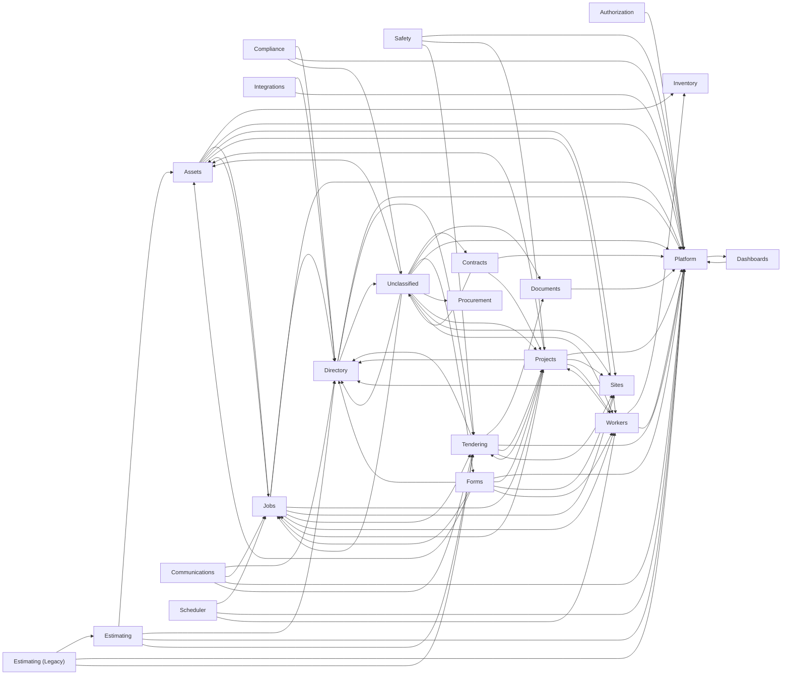

# 04 — Data Model

> **This master = the auto-generated schema relationship map (immediately below) + the curated
> data-model designs merged in during the 2026-07-08 SoT consolidation** (Job↔Project &
> Worker↔WorkerProfile spine, module-ownership / IA map, resource-allocator gap analysis — see
> the MERGED SOURCES seam further down).
>
> The schema-map section is regenerated by `node scripts/data-model/build-relationship-map.mjs`,
> which still writes the raw artifact to `docs/data-model/relationship-map.md` — a **generated
> artifact, NOT source of truth**. Do **not** blindly overwrite this master with a fresh
> generator run: re-merge the regenerated map while preserving the appended design sections.
> Business meaning (domains, field roles) is curated in `docs/data-model/metadata-catalog.json`.

- Last updated: 2026-07-19 14:15 UTC
- Generated from: `apps/api/prisma/schema.prisma` (sha256 `8457cfda3765`)
- Models: 231 | Enums: 41 | FK edges: 358 | Domains: 23

<!-- SOT04-GENERATED:BEGIN -->

## Table of Contents

1. [How to read this document](#how-to-read-this-document)
2. [Domain dependency overview](#domain-dependency-overview)
3. [Domain index](#domain-index)
    1. [Assets (8)](#domain-assets)
    2. [Authorization (2)](#domain-authorization)
    3. [Communications (6)](#domain-communications)
    4. [Compliance (4)](#domain-compliance)
    5. [Contracts (7)](#domain-contracts)
    6. [Dashboards (3)](#domain-dashboards)
    7. [Directory (8)](#domain-directory)
    8. [Documents (6)](#domain-documents)
    9. [Estimating (15)](#domain-estimating)
    10. [Estimating (Legacy) (18)](#domain-estimating-legacy)
    11. [Forms (15)](#domain-forms)
    12. [Integrations (6)](#domain-integrations)
    13. [Inventory (6)](#domain-inventory)
    14. [Jobs (17)](#domain-jobs)
    15. [Platform (23)](#domain-platform)
    16. [Procurement (4)](#domain-procurement)
    17. [Projects (8)](#domain-projects)
    18. [Safety (4)](#domain-safety)
    19. [Scheduler (3)](#domain-scheduler)
    20. [Sites (2)](#domain-sites)
    21. [Tendering (21)](#domain-tendering)
    22. [Unclassified (33)](#domain-unclassified)
    23. [Workers (12)](#domain-workers)
4. [Enums](#enums)
5. [Full model index (A-Z)](#full-model-index-a-z)

### Model quick-jump

[AccessRequest](#model-accessrequest) | [ApprovalDecision](#model-approvaldecision) | [Asset](#model-asset) | [AssetBreakdown](#model-assetbreakdown) | [AssetCategory](#model-assetcategory) | [AssetCheckout](#model-assetcheckout) | [AssetInspection](#model-assetinspection) | [AssetMaintenanceEvent](#model-assetmaintenanceevent) | [AssetMaintenancePlan](#model-assetmaintenanceplan) | [AssetStatusHistory](#model-assetstatushistory) | [AuditLog](#model-auditlog) | [AuthorityRule](#model-authorityrule) | [AutomationRule](#model-automationrule) | [AutomationRuleRun](#model-automationrulerun) | [AvailabilityWindow](#model-availabilitywindow) | [BillingMilestone](#model-billingmilestone) | [BrandAsset](#model-brandasset) | [BrandColorScheme](#model-brandcolorscheme) | [BusinessProcessFlow](#model-businessprocessflow) | [BusinessProcessInstance](#model-businessprocessinstance) | [BusinessProcessStage](#model-businessprocessstage) | [CalendarSyncedEvent](#model-calendarsyncedevent) | [Case](#model-case) | [CaseComment](#model-casecomment) | [CaseNumberSequence](#model-casenumbersequence) | [ClaimLineItem](#model-claimlineitem) | [ClaimNumberSequence](#model-claimnumbersequence) | [Client](#model-client) | [ClientPortalUser](#model-clientportaluser) | [ClientQuote](#model-clientquote) | [ClientSession](#model-clientsession) | [Commitment](#model-commitment) | [CommitmentChange](#model-commitmentchange) | [CommitmentItem](#model-commitmentitem) | [CompanyLegalDocument](#model-companylegaldocument) | [CompanyProfile](#model-companyprofile) | [Competency](#model-competency) | [CompetencyOverride](#model-competencyoverride) | [ComplianceAlert](#model-compliancealert) | [Contact](#model-contact) | [Contract](#model-contract) | [ContractNumberSequence](#model-contractnumbersequence) | [Conversation](#model-conversation) | [ConversationMessage](#model-conversationmessage) | [CorrectiveAction](#model-correctiveaction) | [CorrespondenceMessage](#model-correspondencemessage) | [CorrespondenceThread](#model-correspondencethread) | [CreditApplication](#model-creditapplication) | [Crew](#model-crew) | [CrewWorker](#model-crewworker) | [CuttingOtherRate](#model-cuttingotherrate) | [CuttingSheetItem](#model-cuttingsheetitem) | [DailyDiary](#model-dailydiary) | [Dashboard](#model-dashboard) | [DashboardWidget](#model-dashboardwidget) | [Docket](#model-docket) | [DocketAttachment](#model-docketattachment) | [DocketNumberSequence](#model-docketnumbersequence) | [DocumentAccessRule](#model-documentaccessrule) | [DocumentLink](#model-documentlink) | [DocumentTag](#model-documenttag) | [EmailProviderConfig](#model-emailproviderconfig) | [EntityInsurance](#model-entityinsurance) | [EntityLicence](#model-entitylicence) | [EstimateAssumption](#model-estimateassumption) | [EstimateCoreHoleRate](#model-estimatecoreholerate) | [EstimateCuttingLine](#model-estimatecuttingline) | [EstimateCuttingRate](#model-estimatecuttingrate) | [EstimateEnclosureRate](#model-estimateenclosurerate) | [EstimateEquipLine](#model-estimateequipline) | [EstimateExport](#model-estimateexport) | [EstimateFuelRate](#model-estimatefuelrate) | [EstimateItem](#model-estimateitem) | [EstimateLabourLine](#model-estimatelabourline) | [EstimateLabourRate](#model-estimatelabourrate) | [EstimateMaterialDensity](#model-estimatematerialdensity) | [EstimatePlantLine](#model-estimateplantline) | [EstimatePlantRate](#model-estimateplantrate) | [EstimateWasteLine](#model-estimatewasteline) | [EstimateWasteRate](#model-estimatewasterate) | [Expense](#model-expense) | [ExpenseNumberSequence](#model-expensenumbersequence) | [FormApproval](#model-formapproval) | [FormAttachment](#model-formattachment) | [FormContentSnippet](#model-formcontentsnippet) | [FormField](#model-formfield) | [FormPublicLink](#model-formpubliclink) | [FormRule](#model-formrule) | [FormSchedule](#model-formschedule) | [FormSection](#model-formsection) | [FormSignature](#model-formsignature) | [FormSubmission](#model-formsubmission) | [FormSubmissionValue](#model-formsubmissionvalue) | [FormTemplate](#model-formtemplate) | [FormTemplateVersion](#model-formtemplateversion) | [FormTriggeredRecord](#model-formtriggeredrecord) | [GanttTask](#model-gantttask) | [GlobalAISettings](#model-globalaisettings) | [GlobalList](#model-globallist) | [GlobalListItem](#model-globallistitem) | [HazardNumberSequence](#model-hazardnumbersequence) | [HazardObservation](#model-hazardobservation) | [HealthcheckSeedMarker](#model-healthcheckseedmarker) | [IntegrationCredential](#model-integrationcredential) | [InternalMessage](#model-internalmessage) | [Job](#model-job) | [JobActivity](#model-jobactivity) | [JobCloseout](#model-jobcloseout) | [JobConversion](#model-jobconversion) | [JobIssue](#model-jobissue) | [JobNumberSequence](#model-jobnumbersequence) | [JobProgressEntry](#model-jobprogressentry) | [JobRole](#model-jobrole) | [JobRoleRequirement](#model-jobrolerequirement) | [JobStage](#model-jobstage) | [JobStatusHistory](#model-jobstatushistory) | [JobVariation](#model-jobvariation) | [LeaveRequest](#model-leaverequest) | [ListBinding](#model-listbinding) | [LookupValue](#model-lookupvalue) | [Notification](#model-notification) | [NotificationTriggerConfig](#model-notificationtriggerconfig) | [OperationsSettings](#model-operationssettings) | [PaymentSchedule](#model-paymentschedule) | [Permission](#model-permission) | [PermissionModule](#model-permissionmodule) | [Persona](#model-persona) | [PersonaCompanyInstruction](#model-personacompanyinstruction) | [PilotFeedback](#model-pilotfeedback) | [PlatformConfig](#model-platformconfig) | [PoReconcileAudit](#model-poreconcileaudit) | [PortalInvite](#model-portalinvite) | [PortalSession](#model-portalsession) | [PreStartChecklist](#model-prestartchecklist) | [ProcurementConfig](#model-procurementconfig) | [ProcurementLine](#model-procurementline) | [ProcurementRequest](#model-procurementrequest) | [ProgressClaim](#model-progressclaim) | [Project](#model-project) | [ProjectActivityLog](#model-projectactivitylog) | [ProjectAllocation](#model-projectallocation) | [ProjectMilestone](#model-projectmilestone) | [ProjectNumberSequence](#model-projectnumbersequence) | [ProjectScopeItem](#model-projectscopeitem) | [PublicHoliday](#model-publicholiday) | [PunchItem](#model-punchitem) | [PurchaseOrder](#model-purchaseorder) | [QuoteAssumption](#model-quoteassumption) | [QuoteCostLine](#model-quotecostline) | [QuoteCostOption](#model-quotecostoption) | [QuoteEmail](#model-quoteemail) | [QuoteExclusion](#model-quoteexclusion) | [QuoteProvisionalLine](#model-quoteprovisionalline) | [QuoteScopeItem](#model-quotescopeitem) | [RateColumn](#model-ratecolumn) | [RateRow](#model-raterow) | [RateTable](#model-ratetable) | [RefreshToken](#model-refreshtoken) | [ResourceType](#model-resourcetype) | [Role](#model-role) | [RolePermission](#model-rolepermission) | [SafetyIncident](#model-safetyincident) | [SafetyIncidentNumberSequence](#model-safetyincidentnumbersequence) | [SavedView](#model-savedview) | [ScheduleAllocation](#model-scheduleallocation) | [SchedulingConflict](#model-schedulingconflict) | [ScopeCard](#model-scopecard) | [ScopeOfWorksHeader](#model-scopeofworksheader) | [ScopeOfWorksItem](#model-scopeofworksitem) | [ScopeViewConfig](#model-scopeviewconfig) | [ScopeWasteItem](#model-scopewasteitem) | [SearchEntry](#model-searchentry) | [SharePointFileLink](#model-sharepointfilelink) | [SharePointFolderLink](#model-sharepointfolderlink) | [SharePointFolderMapping](#model-sharepointfoldermapping) | [Shift](#model-shift) | [ShiftAssetAssignment](#model-shiftassetassignment) | [ShiftRoleRequirement](#model-shiftrolerequirement) | [ShiftWorkerAssignment](#model-shiftworkerassignment) | [Site](#model-site) | [SiteGeofence](#model-sitegeofence) | [StockCategory](#model-stockcategory) | [StockItem](#model-stockitem) | [StockMovement](#model-stockmovement) | [StocktakeCount](#model-stocktakecount) | [StocktakeSession](#model-stocktakesession) | [SubcontractorDocument](#model-subcontractordocument) | [SubcontractorSupplier](#model-subcontractorsupplier) | [SupplierCreditEntry](#model-suppliercreditentry) | [Survey](#model-survey) | [SurveyResponse](#model-surveyresponse) | [Tender](#model-tender) | [TenderAssumption](#model-tenderassumption) | [TenderClarification](#model-tenderclarification) | [TenderClarificationNote](#model-tenderclarificationnote) | [TenderClient](#model-tenderclient) | [TenderClientNote](#model-tenderclientnote) | [TenderClientPackage](#model-tenderclientpackage) | [TenderDocumentLink](#model-tenderdocumentlink) | [TenderEntry](#model-tenderentry) | [TenderEstimate](#model-tenderestimate) | [TenderExclusion](#model-tenderexclusion) | [TenderFilterPreset](#model-tenderfilterpreset) | [TenderFollowUp](#model-tenderfollowup) | [TenderNote](#model-tendernote) | [TenderOutcome](#model-tenderoutcome) | [TenderPackage](#model-tenderpackage) | [TenderPricingSnapshot](#model-tenderpricingsnapshot) | [TenderRateEntry](#model-tenderrateentry) | [TenderRateSet](#model-tenderrateset) | [TenderScopeRevision](#model-tenderscoperevision) | [TenderTandC](#model-tendertandc) | [Timesheet](#model-timesheet) | [User](#model-user) | [UserDashboard](#model-userdashboard) | [UserPersonaSettings](#model-userpersonasettings) | [UserRole](#model-userrole) | [Variation](#model-variation) | [VariationNumberSequence](#model-variationnumbersequence) | [VendorInvoice](#model-vendorinvoice) | [VendorInvoiceLine](#model-vendorinvoiceline) | [Worker](#model-worker) | [WorkerCompetency](#model-workercompetency) | [WorkerLeave](#model-workerleave) | [WorkerLocationLog](#model-workerlocationlog) | [WorkerProfile](#model-workerprofile) | [WorkerQualification](#model-workerqualification) | [WorkerRoleSuitability](#model-workerrolesuitability) | [WorkerUnavailability](#model-workerunavailability) | [XeroConnection](#model-xeroconnection) | [XeroSyncLog](#model-xerosynclog)

## How to read this document

Each model lists: its DB table, the domain it belongs to, the records it
**belongs to** (outgoing foreign keys - "this row points at one X"), and what
**references it** (incoming foreign keys - "these rows point back at me").
Field roles (measure / dimension / filter / time) are suggestions consumed by
the Smart Wizard; the authoritative, human-reviewed roles live in
`metadata-catalog.json`.

## Domain dependency overview

How the domains reference each other (arrow = "holds a foreign key into").



## Domain index

- **Assets** (8): Asset, AssetBreakdown, AssetCategory, AssetCheckout, AssetInspection, AssetMaintenanceEvent, AssetMaintenancePlan, AssetStatusHistory
- **Authorization** (2): ApprovalDecision, AuthorityRule
- **Communications** (6): Conversation, ConversationMessage, CorrespondenceMessage, CorrespondenceThread, EmailProviderConfig, InternalMessage
- **Compliance** (4): ComplianceAlert, CreditApplication, EntityInsurance, EntityLicence
- **Contracts** (7): ClaimLineItem, ClaimNumberSequence, Contract, ContractNumberSequence, ProgressClaim, Variation, VariationNumberSequence
- **Dashboards** (3): Dashboard, DashboardWidget, UserDashboard
- **Directory** (8): Client, ClientPortalUser, ClientQuote, ClientSession, Contact, SubcontractorDocument, SubcontractorSupplier, SupplierCreditEntry
- **Documents** (6): DocumentAccessRule, DocumentLink, DocumentTag, SharePointFileLink, SharePointFolderLink, SharePointFolderMapping
- **Estimating** (15): QuoteAssumption, QuoteCostLine, QuoteCostOption, QuoteEmail, QuoteExclusion, QuoteProvisionalLine, QuoteScopeItem, RateColumn, RateRow, RateTable, ScopeCard, ScopeOfWorksHeader, ScopeOfWorksItem, ScopeViewConfig, ScopeWasteItem
- **Estimating (Legacy)** (18): CuttingOtherRate, CuttingSheetItem, EstimateAssumption, EstimateCoreHoleRate, EstimateCuttingLine, EstimateCuttingRate, EstimateEnclosureRate, EstimateEquipLine, EstimateExport, EstimateFuelRate, EstimateItem, EstimateLabourLine, EstimateLabourRate, EstimateMaterialDensity, EstimatePlantLine, EstimatePlantRate, EstimateWasteLine, EstimateWasteRate
- **Forms** (15): FormApproval, FormAttachment, FormContentSnippet, FormField, FormPublicLink, FormRule, FormSchedule, FormSection, FormSignature, FormSubmission, FormSubmissionValue, FormTemplate, FormTemplateVersion, FormTriggeredRecord, PreStartChecklist
- **Integrations** (6): CalendarSyncedEvent, IntegrationCredential, PortalInvite, PortalSession, XeroConnection, XeroSyncLog
- **Inventory** (6): ResourceType, StockCategory, StockItem, StockMovement, StocktakeCount, StocktakeSession
- **Jobs** (17): Job, JobActivity, JobCloseout, JobConversion, JobIssue, JobNumberSequence, JobProgressEntry, JobRole, JobRoleRequirement, JobStage, JobStatusHistory, JobVariation, Shift, ShiftAssetAssignment, ShiftRoleRequirement, ShiftWorkerAssignment, Timesheet
- **Platform** (23): AuditLog, GlobalAISettings, GlobalList, GlobalListItem, HealthcheckSeedMarker, ListBinding, LookupValue, Notification, NotificationTriggerConfig, Permission, PermissionModule, Persona, PersonaCompanyInstruction, PilotFeedback, PlatformConfig, PublicHoliday, RefreshToken, Role, RolePermission, SearchEntry, User, UserPersonaSettings, UserRole
- **Procurement** (4): ProcurementConfig, ProcurementLine, ProcurementRequest, PurchaseOrder
- **Projects** (8): GanttTask, Project, ProjectActivityLog, ProjectAllocation, ProjectMilestone, ProjectNumberSequence, ProjectScopeItem, ScheduleAllocation
- **Safety** (4): HazardNumberSequence, HazardObservation, SafetyIncident, SafetyIncidentNumberSequence
- **Scheduler** (3): AvailabilityWindow, LeaveRequest, SchedulingConflict
- **Sites** (2): Site, SiteGeofence
- **Tendering** (21): Tender, TenderAssumption, TenderClarification, TenderClarificationNote, TenderClient, TenderClientNote, TenderClientPackage, TenderDocumentLink, TenderEntry, TenderEstimate, TenderExclusion, TenderFilterPreset, TenderFollowUp, TenderNote, TenderOutcome, TenderPackage, TenderPricingSnapshot, TenderRateEntry, TenderRateSet, TenderScopeRevision, TenderTandC
- **Unclassified** (33): AccessRequest, AutomationRule, AutomationRuleRun, BillingMilestone, BrandAsset, BrandColorScheme, BusinessProcessFlow, BusinessProcessInstance, BusinessProcessStage, Case, CaseComment, CaseNumberSequence, Commitment, CommitmentChange, CommitmentItem, CompanyLegalDocument, CompanyProfile, CorrectiveAction, DailyDiary, Docket, DocketAttachment, DocketNumberSequence, Expense, ExpenseNumberSequence, OperationsSettings, PaymentSchedule, PoReconcileAudit, PunchItem, SavedView, Survey, SurveyResponse, VendorInvoice, VendorInvoiceLine
- **Workers** (12): Competency, CompetencyOverride, Crew, CrewWorker, Worker, WorkerCompetency, WorkerLeave, WorkerLocationLog, WorkerProfile, WorkerQualification, WorkerRoleSuitability, WorkerUnavailability

## Domain: Assets

### Model: Asset

- Table: `assets` | Domain: Assets | Fields: 30
- Belongs to (FK out):
  - `category` -> **AssetCategory** (assetCategoryId, onDelete SetNull)
  - `resourceType` -> **ResourceType** (resourceTypeId, onDelete SetNull)
- Has many:
  - `shiftAssignments` -> **ShiftAssetAssignment**[]
  - `maintenancePlans` -> **AssetMaintenancePlan**[]
  - `maintenanceEvents` -> **AssetMaintenanceEvent**[]
  - `inspections` -> **AssetInspection**[]
  - `breakdowns` -> **AssetBreakdown**[]
  - `statusHistory` -> **AssetStatusHistory**[]
  - `formSubmissions` -> **FormSubmission**[]
  - `allocations` -> **ProjectAllocation**[]
  - `scheduleAllocations` -> **ScheduleAllocation**[]
  - `scopePlantRefs` -> **ScopeOfWorksItem**[]
  - `dockets` -> **Docket**[]
  - `checkouts` -> **AssetCheckout**[]
- Referenced by: **AssetBreakdown**, **AssetCheckout**, **AssetInspection**, **AssetMaintenanceEvent**, **AssetMaintenancePlan**, **AssetStatusHistory**, **Docket**, **FormSubmission**, **ProjectAllocation**, **ScheduleAllocation**, **ScopeOfWorksItem**, **ShiftAssetAssignment**
- Suggested measures: fuelConsumptionLPer100km, nominalLoadTonnes
- Suggested dimensions: assetCategoryId, resourceTypeId, status, category, resourceType

### Model: AssetBreakdown

- Table: `asset_breakdowns` | Domain: Assets | Fields: 11
- Belongs to (FK out):
  - `asset` -> **Asset** (assetId, onDelete Cascade)
- Suggested dimensions: status, asset
- Time fields: reportedAt, resolvedAt

### Model: AssetCategory

- Table: `asset_categories` | Domain: Assets | Fields: 10
- Has many:
  - `assets` -> **Asset**[]
- Referenced by: **Asset**
- Suggested measures: defaultFuelConsumptionLPer100km, defaultNominalLoadTonnes

### Model: AssetCheckout

- Table: `asset_checkouts` | Domain: Assets | Fields: 17
- Belongs to (FK out):
  - `asset` -> **Asset** (assetId, onDelete Cascade)
  - `holderWorker` -> **Worker** (holderWorkerId, onDelete SetNull)
  - `holderUser` -> **User** (holderUserId, onDelete SetNull)
  - `site` -> **Site** (siteId, onDelete SetNull)
  - `job` -> **Job** (jobId, onDelete SetNull)
- Suggested dimensions: asset, holderWorker, holderUser, site, job
- Time fields: checkedOutAt, dueBackAt, checkedInAt

### Model: AssetInspection

- Table: `asset_inspections` | Domain: Assets | Fields: 9
- Belongs to (FK out):
  - `asset` -> **Asset** (assetId, onDelete Cascade)
- Suggested dimensions: inspectionType, status, asset
- Time fields: inspectedAt

### Model: AssetMaintenanceEvent

- Table: `asset_maintenance_events` | Domain: Assets | Fields: 12
- Belongs to (FK out):
  - `asset` -> **Asset** (assetId, onDelete Cascade)
  - `plan` -> **AssetMaintenancePlan** (maintenancePlanId, onDelete SetNull)
- Suggested dimensions: eventType, status, asset, plan
- Time fields: scheduledAt, completedAt

### Model: AssetMaintenancePlan

- Table: `asset_maintenance_plans` | Domain: Assets | Fields: 14
- Belongs to (FK out):
  - `asset` -> **Asset** (assetId, onDelete Cascade)
- Has many:
  - `events` -> **AssetMaintenanceEvent**[]
- Referenced by: **AssetMaintenanceEvent**
- Suggested measures: intervalDays, warningDays
- Suggested dimensions: status, asset
- Time fields: lastCompletedAt, nextDueAt

### Model: AssetStatusHistory

- Table: `asset_status_history` | Domain: Assets | Fields: 8
- Belongs to (FK out):
  - `asset` -> **Asset** (assetId, onDelete Cascade)
- Suggested dimensions: fromStatus, toStatus, asset
- Time fields: changedAt

## Domain: Authorization

### Model: ApprovalDecision

- Table: `approval_decisions` | Domain: Authorization | Fields: 14
- Belongs to (FK out):
  - `decidedBy` -> **User** (decidedById, onDelete Cascade)
  - `overrules` -> **ApprovalDecision** (overrulesId)
- Has one (back-relation):
  - `overruledBy` -> **ApprovalDecision**
- Referenced by: **ApprovalDecision**
- Suggested measures: amount
- Suggested dimensions: entityType, decision, decidedBy, overrules

### Model: AuthorityRule

- Table: `authority_rules` | Domain: Authorization | Fields: 11
- Suggested measures: limitAmount
- Suggested dimensions: scopeType, scopeId

## Domain: Communications

### Model: Conversation

- Table: `conversations` | Domain: Communications | Fields: 9
- Belongs to (FK out):
  - `user` -> **User** (userId, onDelete Cascade)
- Has many:
  - `messages` -> **ConversationMessage**[]
- Referenced by: **ConversationMessage**
- Suggested dimensions: user

### Model: ConversationMessage

- Table: `conversation_messages` | Domain: Communications | Fields: 10
- Belongs to (FK out):
  - `conversation` -> **Conversation** (conversationId, onDelete Cascade)
- Suggested dimensions: role, conversation

### Model: CorrespondenceMessage

- Table: `correspondence_messages` | Domain: Communications | Fields: 16
- Belongs to (FK out):
  - `thread` -> **CorrespondenceThread** (threadId, onDelete Cascade)
  - `sentBy` -> **User** (sentById, onDelete SetNull)
- Suggested dimensions: thread, sentBy
- Time fields: sentAt, receivedAt

### Model: CorrespondenceThread

- Table: `correspondence_threads` | Domain: Communications | Fields: 14
- Belongs to (FK out):
  - `client` -> **Client** (clientId, onDelete Cascade)
  - `tender` -> **Tender** (tenderId, onDelete Cascade)
  - `job` -> **Job** (jobId, onDelete Cascade)
- Has many:
  - `messages` -> **CorrespondenceMessage**[]
- Referenced by: **CorrespondenceMessage**
- Suggested dimensions: client, tender, job
- Time fields: lastMessageAt

### Model: EmailProviderConfig

- Table: `email_provider_config` | Domain: Communications | Fields: 8
- Belongs to (FK out):
  - `updatedBy` -> **User** (updatedById, onDelete SetNull)
- Suggested dimensions: updatedBy

### Model: InternalMessage

- Table: `internal_messages` | Domain: Communications | Fields: 12
- Belongs to (FK out):
  - `sender` -> **User** (senderId, onDelete Cascade)
  - `recipient` -> **User** (recipientId, onDelete Cascade)
- Suggested dimensions: entityType, status, sender, recipient
- Time fields: readAt

## Domain: Compliance

### Model: ComplianceAlert

- Table: `compliance_alerts` | Domain: Compliance | Fields: 9
- Belongs to (FK out):
  - `sentToUser` -> **User** (sentToUserId)
- Suggested dimensions: entityType, itemType, alertType, sentToUser
- Time fields: sentAt

### Model: CreditApplication

- Table: `credit_applications` | Domain: Compliance | Fields: 21
- Belongs to (FK out):
  - `reviewedBy` -> **User** (reviewedById)
  - `client` -> **Client** (clientId, onDelete Cascade)
  - `subcontractor` -> **SubcontractorSupplier** (subcontractorId, onDelete Cascade)
  - `createdBy` -> **User** (createdById)
- Suggested dimensions: status, reviewedBy, client, subcontractor, createdBy
- Time fields: applicationDate, approvedDate, rejectedDate

### Model: EntityInsurance

- Table: `entity_insurances` | Domain: Compliance | Fields: 17
- Belongs to (FK out):
  - `client` -> **Client** (clientId, onDelete Cascade)
  - `subcontractor` -> **SubcontractorSupplier** (subcontractorId, onDelete Cascade)
  - `companyProfile` -> **CompanyProfile** (companyProfileId, onDelete Cascade)
- Suggested measures: coverageAmount
- Suggested dimensions: insuranceType, status, client, subcontractor, companyProfile
- Time fields: expiryDate

### Model: EntityLicence

- Table: `entity_licences` | Domain: Compliance | Fields: 17
- Belongs to (FK out):
  - `client` -> **Client** (clientId, onDelete Cascade)
  - `subcontractor` -> **SubcontractorSupplier** (subcontractorId, onDelete Cascade)
  - `companyProfile` -> **CompanyProfile** (companyProfileId, onDelete Cascade)
- Suggested dimensions: licenceType, status, client, subcontractor, companyProfile
- Time fields: issueDate, expiryDate

## Domain: Contracts

### Model: ClaimLineItem

- Table: `claim_line_items` | Domain: Contracts | Fields: 12
- Belongs to (FK out):
  - `claim` -> **ProgressClaim** (claimId, onDelete Cascade)
  - `variation` -> **Variation** (variationId, onDelete SetNull)
- Suggested measures: contractValue, thisClaimPct, thisClaimAmount
- Suggested dimensions: claim, discipline, variation

### Model: ClaimNumberSequence

- Table: `claim_number_sequences` | Domain: Contracts | Fields: 2
- Suggested measures: lastNumber

### Model: Contract

- Table: `contracts` | Domain: Contracts | Fields: 20
- Belongs to (FK out):
  - `project` -> **Project** (projectId, onDelete Cascade)
  - `createdBy` -> **User** (createdById, onDelete Restrict)
  - `issuedTerms` -> **CompanyLegalDocument** (issuedTermsDocumentId, onDelete SetNull)
- Has many:
  - `variations` -> **Variation**[]
  - `progressClaims` -> **ProgressClaim**[]
  - `billingMilestones` -> **BillingMilestone**[]
- Referenced by: **BillingMilestone**, **ProgressClaim**, **Variation**
- Suggested measures: contractValue, retentionPct, retentionAmount
- Suggested dimensions: project, status, createdBy, issuedTerms
- Time fields: startDate, endDate

### Model: ContractNumberSequence

- Table: `contract_number_sequences` | Domain: Contracts | Fields: 2
- Suggested measures: lastNumber

### Model: ProgressClaim

- Table: `progress_claims` | Domain: Contracts | Fields: 21
- Belongs to (FK out):
  - `contract` -> **Contract** (contractId, onDelete Cascade)
  - `createdBy` -> **User** (createdById, onDelete Restrict)
- Has many:
  - `lineItems` -> **ClaimLineItem**[]
  - `billingMilestones` -> **BillingMilestone**[]
- Has one (back-relation):
  - `paymentSchedule` -> **PaymentSchedule**
- Referenced by: **BillingMilestone**, **ClaimLineItem**, **PaymentSchedule**
- Suggested measures: totalClaimed, totalApproved, totalPaid
- Suggested dimensions: contract, status, createdBy
- Time fields: claimMonth, submissionDate, paidDate

### Model: Variation

- Table: `variations` | Domain: Contracts | Fields: 19
- Belongs to (FK out):
  - `contract` -> **Contract** (contractId, onDelete Cascade)
  - `createdBy` -> **User** (createdById, onDelete Restrict)
- Has many:
  - `claimLineItems` -> **ClaimLineItem**[]
- Referenced by: **ClaimLineItem**
- Suggested measures: pricedAmount, approvedAmount
- Suggested dimensions: contract, status, createdBy
- Time fields: receivedDate, pricedDate, submittedDate, approvedDate

### Model: VariationNumberSequence

- Table: `variation_number_sequences` | Domain: Contracts | Fields: 2
- Suggested measures: lastNumber

## Domain: Dashboards

### Model: Dashboard

- Table: `dashboards` | Domain: Dashboards | Fields: 13
- Belongs to (FK out):
  - `ownerUser` -> **User** (ownerUserId, onDelete SetNull)
  - `ownerRole` -> **Role** (ownerRoleId, onDelete SetNull)
- Has many:
  - `widgets` -> **DashboardWidget**[]
  - `usersDefaultedTo` -> **User**[]
- Referenced by: **DashboardWidget**, **User**
- Suggested dimensions: scope, ownerRoleId, ownerUser, ownerRole

### Model: DashboardWidget

- Table: `dashboard_widgets` | Domain: Dashboards | Fields: 12
- Belongs to (FK out):
  - `dashboard` -> **Dashboard** (dashboardId, onDelete Cascade)
- Suggested dimensions: type, dashboard

### Model: UserDashboard

- Table: `user_dashboards` | Domain: Dashboards | Fields: 10
- Belongs to (FK out):
  - `user` -> **User** (userId, onDelete Cascade)
- Suggested dimensions: user

## Domain: Directory

### Model: Client

- Table: `clients` | Domain: Directory | Fields: 68
- Belongs to (FK out):
  - `claimReminderUser` -> **User** (claimReminderUserId, onDelete SetNull)
- Has many:
  - `sites` -> **Site**[]
  - `tenderClients` -> **TenderClient**[]
  - `jobs` -> **Job**[]
  - `projects` -> **Project**[]
  - `formSubmissions` -> **FormSubmission**[]
  - `tenderClientNotes` -> **TenderClientNote**[]
  - `clientQuotes` -> **ClientQuote**[]
  - `licences` -> **EntityLicence**[]
  - `insurances` -> **EntityInsurance**[]
  - `creditApplications` -> **CreditApplication**[]
  - `portalUsers` -> **ClientPortalUser**[]
  - `portalInvites` -> **PortalInvite**[]
  - `clarificationNotes` -> **TenderClarificationNote**[]
  - `correspondences` -> **CorrespondenceThread**[]
  - `surveyResponses` -> **SurveyResponse**[]
  - `cases` -> **Case**[]
- Referenced by: **Case**, **ClientPortalUser**, **ClientQuote**, **CorrespondenceThread**, **CreditApplication**, **EntityInsurance**, **EntityLicence**, **FormSubmission**, **Job**, **PortalInvite**, **Project**, **Site**, **SurveyResponse**, **TenderClarificationNote**, **TenderClient**, **TenderClientNote**
- Suggested measures: paymentTermsDays, preferenceScore, winCount, tenderCount, winRate
- Suggested dimensions: status, businessType, paymentTermsType, physicalState, postalState, claimReminderUser
- Time fields: lastTenderAt, lastWonAt

### Model: ClientPortalUser

- Table: `client_portal_users` | Domain: Directory | Fields: 14
- Belongs to (FK out):
  - `client` -> **Client** (clientId, onDelete Cascade)
- Has many:
  - `sessions` -> **PortalSession**[]
- Referenced by: **PortalSession**
- Suggested dimensions: client
- Time fields: lastLoginAt

### Model: ClientQuote

- Table: `client_quotes` | Domain: Directory | Fields: 38
- Belongs to (FK out):
  - `tender` -> **Tender** (tenderId, onDelete Cascade)
  - `client` -> **Client** (clientId)
  - `sourceTenderEstimate` -> **TenderEstimate** (sourceTenderEstimateId, onDelete SetNull)
  - `sentBy` -> **User** (sentById)
  - `issuedTerms` -> **CompanyLegalDocument** (issuedTermsDocumentId, onDelete SetNull)
  - `createdBy` -> **User** (createdById)
- Has many:
  - `costLines` -> **QuoteCostLine**[]
  - `provisionalLines` -> **QuoteProvisionalLine**[]
  - `costOptions` -> **QuoteCostOption**[]
  - `assumptions` -> **QuoteAssumption**[]
  - `exclusions` -> **QuoteExclusion**[]
  - `emails` -> **QuoteEmail**[]
  - `scopeItems` -> **QuoteScopeItem**[]
- Referenced by: **QuoteAssumption**, **QuoteCostLine**, **QuoteCostOption**, **QuoteEmail**, **QuoteExclusion**, **QuoteProvisionalLine**, **QuoteScopeItem**
- Suggested measures: adjustmentPct
- Suggested dimensions: tender, client, sourceTenderEstimate, status, sentBy, issuedTerms, createdBy
- Time fields: sentAt

### Model: ClientSession

- Table: `client_sessions` | Domain: Directory | Fields: 7
- Belongs to (FK out):
  - `user` -> **User** (userId, onDelete Cascade)
- Suggested dimensions: user
- Time fields: firstSeenAt, lastSeenAt

### Model: Contact

- Table: `contacts` | Domain: Directory | Fields: 20
- Belongs to (FK out):
  - `createdBy` -> **User** (createdById, onDelete SetNull)
- Has many:
  - `tenderClients` -> **TenderClient**[]
- Referenced by: **TenderClient**
- Suggested dimensions: organisationType, role, createdBy

### Model: SubcontractorDocument

- Table: `subcontractor_documents` | Domain: Directory | Fields: 10
- Belongs to (FK out):
  - `subcontractor` -> **SubcontractorSupplier** (subcontractorId, onDelete Cascade)
  - `uploadedBy` -> **User** (uploadedById)
- Suggested dimensions: subcontractor, documentType, uploadedBy
- Time fields: uploadedAt

### Model: SubcontractorSupplier

- Table: `subcontractor_suppliers` | Domain: Directory | Fields: 60
- Belongs to (FK out):
  - `createdBy` -> **User** (createdById)
- Has many:
  - `documents` -> **SubcontractorDocument**[]
  - `licences` -> **EntityLicence**[]
  - `insurances` -> **EntityInsurance**[]
  - `creditApplications` -> **CreditApplication**[]
  - `creditEntries` -> **SupplierCreditEntry**[]
  - `rateTables` -> **RateTable**[]
  - `commitments` -> **Commitment**[]
- Referenced by: **Commitment**, **CreditApplication**, **EntityInsurance**, **EntityLicence**, **RateTable**, **SubcontractorDocument**, **SupplierCreditEntry**
- Suggested measures: paymentTermsDays
- Suggested dimensions: businessType, paymentTermsType, entityType, prequalStatus, physicalState, postalState, createdBy
- Time fields: prequalReviewedAt, swmsReviewedAt, complianceBlockedAt

### Model: SupplierCreditEntry

- Table: `supplier_credit_entries` | Domain: Directory | Fields: 11
- Belongs to (FK out):
  - `subcontractor` -> **SubcontractorSupplier** (subcontractorId, onDelete Cascade)
  - `createdBy` -> **User** (createdById)
- Suggested measures: amount
- Suggested dimensions: subcontractor, entryType, createdBy
- Time fields: entryDate

## Domain: Documents

### Model: DocumentAccessRule

- Table: `document_access_rules` | Domain: Documents | Fields: 10
- Belongs to (FK out):
  - `document` -> **DocumentLink** (documentLinkId, onDelete Cascade)
- Suggested dimensions: accessType, roleName, document

### Model: DocumentLink

- Table: `document_links` | Domain: Documents | Fields: 27
- Belongs to (FK out):
  - `folderLink` -> **SharePointFolderLink** (folderLinkId, onDelete SetNull)
  - `fileLink` -> **SharePointFileLink** (fileLinkId, onDelete SetNull)
  - `createdBy` -> **User** (createdById, onDelete SetNull)
  - `updatedBy` -> **User** (updatedById, onDelete SetNull)
- Has many:
  - `tags` -> **DocumentTag**[]
  - `accessRules` -> **DocumentAccessRule**[]
  - `expenseReceipts` -> **Expense**[]
- Referenced by: **DocumentAccessRule**, **DocumentTag**, **Expense**
- Suggested measures: versionNumber
- Suggested dimensions: linkedEntityType, category, status, folderLink, fileLink, createdBy, updatedBy
- Time fields: supersededAt

### Model: DocumentTag

- Table: `document_tags` | Domain: Documents | Fields: 5
- Belongs to (FK out):
  - `document` -> **DocumentLink** (documentLinkId, onDelete Cascade)
- Suggested dimensions: document

### Model: SharePointFileLink

- Table: `sharepoint_file_links` | Domain: Documents | Fields: 20
- Belongs to (FK out):
  - `folderLink` -> **SharePointFolderLink** (folderLinkId, onDelete SetNull)
- Has many:
  - `documents` -> **DocumentLink**[]
  - `tenderDocuments` -> **TenderDocumentLink**[]
- Referenced by: **DocumentLink**, **TenderDocumentLink**
- Suggested measures: versionNumber
- Suggested dimensions: mimeType, linkedEntityType, folderLink

### Model: SharePointFolderLink

- Table: `sharepoint_folder_links` | Domain: Documents | Fields: 15
- Has many:
  - `files` -> **SharePointFileLink**[]
  - `documents` -> **DocumentLink**[]
  - `tenderDocuments` -> **TenderDocumentLink**[]
- Referenced by: **DocumentLink**, **SharePointFileLink**, **TenderDocumentLink**
- Suggested dimensions: linkedEntityType

### Model: SharePointFolderMapping

- Table: `sharepoint_folder_mappings` | Domain: Documents | Fields: 8
- Suggested dimensions: entityType

## Domain: Estimating

### Model: QuoteAssumption

- Table: `quote_assumptions` | Domain: Estimating | Fields: 7
- Belongs to (FK out):
  - `quote` -> **ClientQuote** (quoteId, onDelete Cascade)
  - `costLine` -> **QuoteCostLine** (costLineId, onDelete SetNull)
- Suggested dimensions: quote, costLine

### Model: QuoteCostLine

- Table: `quote_cost_lines` | Domain: Estimating | Fields: 14
- Belongs to (FK out):
  - `quote` -> **ClientQuote** (quoteId, onDelete Cascade)
- Has many:
  - `assumptions` -> **QuoteAssumption**[]
- Referenced by: **QuoteAssumption**
- Suggested measures: price, baseValue, overrideAmount
- Suggested dimensions: quote, sourceEstimateLineType

### Model: QuoteCostOption

- Table: `quote_cost_options` | Domain: Estimating | Fields: 8
- Belongs to (FK out):
  - `quote` -> **ClientQuote** (quoteId, onDelete Cascade)
- Suggested measures: price
- Suggested dimensions: quote

### Model: QuoteEmail

- Table: `quote_emails` | Domain: Estimating | Fields: 9
- Belongs to (FK out):
  - `quote` -> **ClientQuote** (quoteId, onDelete Cascade)
  - `sentBy` -> **User** (sentById)
- Suggested dimensions: quote, sentBy
- Time fields: sentAt

### Model: QuoteExclusion

- Table: `quote_exclusions` | Domain: Estimating | Fields: 5
- Belongs to (FK out):
  - `quote` -> **ClientQuote** (quoteId, onDelete Cascade)
- Suggested dimensions: quote

### Model: QuoteProvisionalLine

- Table: `quote_provisional_lines` | Domain: Estimating | Fields: 7
- Belongs to (FK out):
  - `quote` -> **ClientQuote** (quoteId, onDelete Cascade)
- Suggested measures: price
- Suggested dimensions: quote

### Model: QuoteScopeItem

- Table: `quote_scope_items` | Domain: Estimating | Fields: 15
- Belongs to (FK out):
  - `quote` -> **ClientQuote** (quoteId, onDelete Cascade)
- Suggested dimensions: quote, sourceItemType, quoteDiscipline

### Model: RateColumn

- Table: `rate_columns` | Domain: Estimating | Fields: 14
- Belongs to (FK out):
  - `rateTable` -> **RateTable** (rateTableId, onDelete Cascade)
- Suggested dimensions: rateTable, dataType, role

### Model: RateRow

- Table: `rate_rows` | Domain: Estimating | Fields: 12
- Belongs to (FK out):
  - `rateTable` -> **RateTable** (rateTableId, onDelete Cascade)
- Suggested dimensions: rateTable
- Time fields: effectiveFrom, effectiveTo

### Model: RateTable

- Table: `rate_tables` | Domain: Estimating | Fields: 16
- Belongs to (FK out):
  - `supplier` -> **SubcontractorSupplier** (supplierId)
- Has many:
  - `columns` -> **RateColumn**[]
  - `rows` -> **RateRow**[]
- Referenced by: **RateColumn**, **RateRow**
- Suggested dimensions: category, subcontractorType, supplier

### Model: ScopeCard

- Table: `scope_cards` | Domain: Estimating | Fields: 24
- Belongs to (FK out):
  - `tender` -> **Tender** (tenderId, onDelete Cascade)
  - `createdBy` -> **User** (createdById, onDelete Restrict)
- Has many:
  - `scopeItems` -> **ScopeOfWorksItem**[]
  - `wasteItems` -> **ScopeWasteItem**[]
  - `cuttingItems` -> **CuttingSheetItem**[]
- Referenced by: **CuttingSheetItem**, **ScopeOfWorksItem**, **ScopeWasteItem**
- Suggested measures: cardNumber, plantColumnCount, markupOverride, wasteMarkupOverride, cuttingMarkupOverride, labourDaysOverride
- Suggested dimensions: tender, discipline, createdBy

### Model: ScopeOfWorksHeader

- Table: `scope_of_works_headers` | Domain: Estimating | Fields: 11
- Belongs to (FK out):
  - `tender` -> **Tender** (tenderId, onDelete Cascade)
- Suggested dimensions: tender
- Time fields: proposedStartDate

### Model: ScopeOfWorksItem

- Table: `scope_of_works_items` | Domain: Estimating | Fields: 74
- Belongs to (FK out):
  - `tender` -> **Tender** (tenderId, onDelete Cascade)
  - `card` -> **ScopeCard** (cardId, onDelete SetNull)
  - `plantAsset` -> **Asset** (plantAssetId, onDelete SetNull)
  - `createdBy` -> **User** (createdById, onDelete Restrict)
- Suggested measures: itemNumber, days, value, tonnes, coreHoleQty, wasteTonnes, wasteLoads, measurementQty, quantity, provisionalAmount, excavatorDays, bobcatDays, ewpDays, hookTruckDays, semiTipperDays
- Suggested dimensions: tender, card, rowType, status, materialType, elevation, acmType, acmMaterial, excavationMaterial, wasteType, material, plantAsset, materialKind, createdBy

### Model: ScopeViewConfig

- Table: `scope_view_configs` | Domain: Estimating | Fields: 7
- Belongs to (FK out):
  - `tender` -> **Tender** (tenderId, onDelete Cascade)
- Suggested dimensions: tender, discipline

### Model: ScopeWasteItem

- Table: `scope_waste_items` | Domain: Estimating | Fields: 26
- Belongs to (FK out):
  - `tender` -> **Tender** (tenderId, onDelete Cascade)
  - `card` -> **ScopeCard** (cardId, onDelete Cascade)
  - `createdBy` -> **User** (createdById, onDelete Restrict)
- Suggested measures: qty, wasteLoads, truckDays, ratePerTonne, ratePerLoad, lineTotal
- Suggested dimensions: tender, card, discipline, wasteType, createdBy

## Domain: Estimating (Legacy)

### Model: CuttingOtherRate

- Table: `cutting_other_rates` | Domain: Estimating (Legacy) | Fields: 9
- Has many:
  - `cuttingItems` -> **CuttingSheetItem**[]
- Referenced by: **CuttingSheetItem**
- Suggested measures: rate

### Model: CuttingSheetItem

- Table: `cutting_sheet_items` | Domain: Estimating (Legacy) | Fields: 30
- Belongs to (FK out):
  - `tender` -> **Tender** (tenderId, onDelete Cascade)
  - `card` -> **ScopeCard** (cardId, onDelete Cascade)
  - `otherRate` -> **CuttingOtherRate** (otherRateId, onDelete SetNull)
  - `createdBy` -> **User** (createdById, onDelete Restrict)
- Suggested measures: quantityLm, quantityEach, ratePerM, ratePerHole, lineTotal
- Suggested dimensions: tender, card, itemType, elevation, material, method, otherRate, createdBy

### Model: EstimateAssumption

- Table: `estimate_assumptions` | Domain: Estimating (Legacy) | Fields: 5
- Belongs to (FK out):
  - `item` -> **EstimateItem** (itemId, onDelete Cascade)
- Suggested dimensions: item

### Model: EstimateCoreHoleRate

- Table: `estimate_core_hole_rates` | Domain: Estimating (Legacy) | Fields: 6
- Suggested measures: ratePerHole

### Model: EstimateCuttingLine

- Table: `estimate_cutting_lines` | Domain: Estimating (Legacy) | Fields: 14
- Belongs to (FK out):
  - `item` -> **EstimateItem** (itemId, onDelete Cascade)
- Suggested measures: qty, rate
- Suggested dimensions: item, cuttingType, elevation, material

### Model: EstimateCuttingRate

- Table: `estimate_cutting_rates` | Domain: Estimating (Legacy) | Fields: 10
- Suggested measures: ratePerM
- Suggested dimensions: elevation, material

### Model: EstimateEnclosureRate

- Table: `estimate_enclosure_rates` | Domain: Estimating (Legacy) | Fields: 8
- Suggested measures: rate
- Suggested dimensions: enclosureType

### Model: EstimateEquipLine

- Table: `estimate_equip_lines` | Domain: Estimating (Legacy) | Fields: 9
- Belongs to (FK out):
  - `item` -> **EstimateItem** (itemId, onDelete Cascade)
- Suggested measures: qty, rate
- Suggested dimensions: item

### Model: EstimateExport

- Table: `estimate_exports` | Domain: Estimating (Legacy) | Fields: 9
- Belongs to (FK out):
  - `tender` -> **Tender** (tenderId, onDelete Cascade)
  - `user` -> **User** (generatedBy, onDelete Restrict)
- Suggested dimensions: tender, type, user
- Time fields: generatedAt

### Model: EstimateFuelRate

- Table: `estimate_fuel_rates` | Domain: Estimating (Legacy) | Fields: 8
- Suggested measures: rate

### Model: EstimateItem

- Table: `estimate_items` | Domain: Estimating (Legacy) | Fields: 19
- Belongs to (FK out):
  - `estimate` -> **TenderEstimate** (estimateId, onDelete Cascade)
- Has many:
  - `labourLines` -> **EstimateLabourLine**[]
  - `equipLines` -> **EstimateEquipLine**[]
  - `plantLines` -> **EstimatePlantLine**[]
  - `wasteLines` -> **EstimateWasteLine**[]
  - `cuttingLines` -> **EstimateCuttingLine**[]
  - `assumptions` -> **EstimateAssumption**[]
- Referenced by: **EstimateAssumption**, **EstimateCuttingLine**, **EstimateEquipLine**, **EstimateLabourLine**, **EstimatePlantLine**, **EstimateWasteLine**
- Suggested measures: itemNumber, markup, provisionalAmount
- Suggested dimensions: estimate

### Model: EstimateLabourLine

- Table: `estimate_labour_lines` | Domain: Estimating (Legacy) | Fields: 9
- Belongs to (FK out):
  - `item` -> **EstimateItem** (itemId, onDelete Cascade)
- Suggested measures: qty, days, rate
- Suggested dimensions: item, role

### Model: EstimateLabourRate

- Table: `estimate_labour_rates` | Domain: Estimating (Legacy) | Fields: 9
- Suggested measures: dayRate, nightRate, weekendRate
- Suggested dimensions: role

### Model: EstimateMaterialDensity

- Table: `estimate_material_density` | Domain: Estimating (Legacy) | Fields: 11
- Suggested dimensions: materialName, kind, category

### Model: EstimatePlantLine

- Table: `estimate_plant_lines` | Domain: Estimating (Legacy) | Fields: 9
- Belongs to (FK out):
  - `item` -> **EstimateItem** (itemId, onDelete Cascade)
- Suggested measures: qty, days, rate
- Suggested dimensions: item

### Model: EstimatePlantRate

- Table: `estimate_plant_rates` | Domain: Estimating (Legacy) | Fields: 10
- Suggested measures: rate, fuelRate
- Suggested dimensions: category

### Model: EstimateWasteLine

- Table: `estimate_waste_lines` | Domain: Estimating (Legacy) | Fields: 11
- Belongs to (FK out):
  - `item` -> **EstimateItem** (itemId, onDelete Cascade)
- Suggested measures: qtyTonnes, tonRate, loads, loadRate
- Suggested dimensions: item, wasteType

### Model: EstimateWasteRate

- Table: `estimate_waste_rates` | Domain: Estimating (Legacy) | Fields: 11
- Suggested measures: tonRate, loadRate
- Suggested dimensions: wasteType

## Domain: Forms

### Model: FormApproval

- Table: `form_approvals` | Domain: Forms | Fields: 12
- Belongs to (FK out):
  - `submission` -> **FormSubmission** (submissionId, onDelete Cascade)
  - `assignedTo` -> **User** (assignedToId, onDelete SetNull)
- Suggested measures: stepNumber
- Suggested dimensions: submission, assignedTo, assignedToRole, status
- Time fields: decidedAt, dueAt

### Model: FormAttachment

- Table: `form_attachments` | Domain: Forms | Fields: 7
- Belongs to (FK out):
  - `submission` -> **FormSubmission** (submissionId, onDelete Cascade)
- Suggested dimensions: submission

### Model: FormContentSnippet

- Table: `form_content_snippets` | Domain: Forms | Fields: 9
- Suggested dimensions: category

### Model: FormField

- Table: `form_fields` | Domain: Forms | Fields: 20
- Belongs to (FK out):
  - `section` -> **FormSection** (sectionId, onDelete Cascade)
- Has many:
  - `values` -> **FormSubmissionValue**[]
- Referenced by: **FormSubmissionValue**
- Suggested dimensions: fieldType, section

### Model: FormPublicLink

- Table: `form_public_links` | Domain: Forms | Fields: 17
- Belongs to (FK out):
  - `template` -> **FormTemplate** (templateId, onDelete Cascade)
  - `createdBy` -> **User** (createdById, onDelete SetNull)
- Has many:
  - `submissions` -> **FormSubmission**[]
- Referenced by: **FormSubmission**
- Suggested measures: submissionCount
- Suggested dimensions: template, createdBy
- Time fields: expiresAt

### Model: FormRule

- Table: `form_rules` | Domain: Forms | Fields: 9
- Belongs to (FK out):
  - `version` -> **FormTemplateVersion** (versionId, onDelete Cascade)
- Suggested dimensions: version

### Model: FormSchedule

- Table: `form_schedules` | Domain: Forms | Fields: 13
- Belongs to (FK out):
  - `template` -> **FormTemplate** (templateId, onDelete Cascade)
  - `assignToUser` -> **User** (assignToUserId, onDelete SetNull)
- Suggested dimensions: template, scheduleType, assignToRole, assignToUser
- Time fields: lastRunAt, nextRunAt

### Model: FormSection

- Table: `form_sections` | Domain: Forms | Fields: 12
- Belongs to (FK out):
  - `version` -> **FormTemplateVersion** (versionId, onDelete Cascade)
- Has many:
  - `fields` -> **FormField**[]
- Referenced by: **FormField**
- Suggested dimensions: version

### Model: FormSignature

- Table: `form_signatures` | Domain: Forms | Fields: 7
- Belongs to (FK out):
  - `submission` -> **FormSubmission** (submissionId, onDelete Cascade)
- Suggested dimensions: submission
- Time fields: signedAt

### Model: FormSubmission

- Table: `form_submissions` | Domain: Forms | Fields: 40
- Belongs to (FK out):
  - `templateVersion` -> **FormTemplateVersion** (templateVersionId, onDelete Restrict)
  - `submittedBy` -> **User** (submittedById, onDelete SetNull)
  - `job` -> **Job** (jobId, onDelete SetNull)
  - `client` -> **Client** (clientId, onDelete SetNull)
  - `asset` -> **Asset** (assetId, onDelete SetNull)
  - `worker` -> **Worker** (workerId, onDelete SetNull)
  - `site` -> **Site** (siteId, onDelete SetNull)
  - `shift` -> **Shift** (shiftId, onDelete SetNull)
  - `publicLink` -> **FormPublicLink** (publicLinkId, onDelete SetNull)
- Has many:
  - `values` -> **FormSubmissionValue**[]
  - `attachments` -> **FormAttachment**[]
  - `signatures` -> **FormSignature**[]
  - `approvals` -> **FormApproval**[]
  - `triggeredRecords` -> **FormTriggeredRecord**[]
  - `punchItems` -> **PunchItem**[]
  - `correctiveActions` -> **CorrectiveAction**[]
- Referenced by: **CorrectiveAction**, **FormApproval**, **FormAttachment**, **FormSignature**, **FormSubmissionValue**, **FormTriggeredRecord**, **PunchItem**
- Suggested measures: score, maxScore, scorePct
- Suggested dimensions: status, templateVersion, submittedBy, job, client, asset, worker, site, shift, outcome, publicLink
- Time fields: submittedAt

### Model: FormSubmissionValue

- Table: `form_submission_values` | Domain: Forms | Fields: 13
- Belongs to (FK out):
  - `submission` -> **FormSubmission** (submissionId, onDelete Cascade)
  - `field` -> **FormField** (fieldId, onDelete SetNull)
- Suggested measures: valueNumber
- Suggested dimensions: submission, field
- Time fields: valueDateTime

### Model: FormTemplate

- Table: `form_templates` | Domain: Forms | Fields: 15
- Has many:
  - `versions` -> **FormTemplateVersion**[]
  - `schedules` -> **FormSchedule**[]
  - `publicLinks` -> **FormPublicLink**[]
- Referenced by: **FormPublicLink**, **FormSchedule**, **FormTemplateVersion**
- Suggested dimensions: status, category

### Model: FormTemplateVersion

- Table: `form_template_versions` | Domain: Forms | Fields: 9
- Belongs to (FK out):
  - `template` -> **FormTemplate** (templateId, onDelete Cascade)
- Has many:
  - `sections` -> **FormSection**[]
  - `rules` -> **FormRule**[]
  - `submissions` -> **FormSubmission**[]
- Referenced by: **FormRule**, **FormSection**, **FormSubmission**
- Suggested measures: versionNumber
- Suggested dimensions: status, template

### Model: FormTriggeredRecord

- Table: `form_triggered_records` | Domain: Forms | Fields: 6
- Belongs to (FK out):
  - `submission` -> **FormSubmission** (submissionId, onDelete Cascade)
- Suggested dimensions: submission, recordType

### Model: PreStartChecklist

- Table: `pre_start_checklists` | Domain: Forms | Fields: 33
- Belongs to (FK out):
  - `project` -> **Project** (projectId, onDelete Cascade)
  - `workerProfile` -> **WorkerProfile** (workerProfileId, onDelete Cascade)
  - `allocation` -> **ProjectAllocation** (allocationId, onDelete Cascade)
- Suggested dimensions: project, workerProfile, allocation, status
- Time fields: date, supervisorSignedAt, workerSignedAt, submittedAt

## Domain: Integrations

### Model: CalendarSyncedEvent

- Table: `calendar_synced_events` | Domain: Integrations | Fields: 14
- Belongs to (FK out):
  - `user` -> **User** (userId, onDelete Cascade)
- Suggested dimensions: sourceType, status, user
- Time fields: startAt, endAt, lastSyncedAt

### Model: IntegrationCredential

- Table: `integration_credentials` | Domain: Integrations | Fields: 6

### Model: PortalInvite

- Table: `portal_invites` | Domain: Integrations | Fields: 12
- Belongs to (FK out):
  - `client` -> **Client** (clientId, onDelete Cascade)
- Suggested dimensions: client
- Time fields: expiresAt, acceptedAt

### Model: PortalSession

- Table: `portal_sessions` | Domain: Integrations | Fields: 7
- Belongs to (FK out):
  - `portalUser` -> **ClientPortalUser** (portalUserId, onDelete Cascade)
- Suggested dimensions: portalUser
- Time fields: expiresAt, revokedAt

### Model: XeroConnection

- Table: `xero_connections` | Domain: Integrations | Fields: 10
- Suggested dimensions: scopes
- Time fields: expiresAt, connectedAt

### Model: XeroSyncLog

- Table: `xero_sync_logs` | Domain: Integrations | Fields: 9
- Suggested dimensions: entityType, status

## Domain: Inventory

### Model: ResourceType

- Table: `resource_types` | Domain: Inventory | Fields: 9
- Has many:
  - `workers` -> **Worker**[]
  - `assets` -> **Asset**[]
- Referenced by: **Asset**, **Worker**
- Suggested dimensions: category

### Model: StockCategory

- Table: `stock_categories` | Domain: Inventory | Fields: 8
- Has many:
  - `stockItems` -> **StockItem**[]
- Referenced by: **StockItem**

### Model: StockItem

- Table: `stock_items` | Domain: Inventory | Fields: 14
- Belongs to (FK out):
  - `category` -> **StockCategory** (categoryId, onDelete SetNull)
- Has many:
  - `movements` -> **StockMovement**[]
  - `stocktakeCounts` -> **StocktakeCount**[]
- Referenced by: **StockMovement**, **StocktakeCount**
- Suggested measures: quantityOnHand
- Suggested dimensions: categoryId, category

### Model: StockMovement

- Table: `stock_movements` | Domain: Inventory | Fields: 10
- Belongs to (FK out):
  - `stockItem` -> **StockItem** (stockItemId, onDelete Cascade)
- Suggested measures: quantity
- Suggested dimensions: type, refType, stockItem

### Model: StocktakeCount

- Table: `stocktake_counts` | Domain: Inventory | Fields: 8
- Belongs to (FK out):
  - `session` -> **StocktakeSession** (sessionId, onDelete Cascade)
  - `stockItem` -> **StockItem** (stockItemId, onDelete Cascade)
- Suggested measures: systemQty, countedQty
- Suggested dimensions: session, stockItem

### Model: StocktakeSession

- Table: `stocktake_sessions` | Domain: Inventory | Fields: 9
- Has many:
  - `counts` -> **StocktakeCount**[]
- Referenced by: **StocktakeCount**
- Suggested dimensions: status
- Time fields: startedAt, committedAt

## Domain: Jobs

### Model: Job

- Table: `jobs` | Domain: Jobs | Fields: 39
- Belongs to (FK out):
  - `client` -> **Client** (clientId, onDelete Restrict)
  - `site` -> **Site** (siteId, onDelete Restrict)
  - `sourceTender` -> **Tender** (sourceTenderId, onDelete SetNull)
  - `survivingProject` -> **Project** (survivingProjectId, onDelete SetNull)
  - `projectManager` -> **User** (projectManagerId, onDelete SetNull)
  - `supervisor` -> **User** (supervisorId, onDelete SetNull)
- Has many:
  - `stages` -> **JobStage**[]
  - `activities` -> **JobActivity**[]
  - `shifts` -> **Shift**[]
  - `issues` -> **JobIssue**[]
  - `variations` -> **JobVariation**[]
  - `progressEntries` -> **JobProgressEntry**[]
  - `statusHistory` -> **JobStatusHistory**[]
  - `formSubmissions` -> **FormSubmission**[]
  - `correspondences` -> **CorrespondenceThread**[]
  - `punchItems` -> **PunchItem**[]
  - `dockets` -> **Docket**[]
  - `assetCheckouts` -> **AssetCheckout**[]
  - `commitments` -> **Commitment**[]
  - `expenses` -> **Expense**[]
  - `surveyResponses` -> **SurveyResponse**[]
  - `cases` -> **Case**[]
- Has one (back-relation):
  - `reverseSourceOf` -> **Project**
  - `conversion` -> **JobConversion**
  - `closeout` -> **JobCloseout**
- Referenced by: **AssetCheckout**, **Case**, **Commitment**, **CorrespondenceThread**, **Docket**, **Expense**, **FormSubmission**, **JobActivity**, **JobCloseout**, **JobConversion**, **JobIssue**, **JobProgressEntry**, **JobStage**, **JobStatusHistory**, **JobVariation**, **Project**, **PunchItem**, **Shift**, **SurveyResponse**
- Suggested dimensions: status, client, site, sourceTender, survivingProject, projectManager, supervisor

### Model: JobActivity

- Table: `job_activities` | Domain: Jobs | Fields: 16
- Belongs to (FK out):
  - `job` -> **Job** (jobId, onDelete Cascade)
  - `stage` -> **JobStage** (jobStageId, onDelete Cascade)
  - `owner` -> **User** (ownerUserId, onDelete SetNull)
- Has many:
  - `shifts` -> **Shift**[]
- Referenced by: **Shift**
- Suggested dimensions: jobStageId, status, job, stage, owner
- Time fields: plannedDate

### Model: JobCloseout

- Table: `job_closeouts` | Domain: Jobs | Fields: 12
- Belongs to (FK out):
  - `job` -> **Job** (jobId, onDelete Cascade)
  - `archivedBy` -> **User** (archivedById, onDelete SetNull)
- Suggested dimensions: status, job, archivedBy
- Time fields: archivedAt, readOnlyFrom

### Model: JobConversion

- Table: `job_conversions` | Domain: Jobs | Fields: 9
- Belongs to (FK out):
  - `tender` -> **Tender** (tenderId, onDelete Cascade)
  - `tenderClient` -> **TenderClient** (tenderClientId, onDelete Cascade)
  - `job` -> **Job** (jobId, onDelete Cascade)
- Suggested dimensions: tender, tenderClient, job

### Model: JobIssue

- Table: `job_issues` | Domain: Jobs | Fields: 13
- Belongs to (FK out):
  - `job` -> **Job** (jobId, onDelete Cascade)
  - `reportedBy` -> **User** (reportedById, onDelete SetNull)
- Suggested dimensions: status, job, reportedBy
- Time fields: reportedAt, dueDate

### Model: JobNumberSequence

- Table: `job_number_sequences` | Domain: Jobs | Fields: 2
- Suggested measures: lastNumber

### Model: JobProgressEntry

- Table: `job_progress_entries` | Domain: Jobs | Fields: 12
- Belongs to (FK out):
  - `job` -> **Job** (jobId, onDelete Cascade)
  - `author` -> **User** (authorUserId, onDelete SetNull)
- Suggested measures: percentComplete
- Suggested dimensions: entryType, job, author
- Time fields: entryDate

### Model: JobRole

- Table: `job_roles` | Domain: Jobs | Fields: 10
- Has many:
  - `requirements` -> **JobRoleRequirement**[]
  - `scheduleAllocations` -> **ScheduleAllocation**[]
- Referenced by: **JobRoleRequirement**, **ScheduleAllocation**

### Model: JobRoleRequirement

- Table: `job_role_requirements` | Domain: Jobs | Fields: 8
- Belongs to (FK out):
  - `jobRole` -> **JobRole** (jobRoleId, onDelete Cascade)
  - `competency` -> **Competency** (competencyId, onDelete Restrict)
- Suggested dimensions: jobRoleId, jobRole, competency

### Model: JobStage

- Table: `job_stages` | Domain: Jobs | Fields: 13
- Belongs to (FK out):
  - `job` -> **Job** (jobId, onDelete Cascade)
- Has many:
  - `activities` -> **JobActivity**[]
  - `shifts` -> **Shift**[]
- Referenced by: **JobActivity**, **Shift**
- Suggested dimensions: status, job
- Time fields: startDate, endDate

### Model: JobStatusHistory

- Table: `job_status_history` | Domain: Jobs | Fields: 9
- Belongs to (FK out):
  - `job` -> **Job** (jobId, onDelete Cascade)
  - `changedBy` -> **User** (changedById, onDelete SetNull)
- Suggested dimensions: fromStatus, toStatus, job, changedBy
- Time fields: changedAt

### Model: JobVariation

- Table: `job_variations` | Domain: Jobs | Fields: 13
- Belongs to (FK out):
  - `job` -> **Job** (jobId, onDelete Cascade)
  - `approvedBy` -> **User** (approvedById, onDelete SetNull)
- Suggested measures: amount
- Suggested dimensions: status, job, approvedBy
- Time fields: approvedAt

### Model: Shift

- Table: `shifts` | Domain: Jobs | Fields: 22
- Belongs to (FK out):
  - `job` -> **Job** (jobId, onDelete Cascade)
  - `stage` -> **JobStage** (jobStageId, onDelete SetNull)
  - `activity` -> **JobActivity** (jobActivityId, onDelete Cascade)
  - `lead` -> **User** (leadUserId, onDelete SetNull)
- Has many:
  - `workerAssignments` -> **ShiftWorkerAssignment**[]
  - `assetAssignments` -> **ShiftAssetAssignment**[]
  - `roleRequirements` -> **ShiftRoleRequirement**[]
  - `conflicts` -> **SchedulingConflict**[]
  - `formSubmissions` -> **FormSubmission**[]
- Referenced by: **FormSubmission**, **SchedulingConflict**, **ShiftAssetAssignment**, **ShiftRoleRequirement**, **ShiftWorkerAssignment**
- Suggested dimensions: jobStageId, status, job, stage, activity, lead
- Time fields: startAt, endAt

### Model: ShiftAssetAssignment

- Table: `shift_asset_assignments` | Domain: Jobs | Fields: 6
- Belongs to (FK out):
  - `shift` -> **Shift** (shiftId, onDelete Cascade)
  - `asset` -> **Asset** (assetId, onDelete Cascade)
- Suggested dimensions: shift, asset
- Time fields: assignedAt

### Model: ShiftRoleRequirement

- Table: `shift_role_requirements` | Domain: Jobs | Fields: 8
- Belongs to (FK out):
  - `shift` -> **Shift** (shiftId, onDelete Cascade)
  - `competency` -> **Competency** (competencyId, onDelete SetNull)
- Suggested measures: requiredCount
- Suggested dimensions: roleLabel, shift, competency

### Model: ShiftWorkerAssignment

- Table: `shift_worker_assignments` | Domain: Jobs | Fields: 7
- Belongs to (FK out):
  - `shift` -> **Shift** (shiftId, onDelete Cascade)
  - `worker` -> **Worker** (workerId, onDelete Cascade)
- Suggested dimensions: roleLabel, shift, worker
- Time fields: assignedAt

### Model: Timesheet

- Table: `timesheets` | Domain: Jobs | Fields: 36
- Belongs to (FK out):
  - `project` -> **Project** (projectId, onDelete Cascade)
  - `workerProfile` -> **WorkerProfile** (workerProfileId, onDelete Cascade)
  - `allocation` -> **ProjectAllocation** (allocationId, onDelete Cascade)
  - `clockOnGeofence` -> **SiteGeofence** (clockOnGeofenceId, onDelete SetNull)
  - `clockOffGeofence` -> **SiteGeofence** (clockOffGeofenceId, onDelete SetNull)
  - `approvedBy` -> **User** (approvedById, onDelete SetNull)
  - `rejectedBy` -> **User** (rejectedById, onDelete SetNull)
- Suggested measures: hoursWorked
- Suggested dimensions: project, workerProfile, allocation, clockOnGeofence, clockOffGeofence, status, approvedBy, rejectedBy
- Time fields: date, clockOnTime, clockOffTime, submittedAt, approvedAt, rejectedAt

## Domain: Platform

### Model: AuditLog

- Table: `audit_logs` | Domain: Platform | Fields: 8
- Belongs to (FK out):
  - `actor` -> **User** (actorId, onDelete SetNull)
- Suggested dimensions: entityType, actor

### Model: GlobalAISettings

- Table: `global_ai_settings` | Domain: Platform | Fields: 6

### Model: GlobalList

- Table: `global_lists` | Domain: Platform | Fields: 12
- Belongs to (FK out):
  - `createdBy` -> **User** (createdById)
- Has many:
  - `items` -> **GlobalListItem**[]
- Referenced by: **GlobalListItem**
- Suggested dimensions: type, createdBy

### Model: GlobalListItem

- Table: `global_list_items` | Domain: Platform | Fields: 13
- Belongs to (FK out):
  - `list` -> **GlobalList** (listId, onDelete Cascade)
  - `createdBy` -> **User** (createdById)
- Has many:
  - `tenderPackages` -> **TenderPackage**[]
- Referenced by: **TenderPackage**
- Suggested dimensions: list, createdBy

### Model: HealthcheckSeedMarker

- Table: `healthcheck_seed_markers` | Domain: Platform | Fields: 3

### Model: ListBinding

- Table: `list_bindings` | Domain: Platform | Fields: 7
- Suggested dimensions: consumerType

### Model: LookupValue

- Table: `lookup_values` | Domain: Platform | Fields: 9
- Suggested dimensions: category

### Model: Notification

- Table: `notifications` | Domain: Platform | Fields: 11
- Belongs to (FK out):
  - `user` -> **User** (userId, onDelete Cascade)
- Suggested dimensions: status, user
- Time fields: readAt

### Model: NotificationTriggerConfig

- Table: `notification_trigger_configs` | Domain: Platform | Fields: 10
- Suggested dimensions: deliveryMethod, recipientRoles

### Model: Permission

- Table: `permissions` | Domain: Platform | Fields: 9
- Has many:
  - `rolePermissions` -> **RolePermission**[]
- Referenced by: **RolePermission**

### Model: PermissionModule

- Table: `permission_modules` | Domain: Platform | Fields: 4

### Model: Persona

- Table: `personas` | Domain: Platform | Fields: 8
- Has many:
  - `userSettings` -> **UserPersonaSettings**[]
- Has one (back-relation):
  - `companyInstruction` -> **PersonaCompanyInstruction**
- Referenced by: **PersonaCompanyInstruction**, **UserPersonaSettings**

### Model: PersonaCompanyInstruction

- Table: `persona_company_instructions` | Domain: Platform | Fields: 8
- Belongs to (FK out):
  - `persona` -> **Persona** (personaId, onDelete Cascade)
  - `updatedBy` -> **User** (updatedById)
- Suggested dimensions: persona, updatedBy

### Model: PilotFeedback

- Table: `pilot_feedback` | Domain: Platform | Fields: 8
- Belongs to (FK out):
  - `user` -> **User** (userId, onDelete Cascade)
- Suggested dimensions: user, category, status

### Model: PlatformConfig

- Table: `platform_config` | Domain: Platform | Fields: 16
- Time fields: anthropicKeyValidatedAt, openaiKeyValidatedAt, geminiKeyValidatedAt, groqKeyValidatedAt

### Model: PublicHoliday

- Table: `public_holidays` | Domain: Platform | Fields: 6
- Time fields: date

### Model: RefreshToken

- Table: `refresh_tokens` | Domain: Platform | Fields: 7
- Belongs to (FK out):
  - `user` -> **User** (userId, onDelete Cascade)
- Suggested dimensions: user
- Time fields: expiresAt, revokedAt

### Model: Role

- Table: `roles` | Domain: Platform | Fields: 9
- Has many:
  - `userRoles` -> **UserRole**[]
  - `rolePermissions` -> **RolePermission**[]
  - `dashboards` -> **Dashboard**[]
- Referenced by: **Dashboard**, **RolePermission**, **UserRole**

### Model: RolePermission

- Table: `role_permissions` | Domain: Platform | Fields: 6
- Belongs to (FK out):
  - `role` -> **Role** (roleId, onDelete Cascade)
  - `permission` -> **Permission** (permissionId, onDelete Cascade)
- Suggested dimensions: roleId, role, permission
- Time fields: assignedAt

### Model: SearchEntry

- Table: `search_entries` | Domain: Platform | Fields: 11
- Suggested dimensions: entityType

### Model: User

- Table: `users` | Domain: Platform | Fields: 139
- Belongs to (FK out):
  - `createdBy` -> **User** (createdById)
  - `updatedBy` -> **User** (updatedById)
  - `manager` -> **User** (managerId, onDelete SetNull)
  - `defaultDashboard` -> **Dashboard** (defaultDashboardId, onDelete SetNull)
- Has many:
  - `createdUsers` -> **User**[]
  - `updatedUsers` -> **User**[]
  - `directReports` -> **User**[]
  - `userRoles` -> **UserRole**[]
  - `refreshTokens` -> **RefreshToken**[]
  - `auditLogs` -> **AuditLog**[]
  - `notifications` -> **Notification**[]
  - `dashboards` -> **Dashboard**[]
  - `userDashboards` -> **UserDashboard**[]
  - `savedViews` -> **SavedView**[]
  - `estimatedTenders` -> **Tender**[]
  - `assignedTenders` -> **Tender**[]
  - `tenderNotes` -> **TenderNote**[]
  - `tenderFollowUps` -> **TenderFollowUp**[]
  - `tenderEntriesAuthored` -> **TenderEntry**[]
  - `tenderEntriesAssigned` -> **TenderEntry**[]
  - `lockedTenderRateSets` -> **TenderRateSet**[]
  - `managedJobs` -> **Job**[]
  - `supervisedJobs` -> **Job**[]
  - `ownedActivities` -> **JobActivity**[]
  - `ledShifts` -> **Shift**[]
  - `reportedJobIssues` -> **JobIssue**[]
  - `raisedPunchItems` -> **PunchItem**[]
  - `assignedPunchItems` -> **PunchItem**[]
  - `closedPunchItems` -> **PunchItem**[]
  - `approvedVariations` -> **JobVariation**[]
  - `progressEntries` -> **JobProgressEntry**[]
  - `statusChanges` -> **JobStatusHistory**[]
  - `formSubmissions` -> **FormSubmission**[]
  - `createdDocuments` -> **DocumentLink**[]
  - `updatedDocuments` -> **DocumentLink**[]
  - `archivedCloseouts` -> **JobCloseout**[]
  - `tenderClientNotes` -> **TenderClientNote**[]
  - `tenderScopeRevisions` -> **TenderScopeRevision**[]
  - `projectsManaged` -> **Project**[]
  - `projectsSupervised` -> **Project**[]
  - `projectsEstimated` -> **Project**[]
  - `projectsWhs` -> **Project**[]
  - `projectsCreated` -> **Project**[]
  - `projectActivityLogs` -> **ProjectActivityLog**[]
  - `projectAllocationsCreated` -> **ProjectAllocation**[]
  - `scheduleAllocationsCreated` -> **ScheduleAllocation**[]
  - `competencyOverrides` -> **CompetencyOverride**[]
  - `approvedTimesheets` -> **Timesheet**[]
  - `rejectedTimesheets` -> **Timesheet**[]
  - `approvedWorkerLeaves` -> **WorkerLeave**[]
  - `requestedWorkerLeaves` -> **WorkerLeave**[]
  - `approvedLeaveRequests` -> **LeaveRequest**[]
  - `formApprovalAssignments` -> **FormApproval**[]
  - `formScheduleAssignments` -> **FormSchedule**[]
  - `formPublicLinksCreated` -> **FormPublicLink**[]
  - `scopeItemsCreated` -> **ScopeOfWorksItem**[]
  - `estimateExports` -> **EstimateExport**[]
  - `globalListsCreated` -> **GlobalList**[]
  - `listItemsCreated` -> **GlobalListItem**[]
  - `clarificationNotesCreated` -> **TenderClarificationNote**[]
  - `cuttingSheetItemsCreated` -> **CuttingSheetItem**[]
  - `emailProviderConfigUpdates` -> **EmailProviderConfig**[]
  - `operationsSettingsUpdates` -> **OperationsSettings**[]
  - `contractsCreated` -> **Contract**[]
  - `variationsCreated` -> **Variation**[]
  - `progressClaimsCreated` -> **ProgressClaim**[]
  - `paymentSchedulesCreated` -> **PaymentSchedule**[]
  - `billingMilestonesCreated` -> **BillingMilestone**[]
  - `createdQuotes` -> **ClientQuote**[]
  - `sentQuotes` -> **ClientQuote**[]
  - `sentQuoteEmails` -> **QuoteEmail**[]
  - `sentCorrespondence` -> **CorrespondenceMessage**[]
  - `tenderFilterPresets` -> **TenderFilterPreset**[]
  - `scopeWasteItemsCreated` -> **ScopeWasteItem**[]
  - `scopeCardsCreated` -> **ScopeCard**[]
  - `subcontractorsCreated` -> **SubcontractorSupplier**[]
  - `subcontractorDocsUploaded` -> **SubcontractorDocument**[]
  - `creditAppsCreated` -> **CreditApplication**[]
  - `creditAppsReviewed` -> **CreditApplication**[]
  - `supplierCreditEntries` -> **SupplierCreditEntry**[]
  - `contactsCreated` -> **Contact**[]
  - `clientsAsClaimReminder` -> **Client**[]
  - `qualificationsCreated` -> **WorkerQualification**[]
  - `complianceAlertsSent` -> **ComplianceAlert**[]
  - `safetyIncidentsReported` -> **SafetyIncident**[]
  - `safetyIncidentsClosed` -> **SafetyIncident**[]
  - `hazardsReported` -> **HazardObservation**[]
  - `hazardsAssigned` -> **HazardObservation**[]
  - `correctiveActionsAssigned` -> **CorrectiveAction**[]
  - `correctiveActionsClosed` -> **CorrectiveAction**[]
  - `personaInstructionUpdates` -> **PersonaCompanyInstruction**[]
  - `personaSettings` -> **UserPersonaSettings**[]
  - `pilotFeedback` -> **PilotFeedback**[]
  - `authoredDailyDiaries` -> **DailyDiary**[]
  - `sentInternalMessages` -> **InternalMessage**[]
  - `receivedInternalMessages` -> **InternalMessage**[]
  - `approvalDecisions` -> **ApprovalDecision**[]
  - `conversations` -> **Conversation**[]
  - `calendarSyncedEvents` -> **CalendarSyncedEvent**[]
  - `clientSessions` -> **ClientSession**[]
  - `companyProfilesAsWhs` -> **CompanyProfile**[]
  - `companyLegalDocsCreated` -> **CompanyLegalDocument**[]
  - `assetCheckouts` -> **AssetCheckout**[]
  - `commitmentsCreated` -> **Commitment**[]
  - `commitmentChangesCreated` -> **CommitmentChange**[]
  - `commitmentChangesApproved` -> **CommitmentChange**[]
  - `expensesSubmitted` -> **Expense**[]
  - `expensesApproved` -> **Expense**[]
  - `surveyResponsesCreated` -> **SurveyResponse**[]
  - `casesRaised` -> **Case**[]
  - `casesAssigned` -> **Case**[]
  - `caseCommentsAuthored` -> **CaseComment**[]
- Has one (back-relation):
  - `worker` -> **Worker**
  - `workerProfile` -> **WorkerProfile**
- Referenced by: **ApprovalDecision**, **AssetCheckout**, **AuditLog**, **BillingMilestone**, **CalendarSyncedEvent**, **Case**, **CaseComment**, **Client**, **ClientQuote**, **ClientSession**, **Commitment**, **CommitmentChange**, **CompanyLegalDocument**, **CompanyProfile**, **CompetencyOverride**, **ComplianceAlert**, **Contact**, **Contract**, **Conversation**, **CorrectiveAction**, **CorrespondenceMessage**, **CreditApplication**, **CuttingSheetItem**, **DailyDiary**, **Dashboard**, **DocumentLink**, **EmailProviderConfig**, **EstimateExport**, **Expense**, **FormApproval**, **FormPublicLink**, **FormSchedule**, **FormSubmission**, **GlobalList**, **GlobalListItem**, **HazardObservation**, **InternalMessage**, **Job**, **JobActivity**, **JobCloseout**, **JobIssue**, **JobProgressEntry**, **JobStatusHistory**, **JobVariation**, **LeaveRequest**, **Notification**, **OperationsSettings**, **PaymentSchedule**, **PersonaCompanyInstruction**, **PilotFeedback**, **ProgressClaim**, **Project**, **ProjectActivityLog**, **ProjectAllocation**, **PunchItem**, **QuoteEmail**, **RefreshToken**, **SafetyIncident**, **SavedView**, **ScheduleAllocation**, **ScopeCard**, **ScopeOfWorksItem**, **ScopeWasteItem**, **Shift**, **SubcontractorDocument**, **SubcontractorSupplier**, **SupplierCreditEntry**, **SurveyResponse**, **Tender**, **TenderClarificationNote**, **TenderClientNote**, **TenderEntry**, **TenderFilterPreset**, **TenderFollowUp**, **TenderNote**, **TenderRateSet**, **TenderScopeRevision**, **Timesheet**, **User**, **UserDashboard**, **UserPersonaSettings**, **UserRole**, **Variation**, **Worker**, **WorkerLeave**, **WorkerProfile**, **WorkerQualification**
- Suggested dimensions: createdBy, updatedBy, manager, defaultDashboard
- Time fields: lastLoginAt, anthropicKeyValidatedAt, openaiKeyValidatedAt, geminiKeyValidatedAt, groqKeyValidatedAt, updateRequestedAt

### Model: UserPersonaSettings

- Table: `user_persona_settings` | Domain: Platform | Fields: 10
- Belongs to (FK out):
  - `user` -> **User** (userId, onDelete Cascade)
  - `persona` -> **Persona** (personaId, onDelete Cascade)
- Suggested dimensions: user, persona

### Model: UserRole

- Table: `user_roles` | Domain: Platform | Fields: 6
- Belongs to (FK out):
  - `user` -> **User** (userId, onDelete Cascade)
  - `role` -> **Role** (roleId, onDelete Cascade)
- Suggested dimensions: roleId, user, role
- Time fields: assignedAt

## Domain: Procurement

### Model: ProcurementConfig

- Table: `procurement_config` | Domain: Procurement | Fields: 7
- Suggested measures: matchQtyTolerancePct, matchPriceTolerancePct

### Model: ProcurementLine

- Table: `procurement_lines` | Domain: Procurement | Fields: 12
- Belongs to (FK out):
  - `request` -> **ProcurementRequest** (requestId, onDelete Cascade)
- Suggested measures: quantity, unitPrice, lineTotal
- Suggested dimensions: category, request

### Model: ProcurementRequest

- Table: `procurement_requests` | Domain: Procurement | Fields: 21
- Has many:
  - `lines` -> **ProcurementLine**[]
  - `purchaseOrders` -> **PurchaseOrder**[]
- Referenced by: **ProcurementLine**, **PurchaseOrder**
- Suggested dimensions: status
- Time fields: submittedAt, approvedAt, issuedAt, receivedAt, cancelledAt

### Model: PurchaseOrder

- Table: `purchase_orders` | Domain: Procurement | Fields: 12
- Belongs to (FK out):
  - `request` -> **ProcurementRequest** (requestId, onDelete Cascade)
- Has many:
  - `vendorInvoices` -> **VendorInvoice**[]
- Has one (back-relation):
  - `reconcileAudit` -> **PoReconcileAudit**
- Referenced by: **PoReconcileAudit**, **VendorInvoice**
- Suggested dimensions: request
- Time fields: issuedAt, emailSentAt

## Domain: Projects

### Model: GanttTask

- Table: `gantt_tasks` | Domain: Projects | Fields: 15
- Belongs to (FK out):
  - `project` -> **Project** (projectId, onDelete Cascade)
  - `assignedTo` -> **WorkerProfile** (assignedToId, onDelete SetNull)
- Suggested dimensions: project, discipline, assignedTo
- Time fields: startDate, endDate

### Model: Project

- Table: `projects` | Domain: Projects | Fields: 59
- Belongs to (FK out):
  - `sourceTender` -> **Tender** (sourceTenderId, onDelete SetNull)
  - `sourceJob` -> **Job** (sourceJobId, onDelete SetNull)
  - `client` -> **Client** (clientId, onDelete Restrict)
  - `site` -> **Site** (siteId, onDelete Restrict)
  - `projectManager` -> **User** (projectManagerId, onDelete SetNull)
  - `supervisor` -> **User** (supervisorId, onDelete SetNull)
  - `estimator` -> **User** (estimatorId, onDelete SetNull)
  - `whsOfficer` -> **User** (whsOfficerId, onDelete SetNull)
  - `createdBy` -> **User** (createdById, onDelete Restrict)
- Has many:
  - `scopeItems` -> **ProjectScopeItem**[]
  - `milestones` -> **ProjectMilestone**[]
  - `activityLog` -> **ProjectActivityLog**[]
  - `documents` -> **TenderDocumentLink**[]
  - `allocations` -> **ProjectAllocation**[]
  - `scheduleAllocations` -> **ScheduleAllocation**[]
  - `preStartChecklists` -> **PreStartChecklist**[]
  - `timesheets` -> **Timesheet**[]
  - `safetyIncidents` -> **SafetyIncident**[]
  - `hazardObservations` -> **HazardObservation**[]
  - `ganttTasks` -> **GanttTask**[]
  - `dailyDiaries` -> **DailyDiary**[]
  - `expenses` -> **Expense**[]
  - `surveyResponses` -> **SurveyResponse**[]
  - `cases` -> **Case**[]
- Has one (back-relation):
  - `reverseSurvivorOf` -> **Job**
  - `contract` -> **Contract**
- Referenced by: **Case**, **Contract**, **DailyDiary**, **Expense**, **GanttTask**, **HazardObservation**, **Job**, **PreStartChecklist**, **ProjectActivityLog**, **ProjectAllocation**, **ProjectMilestone**, **ProjectScopeItem**, **SafetyIncident**, **ScheduleAllocation**, **SurveyResponse**, **TenderDocumentLink**, **Timesheet**
- Suggested measures: contractValue, actualCost
- Suggested dimensions: status, sourceTender, sourceJob, client, site, siteAddressState, projectManager, supervisor, estimator, whsOfficer, createdBy
- Time fields: proposedStartDate, actualStartDate, practicalCompletionDate, closedDate, plannedStartDate, plannedEndDate

### Model: ProjectActivityLog

- Table: `project_activity_logs` | Domain: Projects | Fields: 8
- Belongs to (FK out):
  - `project` -> **Project** (projectId, onDelete Cascade)
  - `user` -> **User** (userId, onDelete Restrict)
- Suggested dimensions: project, user, action

### Model: ProjectAllocation

- Table: `project_allocations` | Domain: Projects | Fields: 19
- Belongs to (FK out):
  - `project` -> **Project** (projectId, onDelete Cascade)
  - `workerProfile` -> **WorkerProfile** (workerProfileId, onDelete Cascade)
  - `asset` -> **Asset** (assetId, onDelete Cascade)
  - `createdBy` -> **User** (createdById, onDelete Restrict)
- Has many:
  - `preStartChecklists` -> **PreStartChecklist**[]
  - `timesheets` -> **Timesheet**[]
  - `competencyOverrides` -> **CompetencyOverride**[]
- Referenced by: **CompetencyOverride**, **PreStartChecklist**, **Timesheet**
- Suggested dimensions: project, type, workerProfile, asset, roleOnProject, createdBy
- Time fields: startDate, endDate

### Model: ProjectMilestone

- Table: `project_milestones` | Domain: Projects | Fields: 8
- Belongs to (FK out):
  - `project` -> **Project** (projectId, onDelete Cascade)
- Suggested dimensions: project, status
- Time fields: plannedDate, actualDate

### Model: ProjectNumberSequence

- Table: `project_number_sequences` | Domain: Projects | Fields: 2
- Suggested measures: lastNumber

### Model: ProjectScopeItem

- Table: `project_scope_items` | Domain: Projects | Fields: 8
- Belongs to (FK out):
  - `project` -> **Project** (projectId, onDelete Cascade)
- Suggested measures: quantity
- Suggested dimensions: project, scopeCode

### Model: ScheduleAllocation

- Table: `schedule_allocations` | Domain: Projects | Fields: 17
- Belongs to (FK out):
  - `project` -> **Project** (projectId, onDelete Cascade)
  - `workerProfile` -> **WorkerProfile** (workerProfileId, onDelete Cascade)
  - `asset` -> **Asset** (assetId, onDelete Cascade)
  - `jobRole` -> **JobRole** (jobRoleId, onDelete SetNull)
  - `createdBy` -> **User** (createdById, onDelete Restrict)
- Suggested dimensions: project, targetType, workerProfile, asset, jobRoleId, jobRole, createdBy
- Time fields: date

## Domain: Safety

### Model: HazardNumberSequence

- Table: `hazard_number_sequences` | Domain: Safety | Fields: 2
- Suggested measures: lastNumber

### Model: HazardObservation

- Table: `hazard_observations` | Domain: Safety | Fields: 22
- Belongs to (FK out):
  - `tender` -> **Tender** (tenderId, onDelete SetNull)
  - `project` -> **Project** (projectId)
  - `reportedBy` -> **User** (reportedById)
  - `assignedTo` -> **User** (assignedToId)
- Suggested dimensions: tender, project, reportedBy, hazardType, assignedTo, status
- Time fields: observationDate, dueDate, closedAt

### Model: SafetyIncident

- Table: `safety_incidents` | Domain: Safety | Fields: 24
- Belongs to (FK out):
  - `tender` -> **Tender** (tenderId, onDelete SetNull)
  - `project` -> **Project** (projectId)
  - `reportedBy` -> **User** (reportedById)
  - `closedBy` -> **User** (closedById)
- Suggested dimensions: tender, project, reportedBy, incidentType, status, closedBy
- Time fields: incidentDate, closedAt

### Model: SafetyIncidentNumberSequence

- Table: `safety_incident_number_sequences` | Domain: Safety | Fields: 2
- Suggested measures: lastNumber

## Domain: Scheduler

### Model: AvailabilityWindow

- Table: `availability_windows` | Domain: Scheduler | Fields: 9
- Belongs to (FK out):
  - `worker` -> **Worker** (workerId, onDelete Cascade)
- Suggested dimensions: status, worker
- Time fields: startAt, endAt

### Model: LeaveRequest

- Table: `leave_requests` | Domain: Scheduler | Fields: 16
- Belongs to (FK out):
  - `worker` -> **WorkerProfile** (workerId, onDelete Cascade)
  - `approvedBy` -> **User** (approvedById, onDelete SetNull)
  - `workerLeave` -> **WorkerLeave** (workerLeaveId, onDelete SetNull)
- Suggested measures: hours
- Suggested dimensions: worker, type, status, approvedBy, workerLeave
- Time fields: startDate, endDate, approvedAt

### Model: SchedulingConflict

- Table: `scheduling_conflicts` | Domain: Scheduler | Fields: 7
- Belongs to (FK out):
  - `shift` -> **Shift** (shiftId, onDelete Cascade)
- Suggested dimensions: shift

## Domain: Sites

### Model: Site

- Table: `sites` | Domain: Sites | Fields: 21
- Belongs to (FK out):
  - `client` -> **Client** (clientId, onDelete SetNull)
- Has many:
  - `jobs` -> **Job**[]
  - `projects` -> **Project**[]
  - `formSubmissions` -> **FormSubmission**[]
  - `tenders` -> **Tender**[]
  - `assetCheckouts` -> **AssetCheckout**[]
  - `dailyDiaries` -> **DailyDiary**[]
  - `geofences` -> **SiteGeofence**[]
- Referenced by: **AssetCheckout**, **DailyDiary**, **FormSubmission**, **Job**, **Project**, **SiteGeofence**, **Tender**
- Suggested dimensions: state, client

### Model: SiteGeofence

- Table: `site_geofences` | Domain: Sites | Fields: 13
- Belongs to (FK out):
  - `site` -> **Site** (siteId, onDelete Cascade)
- Has many:
  - `clockOnEvents` -> **Timesheet**[]
  - `clockOffEvents` -> **Timesheet**[]
- Referenced by: **Timesheet**
- Suggested dimensions: site

## Domain: Tendering

### Model: Tender

- Table: `tenders` | Domain: Tendering | Fields: 57
- Belongs to (FK out):
  - `estimator` -> **User** (estimatorUserId, onDelete SetNull)
  - `assignedEstimator` -> **User** (assignedEstimatorId, onDelete SetNull)
  - `site` -> **Site** (siteId, onDelete Restrict)
- Has many:
  - `tenderClients` -> **TenderClient**[]
  - `tenderNotes` -> **TenderNote**[]
  - `clarifications` -> **TenderClarification**[]
  - `pricingSnapshots` -> **TenderPricingSnapshot**[]
  - `followUps` -> **TenderFollowUp**[]
  - `outcomes` -> **TenderOutcome**[]
  - `tenderDocuments` -> **TenderDocumentLink**[]
  - `clientNotes` -> **TenderClientNote**[]
  - `scopeRevisions` -> **TenderScopeRevision**[]
  - `scopeItems` -> **ScopeOfWorksItem**[]
  - `scopeCards` -> **ScopeCard**[]
  - `estimateExports` -> **EstimateExport**[]
  - `projects` -> **Project**[]
  - `clarificationNotes` -> **TenderClarificationNote**[]
  - `entries` -> **TenderEntry**[]
  - `cuttingSheetItems` -> **CuttingSheetItem**[]
  - `scopeViewConfigs` -> **ScopeViewConfig**[]
  - `assumptions` -> **TenderAssumption**[]
  - `exclusions` -> **TenderExclusion**[]
  - `clientQuotes` -> **ClientQuote**[]
  - `packages` -> **TenderPackage**[]
  - `wasteItems` -> **ScopeWasteItem**[]
  - `safetyIncidents` -> **SafetyIncident**[]
  - `hazardObservations` -> **HazardObservation**[]
  - `correspondences` -> **CorrespondenceThread**[]
- Has one (back-relation):
  - `sourceJob` -> **Job**
  - `jobConversion` -> **JobConversion**
  - `estimate` -> **TenderEstimate**
  - `scopeHeader` -> **ScopeOfWorksHeader**
  - `tandC` -> **TenderTandC**
  - `rateSet` -> **TenderRateSet**
- Referenced by: **ClientQuote**, **CorrespondenceThread**, **CuttingSheetItem**, **EstimateExport**, **HazardObservation**, **Job**, **JobConversion**, **Project**, **SafetyIncident**, **ScopeCard**, **ScopeOfWorksHeader**, **ScopeOfWorksItem**, **ScopeViewConfig**, **ScopeWasteItem**, **TenderAssumption**, **TenderClarification**, **TenderClarificationNote**, **TenderClient**, **TenderClientNote**, **TenderDocumentLink**, **TenderEntry**, **TenderEstimate**, **TenderExclusion**, **TenderFollowUp**, **TenderNote**, **TenderOutcome**, **TenderPackage**, **TenderPricingSnapshot**, **TenderRateSet**, **TenderScopeRevision**, **TenderTandC**
- Suggested measures: revisionNumber, leadTimeDays, estimatedValue
- Suggested dimensions: status, estimator, assignedEstimator, site
- Time fields: dueDate, proposedStartDate, submittedAt, ratesSnapshotAt, wonAt, lostAt

### Model: TenderAssumption

- Table: `tender_assumptions` | Domain: Tendering | Fields: 7
- Belongs to (FK out):
  - `tender` -> **Tender** (tenderId, onDelete Cascade)
- Suggested dimensions: tender

### Model: TenderClarification

- Table: `tender_clarifications` | Domain: Tendering | Fields: 9
- Belongs to (FK out):
  - `tender` -> **Tender** (tenderId, onDelete Cascade)
- Suggested dimensions: status, tender
- Time fields: dueDate

### Model: TenderClarificationNote

- Table: `tender_clarification_notes` | Domain: Tendering | Fields: 12
- Belongs to (FK out):
  - `tender` -> **Tender** (tenderId, onDelete Cascade)
  - `createdBy` -> **User** (createdById)
  - `client` -> **Client** (clientId, onDelete SetNull)
- Suggested dimensions: tender, noteType, createdBy, client
- Time fields: occurredAt

### Model: TenderClient

- Table: `tender_clients` | Domain: Tendering | Fields: 17
- Belongs to (FK out):
  - `tender` -> **Tender** (tenderId, onDelete Cascade)
  - `client` -> **Client** (clientId, onDelete Restrict)
  - `contact` -> **Contact** (contactId, onDelete SetNull)
- Has many:
  - `clientPackages` -> **TenderClientPackage**[]
- Has one (back-relation):
  - `jobConversion` -> **JobConversion**
- Referenced by: **JobConversion**, **TenderClientPackage**
- Suggested dimensions: relationshipType, tender, client, contact
- Time fields: contractIssuedAt, submissionDate

### Model: TenderClientNote

- Table: `tender_client_notes` | Domain: Tendering | Fields: 12
- Belongs to (FK out):
  - `tender` -> **Tender** (tenderId, onDelete Cascade)
  - `client` -> **Client** (clientId, onDelete Cascade)
  - `createdBy` -> **User** (createdById, onDelete SetNull)
- Suggested dimensions: tender, client, noteType, createdBy
- Time fields: occurredAt

### Model: TenderClientPackage

- Table: `tender_client_packages` | Domain: Tendering | Fields: 9
- Belongs to (FK out):
  - `tenderClient` -> **TenderClient** (tenderClientId, onDelete Cascade)
  - `tenderPackage` -> **TenderPackage** (tenderPackageId, onDelete Cascade)
- Suggested dimensions: pricingBasis, basisNote, tenderClient, tenderPackage

### Model: TenderDocumentLink

- Table: `tender_document_links` | Domain: Tendering | Fields: 14
- Belongs to (FK out):
  - `tender` -> **Tender** (tenderId, onDelete Cascade)
  - `project` -> **Project** (projectId, onDelete SetNull)
  - `folderLink` -> **SharePointFolderLink** (folderLinkId, onDelete SetNull)
  - `fileLink` -> **SharePointFileLink** (fileLinkId, onDelete SetNull)
- Suggested dimensions: category, tender, project, folderLink, fileLink

### Model: TenderEntry

- Table: `tender_entries` | Domain: Tendering | Fields: 14
- Belongs to (FK out):
  - `tender` -> **Tender** (tenderId, onDelete Cascade)
  - `assignee` -> **User** (assigneeId, onDelete SetNull)
  - `author` -> **User** (authorId)
- Suggested dimensions: tender, type, assignee, status, author
- Time fields: dueDate

### Model: TenderEstimate

- Table: `tender_estimates` | Domain: Tendering | Fields: 11
- Belongs to (FK out):
  - `tender` -> **Tender** (tenderId, onDelete Cascade)
- Has many:
  - `items` -> **EstimateItem**[]
  - `clientQuotes` -> **ClientQuote**[]
- Referenced by: **ClientQuote**, **EstimateItem**
- Suggested measures: markup
- Suggested dimensions: tender
- Time fields: lockedAt

### Model: TenderExclusion

- Table: `tender_exclusions` | Domain: Tendering | Fields: 7
- Belongs to (FK out):
  - `tender` -> **Tender** (tenderId, onDelete Cascade)
- Suggested dimensions: tender

### Model: TenderFilterPreset

- Table: `tender_filter_presets` | Domain: Tendering | Fields: 8
- Belongs to (FK out):
  - `user` -> **User** (userId, onDelete Cascade)
- Suggested dimensions: user

### Model: TenderFollowUp

- Table: `tender_follow_ups` | Domain: Tendering | Fields: 10
- Belongs to (FK out):
  - `tender` -> **Tender** (tenderId, onDelete Cascade)
  - `assignedUser` -> **User** (assignedUserId, onDelete SetNull)
- Suggested dimensions: status, tender, assignedUser
- Time fields: dueAt

### Model: TenderNote

- Table: `tender_notes` | Domain: Tendering | Fields: 7
- Belongs to (FK out):
  - `tender` -> **Tender** (tenderId, onDelete Cascade)
  - `author` -> **User** (authorUserId, onDelete SetNull)
- Suggested dimensions: tender, author

### Model: TenderOutcome

- Table: `tender_outcomes` | Domain: Tendering | Fields: 6
- Belongs to (FK out):
  - `tender` -> **Tender** (tenderId, onDelete Cascade)
- Suggested dimensions: outcomeType, tender
- Time fields: recordedAt

### Model: TenderPackage

- Table: `tender_packages` | Domain: Tendering | Fields: 8
- Belongs to (FK out):
  - `tender` -> **Tender** (tenderId, onDelete Cascade)
  - `disciplineItem` -> **GlobalListItem** (disciplineItemId, onDelete Restrict)
- Has many:
  - `clientPackages` -> **TenderClientPackage**[]
- Referenced by: **TenderClientPackage**
- Suggested dimensions: disciplineItemId, tender, disciplineItem

### Model: TenderPricingSnapshot

- Table: `tender_pricing_snapshots` | Domain: Tendering | Fields: 8
- Belongs to (FK out):
  - `tender` -> **Tender** (tenderId, onDelete Cascade)
- Suggested measures: estimatedValue, marginPercent
- Suggested dimensions: tender

### Model: TenderRateEntry

- Table: `tender_rate_entries` | Domain: Tendering | Fields: 12
- Belongs to (FK out):
  - `rateSet` -> **TenderRateSet** (tenderRateSetId, onDelete Cascade)
- Suggested measures: originalValue, overrideValue
- Suggested dimensions: rateSet

### Model: TenderRateSet

- Table: `tender_rate_sets` | Domain: Tendering | Fields: 10
- Belongs to (FK out):
  - `tender` -> **Tender** (tenderId, onDelete Cascade)
  - `lockedBy` -> **User** (lockedById, onDelete SetNull)
- Has many:
  - `entries` -> **TenderRateEntry**[]
- Referenced by: **TenderRateEntry**
- Suggested dimensions: tender, lockedBy
- Time fields: lockedAt

### Model: TenderScopeRevision

- Table: `tender_scope_revisions` | Domain: Tendering | Fields: 9
- Belongs to (FK out):
  - `tender` -> **Tender** (tenderId, onDelete Cascade)
  - `createdBy` -> **User** (createdById, onDelete SetNull)
- Suggested dimensions: tender, createdBy

### Model: TenderTandC

- Table: `tender_tandc` | Domain: Tendering | Fields: 6
- Belongs to (FK out):
  - `tender` -> **Tender** (tenderId, onDelete Cascade)
- Suggested dimensions: tender

## Domain: Unclassified

### Model: AccessRequest

- Table: `access_requests` | Domain: Unclassified | Fields: 11
- Suggested dimensions: kind, status
- Time fields: reviewedAt

### Model: AutomationRule

- Table: `automation_rules` | Domain: Unclassified | Fields: 13
- Has many:
  - `runs` -> **AutomationRuleRun**[]
- Referenced by: **AutomationRuleRun**

### Model: AutomationRuleRun

- Table: `automation_rule_runs` | Domain: Unclassified | Fields: 11
- Belongs to (FK out):
  - `rule` -> **AutomationRule** (ruleId, onDelete Cascade)
- Suggested dimensions: rule

### Model: BillingMilestone

- Table: `billing_milestones` | Domain: Unclassified | Fields: 20
- Belongs to (FK out):
  - `contract` -> **Contract** (contractId, onDelete Cascade)
  - `claim` -> **ProgressClaim** (claimId, onDelete SetNull)
  - `createdBy` -> **User** (createdById, onDelete Restrict)
- Suggested measures: triggerPercent, amount, amountPercent
- Suggested dimensions: contract, triggerType, amountType, status, claim, createdBy
- Time fields: triggerDate

### Model: BrandAsset

- Table: `brand_asset` | Domain: Unclassified | Fields: 7
- Belongs to (FK out):
  - `profile` -> **CompanyProfile** (profileId, onDelete Cascade)
- Suggested dimensions: profile, kind

### Model: BrandColorScheme

- Table: `brand_color_scheme` | Domain: Unclassified | Fields: 7
- Has many:
  - `activeOn` -> **CompanyProfile**[]
- Referenced by: **CompanyProfile**

### Model: BusinessProcessFlow

- Table: `business_process_flows` | Domain: Unclassified | Fields: 8
- Has many:
  - `stages` -> **BusinessProcessStage**[]
  - `instances` -> **BusinessProcessInstance**[]
- Referenced by: **BusinessProcessInstance**, **BusinessProcessStage**
- Suggested dimensions: entityType

### Model: BusinessProcessInstance

- Table: `business_process_instances` | Domain: Unclassified | Fields: 10
- Belongs to (FK out):
  - `flow` -> **BusinessProcessFlow** (flowId, onDelete Cascade)
  - `currentStage` -> **BusinessProcessStage** (currentStageId, onDelete Restrict)
- Suggested dimensions: flow, entityType, currentStageId, currentStage

### Model: BusinessProcessStage

- Table: `business_process_stages` | Domain: Unclassified | Fields: 9
- Belongs to (FK out):
  - `flow` -> **BusinessProcessFlow** (flowId, onDelete Cascade)
- Has many:
  - `currentInstances` -> **BusinessProcessInstance**[]
- Referenced by: **BusinessProcessInstance**
- Suggested dimensions: flow

### Model: Case

- Table: `cases` | Domain: Unclassified | Fields: 23
- Belongs to (FK out):
  - `client` -> **Client** (clientId, onDelete SetNull)
  - `job` -> **Job** (jobId, onDelete SetNull)
  - `project` -> **Project** (projectId, onDelete SetNull)
  - `raisedBy` -> **User** (raisedById, onDelete Restrict)
  - `assignedTo` -> **User** (assignedToId, onDelete SetNull)
- Has many:
  - `comments` -> **CaseComment**[]
- Referenced by: **CaseComment**
- Suggested dimensions: type, status, priority, client, job, project, raisedBy, assignedTo
- Time fields: dueAt, resolvedAt

### Model: CaseComment

- Table: `case_comments` | Domain: Unclassified | Fields: 7
- Belongs to (FK out):
  - `case` -> **Case** (caseId, onDelete Cascade)
  - `author` -> **User** (authorId, onDelete Restrict)
- Suggested dimensions: case, author

### Model: CaseNumberSequence

- Table: `case_number_sequences` | Domain: Unclassified | Fields: 2
- Suggested measures: lastNumber

### Model: Commitment

- Table: `commitments` | Domain: Unclassified | Fields: 17
- Belongs to (FK out):
  - `job` -> **Job** (jobId, onDelete Restrict)
  - `supplier` -> **SubcontractorSupplier** (supplierId, onDelete SetNull)
  - `createdBy` -> **User** (createdById, onDelete Restrict)
- Has many:
  - `items` -> **CommitmentItem**[]
  - `changes` -> **CommitmentChange**[]
- Referenced by: **CommitmentChange**, **CommitmentItem**
- Suggested measures: value
- Suggested dimensions: job, type, supplier, status, createdBy

### Model: CommitmentChange

- Table: `commitment_changes` | Domain: Unclassified | Fields: 13
- Belongs to (FK out):
  - `commitment` -> **Commitment** (commitmentId, onDelete Cascade)
  - `approvedBy` -> **User** (approvedById, onDelete SetNull)
  - `createdBy` -> **User** (createdById, onDelete Restrict)
- Suggested measures: valueChange
- Suggested dimensions: commitment, status, approvedBy, createdBy

### Model: CommitmentItem

- Table: `commitment_items` | Domain: Unclassified | Fields: 11
- Belongs to (FK out):
  - `commitment` -> **Commitment** (commitmentId, onDelete Cascade)
- Suggested measures: quantity, rate, amount
- Suggested dimensions: commitment, costCategory

### Model: CompanyLegalDocument

- Table: `company_legal_documents` | Domain: Unclassified | Fields: 15
- Belongs to (FK out):
  - `profile` -> **CompanyProfile** (profileId, onDelete Cascade)
  - `createdBy` -> **User** (createdById, onDelete SetNull)
- Has many:
  - `issuedOnQuotes` -> **ClientQuote**[]
  - `issuedOnContracts` -> **Contract**[]
- Referenced by: **ClientQuote**, **Contract**
- Suggested dimensions: profile, type, createdBy
- Time fields: effectiveFrom, effectiveTo

### Model: CompanyProfile

- Table: `company_profile` | Domain: Unclassified | Fields: 54
- Belongs to (FK out):
  - `whsOfficer` -> **User** (whsOfficerUserId, onDelete SetNull)
  - `activeColorScheme` -> **BrandColorScheme** (activeColorSchemeId, onDelete SetNull)
- Has many:
  - `brandAssets` -> **BrandAsset**[]
  - `licences` -> **EntityLicence**[]
  - `insurances` -> **EntityInsurance**[]
  - `legalDocuments` -> **CompanyLegalDocument**[]
- Referenced by: **BrandAsset**, **CompanyLegalDocument**, **EntityInsurance**, **EntityLicence**
- Suggested measures: gstRate, defaultPaymentTermsDays, defaultQuoteValidityDays, defaultMarkupPercent
- Suggested dimensions: entityType, registeredState, postalState, whsOfficer, activeColorScheme

### Model: CorrectiveAction

- Table: `corrective_actions` | Domain: Unclassified | Fields: 19
- Belongs to (FK out):
  - `submission` -> **FormSubmission** (submissionId, onDelete SetNull)
  - `assignedTo` -> **User** (assignedToId, onDelete SetNull)
  - `closedBy` -> **User** (closedById, onDelete SetNull)
- Suggested dimensions: submission, assignedTo, assignedToRole, priority, status, closedBy
- Time fields: dueAt, closedAt

### Model: DailyDiary

- Table: `daily_diaries` | Domain: Unclassified | Fields: 21
- Belongs to (FK out):
  - `project` -> **Project** (projectId, onDelete Cascade)
  - `site` -> **Site** (siteId, onDelete SetNull)
  - `author` -> **User** (authorId, onDelete Restrict)
- Suggested dimensions: project, site, author
- Time fields: date, submittedAt

### Model: Docket

- Table: `dockets` | Domain: Unclassified | Fields: 22
- Belongs to (FK out):
  - `job` -> **Job** (jobId, onDelete SetNull)
  - `asset` -> **Asset** (assetId, onDelete SetNull)
  - `worker` -> **Worker** (workerId, onDelete Restrict)
- Has many:
  - `attachments` -> **DocketAttachment**[]
- Referenced by: **DocketAttachment**
- Suggested measures: quantity
- Suggested dimensions: type, job, asset, worker, materialWasteType, status
- Time fields: capturedAt

### Model: DocketAttachment

- Table: `docket_attachments` | Domain: Unclassified | Fields: 7
- Belongs to (FK out):
  - `docket` -> **Docket** (docketId, onDelete Cascade)
- Suggested dimensions: docket, kind, mimeType
- Time fields: capturedAt

### Model: DocketNumberSequence

- Table: `docket_number_sequences` | Domain: Unclassified | Fields: 2
- Suggested measures: lastNumber

### Model: Expense

- Table: `expenses` | Domain: Unclassified | Fields: 24
- Belongs to (FK out):
  - `submittedBy` -> **User** (submittedById, onDelete Restrict)
  - `project` -> **Project** (projectId, onDelete SetNull)
  - `job` -> **Job** (jobId, onDelete SetNull)
  - `receiptDocument` -> **DocumentLink** (receiptDocumentId, onDelete SetNull)
  - `approvedBy` -> **User** (approvedById, onDelete SetNull)
- Suggested measures: amount
- Suggested dimensions: submittedBy, project, job, category, paymentMethod, receiptDocument, status, approvedBy
- Time fields: spentOn, approvedAt

### Model: ExpenseNumberSequence

- Table: `expense_number_sequences` | Domain: Unclassified | Fields: 2
- Suggested measures: lastNumber

### Model: OperationsSettings

- Table: `operations_settings` | Domain: Unclassified | Fields: 9
- Belongs to (FK out):
  - `updatedBy` -> **User** (updatedById, onDelete SetNull)
- Suggested measures: fuelPricePerLitre, travelRatePerKm, sopaResponseDays
- Suggested dimensions: updatedBy
- Time fields: fuelPriceFetchedAt

### Model: PaymentSchedule

- Table: `payment_schedules` | Domain: Unclassified | Fields: 12
- Belongs to (FK out):
  - `progressClaim` -> **ProgressClaim** (progressClaimId, onDelete Cascade)
  - `createdBy` -> **User** (createdById, onDelete Restrict)
- Suggested measures: scheduledAmount
- Suggested dimensions: progressClaim, status, createdBy
- Time fields: dueBy, respondedAt

### Model: PoReconcileAudit

- Table: `po_reconcile_audits` | Domain: Unclassified | Fields: 10
- Belongs to (FK out):
  - `purchaseOrder` -> **PurchaseOrder** (purchaseOrderId, onDelete Restrict)
- Suggested measures: poTotal, invoicedTotal
- Suggested dimensions: purchaseOrder
- Time fields: reconciledAt

### Model: PunchItem

- Table: `punch_items` | Domain: Unclassified | Fields: 21
- Belongs to (FK out):
  - `job` -> **Job** (jobId, onDelete Cascade)
  - `raisedBy` -> **User** (raisedById, onDelete Restrict)
  - `assignedTo` -> **User** (assignedToId, onDelete SetNull)
  - `closedBy` -> **User** (closedById, onDelete SetNull)
  - `submission` -> **FormSubmission** (submissionId, onDelete SetNull)
- Suggested dimensions: status, job, raisedBy, assignedTo, closedBy, submission
- Time fields: dueAt, closedAt

### Model: SavedView

- Table: `saved_views` | Domain: Unclassified | Fields: 11
- Belongs to (FK out):
  - `owner` -> **User** (ownerId, onDelete Cascade)
- Suggested dimensions: owner, entityType

### Model: Survey

- Table: `surveys` | Domain: Unclassified | Fields: 8
- Has many:
  - `responses` -> **SurveyResponse**[]
- Referenced by: **SurveyResponse**

### Model: SurveyResponse

- Table: `survey_responses` | Domain: Unclassified | Fields: 16
- Belongs to (FK out):
  - `survey` -> **Survey** (surveyId, onDelete Restrict)
  - `client` -> **Client** (clientId, onDelete Restrict)
  - `job` -> **Job** (jobId, onDelete SetNull)
  - `project` -> **Project** (projectId, onDelete SetNull)
  - `createdBy` -> **User** (createdById, onDelete SetNull)
- Suggested measures: overallScore
- Suggested dimensions: survey, client, job, project, createdBy
- Time fields: submittedAt

### Model: VendorInvoice

- Table: `vendor_invoices` | Domain: Unclassified | Fields: 18
- Belongs to (FK out):
  - `purchaseOrder` -> **PurchaseOrder** (purchaseOrderId, onDelete Restrict)
- Has many:
  - `lines` -> **VendorInvoiceLine**[]
- Referenced by: **VendorInvoiceLine**
- Suggested measures: invoicedTotal
- Suggested dimensions: matchStatus, purchaseOrder
- Time fields: invoiceDate, dueDate, approvedAt

### Model: VendorInvoiceLine

- Table: `vendor_invoice_lines` | Domain: Unclassified | Fields: 15
- Belongs to (FK out):
  - `invoice` -> **VendorInvoice** (invoiceId, onDelete Cascade)
- Suggested measures: orderedQty, receivedQty, billedQty, orderedUnitPrice, billedUnitPrice, billedLineTotal, qtyVariance, priceVariance
- Suggested dimensions: invoice

## Domain: Workers

### Model: Competency

- Table: `competencies` | Domain: Workers | Fields: 9
- Has many:
  - `workerCompetencies` -> **WorkerCompetency**[]
  - `shiftRoleRequirements` -> **ShiftRoleRequirement**[]
  - `jobRoleRequirements` -> **JobRoleRequirement**[]
- Referenced by: **JobRoleRequirement**, **ShiftRoleRequirement**, **WorkerCompetency**

### Model: CompetencyOverride

- Table: `competency_overrides` | Domain: Workers | Fields: 11
- Belongs to (FK out):
  - `allocation` -> **ProjectAllocation** (allocationId, onDelete Cascade)
  - `overriddenBy` -> **User** (overriddenById, onDelete Restrict)
- Suggested dimensions: allocation, missingQualTypes, expiredQualTypes, overriddenBy

### Model: Crew

- Table: `crews` | Domain: Workers | Fields: 8
- Has many:
  - `members` -> **CrewWorker**[]
- Referenced by: **CrewWorker**
- Suggested dimensions: status

### Model: CrewWorker

- Table: `crew_workers` | Domain: Workers | Fields: 7
- Belongs to (FK out):
  - `crew` -> **Crew** (crewId, onDelete Cascade)
  - `worker` -> **Worker** (workerId, onDelete Cascade)
- Suggested dimensions: roleLabel, crew, worker

### Model: Worker

- Table: `workers` | Domain: Workers | Fields: 23
- Belongs to (FK out):
  - `user` -> **User** (userId, onDelete SetNull)
  - `resourceType` -> **ResourceType** (resourceTypeId, onDelete SetNull)
- Has many:
  - `crewMemberships` -> **CrewWorker**[]
  - `competencies` -> **WorkerCompetency**[]
  - `shiftAssignments` -> **ShiftWorkerAssignment**[]
  - `availabilityWindows` -> **AvailabilityWindow**[]
  - `roleSuitabilities` -> **WorkerRoleSuitability**[]
  - `formSubmissions` -> **FormSubmission**[]
  - `dockets` -> **Docket**[]
  - `assetCheckouts` -> **AssetCheckout**[]
- Referenced by: **AssetCheckout**, **AvailabilityWindow**, **CrewWorker**, **Docket**, **FormSubmission**, **ShiftWorkerAssignment**, **WorkerCompetency**, **WorkerRoleSuitability**
- Suggested dimensions: resourceTypeId, employmentType, status, user, resourceType

### Model: WorkerCompetency

- Table: `worker_competencies` | Domain: Workers | Fields: 9
- Belongs to (FK out):
  - `worker` -> **Worker** (workerId, onDelete Cascade)
  - `competency` -> **Competency** (competencyId, onDelete Cascade)
- Suggested dimensions: worker, competency
- Time fields: achievedAt, expiresAt

### Model: WorkerLeave

- Table: `worker_leaves` | Domain: Workers | Fields: 16
- Belongs to (FK out):
  - `workerProfile` -> **WorkerProfile** (workerProfileId, onDelete Cascade)
  - `requestedBy` -> **User** (requestedById, onDelete SetNull)
  - `approvedBy` -> **User** (approvedById, onDelete SetNull)
- Has one (back-relation):
  - `leaveRequest` -> **LeaveRequest**
- Referenced by: **LeaveRequest**
- Suggested dimensions: workerProfile, leaveType, status, requestedBy, approvedBy
- Time fields: startDate, endDate, approvedAt

### Model: WorkerLocationLog

- Table: `worker_location_logs` | Domain: Workers | Fields: 9
- Belongs to (FK out):
  - `workerProfile` -> **WorkerProfile** (workerProfileId, onDelete Cascade)
- Suggested dimensions: workerProfile, eventType
- Time fields: recordedAt

### Model: WorkerProfile

- Table: `worker_profiles` | Domain: Workers | Fields: 31
- Belongs to (FK out):
  - `internalUser` -> **User** (internalUserId, onDelete SetNull)
- Has many:
  - `allocations` -> **ProjectAllocation**[]
  - `scheduleAllocations` -> **ScheduleAllocation**[]
  - `preStartChecklists` -> **PreStartChecklist**[]
  - `timesheets` -> **Timesheet**[]
  - `qualifications` -> **WorkerQualification**[]
  - `ganttTasks` -> **GanttTask**[]
  - `locationLogs` -> **WorkerLocationLog**[]
  - `leaves` -> **WorkerLeave**[]
  - `unavailabilities` -> **WorkerUnavailability**[]
  - `leaveRequests` -> **LeaveRequest**[]
- Referenced by: **GanttTask**, **LeaveRequest**, **PreStartChecklist**, **ProjectAllocation**, **ScheduleAllocation**, **Timesheet**, **WorkerLeave**, **WorkerLocationLog**, **WorkerQualification**, **WorkerUnavailability**
- Suggested dimensions: role, internalUser
- Time fields: locationConsentAt, locationConsentRevokedAt

### Model: WorkerQualification

- Table: `worker_qualifications` | Domain: Workers | Fields: 14
- Belongs to (FK out):
  - `workerProfile` -> **WorkerProfile** (workerProfileId, onDelete Cascade)
  - `createdBy` -> **User** (createdById, onDelete SetNull)
- Suggested dimensions: workerProfile, qualType, createdBy
- Time fields: issueDate, expiryDate

### Model: WorkerRoleSuitability

- Table: `worker_role_suitabilities` | Domain: Workers | Fields: 8
- Belongs to (FK out):
  - `worker` -> **Worker** (workerId, onDelete Cascade)
- Suggested dimensions: roleLabel, worker

### Model: WorkerUnavailability

- Table: `worker_unavailability` | Domain: Workers | Fields: 9
- Belongs to (FK out):
  - `workerProfile` -> **WorkerProfile** (workerProfileId, onDelete Cascade)
- Suggested dimensions: workerProfile
- Time fields: startDate, endDate

## Enums

- **AllocationTargetType**: WORKER, ASSET
- **ApprovalDecisionKind**: APPROVED, REJECTED, OVERRULED
- **AuthorityScopeType**: USER, ROLE, DEPARTMENT, GLOBAL
- **BillingMilestoneAmountType**: FIXED, PERCENT_OF_CONTRACT
- **BillingMilestoneStatus**: PENDING, DUE, CLAIMED
- **BillingMilestoneTrigger**: DATE, PERCENT_COMPLETE, EVENT
- **BrandAssetKind**: LOGO_LIGHT, LOGO_DARK, FAVICON, PDF_LETTERHEAD
- **CasePriority**: low, medium, high, urgent
- **CaseStatus**: open, in_progress, waiting, resolved, closed
- **CaseType**: defect, warranty, rfi, complaint, other
- **ClaimStatus**: DRAFT, SUBMITTED, APPROVED, PAID
- **ClientQuoteStatus**: DRAFT, SENT, SUPERSEDED
- **CommitmentChangeStatus**: DRAFT, PENDING, APPROVED, REJECTED
- **CommitmentStatus**: DRAFT, APPROVED, CLOSED, CANCELLED
- **CommitmentType**: SUBCONTRACT, PURCHASE_ORDER, HIRE, OTHER
- **CompanyEntityType**: PTY_LTD, SOLE_TRADER, PARTNERSHIP, TRUST, OTHER
- **CompanyLegalDocumentType**: TERMS_AND_CONDITIONS, COVER_LETTER, STANDARD_ASSUMPTIONS, STANDARD_EXCLUSIONS, PROJECT_ALLOWANCES, PRIVACY_NOTICE
- **ContractStatus**: ACTIVE, PRACTICAL_COMPLETION, DEFECTS, CLOSED
- **DocketType**: DELIVERY, HAULAGE, DISPOSAL
- **ExpenseStatus**: DRAFT, SUBMITTED, APPROVED, REJECTED, REIMBURSED
- **GlobalListType**: STATIC, DYNAMIC
- **InvoiceMatchStatus**: PENDING, MATCHED, HELD, APPROVED, REJECTED
- **LeaveRequestStatus**: PENDING, APPROVED, REJECTED
- **LeaveRequestType**: ANNUAL, PERSONAL, UNPAID, OTHER
- **ListBindingConsumerType**: RATE_COLUMN, FORM_FIELD, MODULE_DROPDOWN
- **MaterialKind**: VOLUME, AREA, EACH, FACTOR
- **PaymentScheduleStatus**: PENDING, ISSUED, OVERDUE
- **PreStartStatus**: DRAFT, SUBMITTED
- **ProcurementLineCategory**: CONSUMABLE, EQUIPMENT, HIRE, ASSET, SUBCONTRACT
- **ProcurementRequestStatus**: DRAFT, SUBMITTED, APPROVED, ISSUED, RECEIVED, CANCELLED
- **ProjectActivityAction**: PROJECT_CREATED, STATUS_CHANGED, TEAM_CHANGED, CONTRACT_VALUE_CHANGED, BUDGET_CHANGED, DOCUMENT_ADDED, DOCUMENT_REMOVED, WORKER_ALLOCATED, ASSET_ALLOCATED, TIMESHEET_SUBMITTED, TIMESHEET_REJECTED, PRESTART_SUBMITTED
- **ProjectStatus**: MOBILISING, ACTIVE, PRACTICAL_COMPLETION, DEFECTS, CLOSED
- **RateColumnDataType**: TEXT, NUMBER, CURRENCY, DATE, BOOL, LIST_REF
- **RateColumnRole**: KEY, VALUE, INFO
- **RateTableCategory**: INITIAL_SERVICES, SUBCONTRACTOR
- **ScheduleTargetType**: WORKER, ASSET
- **SharePointMappingEntityType**: TENDER, JOB
- **StockMovementType**: RECEIVE, ISSUE, ADJUST, RETURN
- **TenderPricingBasis**: DOCUMENTS, CLIENT_REQUEST, IDENTIFIED_RISK
- **TimesheetStatus**: DRAFT, SUBMITTED, APPROVED
- **VariationStatus**: RECEIVED, PRICED, SUBMITTED, APPROVED

## Full model index (A-Z)

- **AccessRequest** (Unclassified) - table `access_requests`
- **ApprovalDecision** (Authorization) - table `approval_decisions`
- **Asset** (Assets) - table `assets`
- **AssetBreakdown** (Assets) - table `asset_breakdowns`
- **AssetCategory** (Assets) - table `asset_categories`
- **AssetCheckout** (Assets) - table `asset_checkouts`
- **AssetInspection** (Assets) - table `asset_inspections`
- **AssetMaintenanceEvent** (Assets) - table `asset_maintenance_events`
- **AssetMaintenancePlan** (Assets) - table `asset_maintenance_plans`
- **AssetStatusHistory** (Assets) - table `asset_status_history`
- **AuditLog** (Platform) - table `audit_logs`
- **AuthorityRule** (Authorization) - table `authority_rules`
- **AutomationRule** (Unclassified) - table `automation_rules`
- **AutomationRuleRun** (Unclassified) - table `automation_rule_runs`
- **AvailabilityWindow** (Scheduler) - table `availability_windows`
- **BillingMilestone** (Unclassified) - table `billing_milestones`
- **BrandAsset** (Unclassified) - table `brand_asset`
- **BrandColorScheme** (Unclassified) - table `brand_color_scheme`
- **BusinessProcessFlow** (Unclassified) - table `business_process_flows`
- **BusinessProcessInstance** (Unclassified) - table `business_process_instances`
- **BusinessProcessStage** (Unclassified) - table `business_process_stages`
- **CalendarSyncedEvent** (Integrations) - table `calendar_synced_events`
- **Case** (Unclassified) - table `cases`
- **CaseComment** (Unclassified) - table `case_comments`
- **CaseNumberSequence** (Unclassified) - table `case_number_sequences`
- **ClaimLineItem** (Contracts) - table `claim_line_items`
- **ClaimNumberSequence** (Contracts) - table `claim_number_sequences`
- **Client** (Directory) - table `clients`
- **ClientPortalUser** (Directory) - table `client_portal_users`
- **ClientQuote** (Directory) - table `client_quotes`
- **ClientSession** (Directory) - table `client_sessions`
- **Commitment** (Unclassified) - table `commitments`
- **CommitmentChange** (Unclassified) - table `commitment_changes`
- **CommitmentItem** (Unclassified) - table `commitment_items`
- **CompanyLegalDocument** (Unclassified) - table `company_legal_documents`
- **CompanyProfile** (Unclassified) - table `company_profile`
- **Competency** (Workers) - table `competencies`
- **CompetencyOverride** (Workers) - table `competency_overrides`
- **ComplianceAlert** (Compliance) - table `compliance_alerts`
- **Contact** (Directory) - table `contacts`
- **Contract** (Contracts) - table `contracts`
- **ContractNumberSequence** (Contracts) - table `contract_number_sequences`
- **Conversation** (Communications) - table `conversations`
- **ConversationMessage** (Communications) - table `conversation_messages`
- **CorrectiveAction** (Unclassified) - table `corrective_actions`
- **CorrespondenceMessage** (Communications) - table `correspondence_messages`
- **CorrespondenceThread** (Communications) - table `correspondence_threads`
- **CreditApplication** (Compliance) - table `credit_applications`
- **Crew** (Workers) - table `crews`
- **CrewWorker** (Workers) - table `crew_workers`
- **CuttingOtherRate** (Estimating (Legacy)) - table `cutting_other_rates`
- **CuttingSheetItem** (Estimating (Legacy)) - table `cutting_sheet_items`
- **DailyDiary** (Unclassified) - table `daily_diaries`
- **Dashboard** (Dashboards) - table `dashboards`
- **DashboardWidget** (Dashboards) - table `dashboard_widgets`
- **Docket** (Unclassified) - table `dockets`
- **DocketAttachment** (Unclassified) - table `docket_attachments`
- **DocketNumberSequence** (Unclassified) - table `docket_number_sequences`
- **DocumentAccessRule** (Documents) - table `document_access_rules`
- **DocumentLink** (Documents) - table `document_links`
- **DocumentTag** (Documents) - table `document_tags`
- **EmailProviderConfig** (Communications) - table `email_provider_config`
- **EntityInsurance** (Compliance) - table `entity_insurances`
- **EntityLicence** (Compliance) - table `entity_licences`
- **EstimateAssumption** (Estimating (Legacy)) - table `estimate_assumptions`
- **EstimateCoreHoleRate** (Estimating (Legacy)) - table `estimate_core_hole_rates`
- **EstimateCuttingLine** (Estimating (Legacy)) - table `estimate_cutting_lines`
- **EstimateCuttingRate** (Estimating (Legacy)) - table `estimate_cutting_rates`
- **EstimateEnclosureRate** (Estimating (Legacy)) - table `estimate_enclosure_rates`
- **EstimateEquipLine** (Estimating (Legacy)) - table `estimate_equip_lines`
- **EstimateExport** (Estimating (Legacy)) - table `estimate_exports`
- **EstimateFuelRate** (Estimating (Legacy)) - table `estimate_fuel_rates`
- **EstimateItem** (Estimating (Legacy)) - table `estimate_items`
- **EstimateLabourLine** (Estimating (Legacy)) - table `estimate_labour_lines`
- **EstimateLabourRate** (Estimating (Legacy)) - table `estimate_labour_rates`
- **EstimateMaterialDensity** (Estimating (Legacy)) - table `estimate_material_density`
- **EstimatePlantLine** (Estimating (Legacy)) - table `estimate_plant_lines`
- **EstimatePlantRate** (Estimating (Legacy)) - table `estimate_plant_rates`
- **EstimateWasteLine** (Estimating (Legacy)) - table `estimate_waste_lines`
- **EstimateWasteRate** (Estimating (Legacy)) - table `estimate_waste_rates`
- **Expense** (Unclassified) - table `expenses`
- **ExpenseNumberSequence** (Unclassified) - table `expense_number_sequences`
- **FormApproval** (Forms) - table `form_approvals`
- **FormAttachment** (Forms) - table `form_attachments`
- **FormContentSnippet** (Forms) - table `form_content_snippets`
- **FormField** (Forms) - table `form_fields`
- **FormPublicLink** (Forms) - table `form_public_links`
- **FormRule** (Forms) - table `form_rules`
- **FormSchedule** (Forms) - table `form_schedules`
- **FormSection** (Forms) - table `form_sections`
- **FormSignature** (Forms) - table `form_signatures`
- **FormSubmission** (Forms) - table `form_submissions`
- **FormSubmissionValue** (Forms) - table `form_submission_values`
- **FormTemplate** (Forms) - table `form_templates`
- **FormTemplateVersion** (Forms) - table `form_template_versions`
- **FormTriggeredRecord** (Forms) - table `form_triggered_records`
- **GanttTask** (Projects) - table `gantt_tasks`
- **GlobalAISettings** (Platform) - table `global_ai_settings`
- **GlobalList** (Platform) - table `global_lists`
- **GlobalListItem** (Platform) - table `global_list_items`
- **HazardNumberSequence** (Safety) - table `hazard_number_sequences`
- **HazardObservation** (Safety) - table `hazard_observations`
- **HealthcheckSeedMarker** (Platform) - table `healthcheck_seed_markers`
- **IntegrationCredential** (Integrations) - table `integration_credentials`
- **InternalMessage** (Communications) - table `internal_messages`
- **Job** (Jobs) - table `jobs`
- **JobActivity** (Jobs) - table `job_activities`
- **JobCloseout** (Jobs) - table `job_closeouts`
- **JobConversion** (Jobs) - table `job_conversions`
- **JobIssue** (Jobs) - table `job_issues`
- **JobNumberSequence** (Jobs) - table `job_number_sequences`
- **JobProgressEntry** (Jobs) - table `job_progress_entries`
- **JobRole** (Jobs) - table `job_roles`
- **JobRoleRequirement** (Jobs) - table `job_role_requirements`
- **JobStage** (Jobs) - table `job_stages`
- **JobStatusHistory** (Jobs) - table `job_status_history`
- **JobVariation** (Jobs) - table `job_variations`
- **LeaveRequest** (Scheduler) - table `leave_requests`
- **ListBinding** (Platform) - table `list_bindings`
- **LookupValue** (Platform) - table `lookup_values`
- **Notification** (Platform) - table `notifications`
- **NotificationTriggerConfig** (Platform) - table `notification_trigger_configs`
- **OperationsSettings** (Unclassified) - table `operations_settings`
- **PaymentSchedule** (Unclassified) - table `payment_schedules`
- **Permission** (Platform) - table `permissions`
- **PermissionModule** (Platform) - table `permission_modules`
- **Persona** (Platform) - table `personas`
- **PersonaCompanyInstruction** (Platform) - table `persona_company_instructions`
- **PilotFeedback** (Platform) - table `pilot_feedback`
- **PlatformConfig** (Platform) - table `platform_config`
- **PoReconcileAudit** (Unclassified) - table `po_reconcile_audits`
- **PortalInvite** (Integrations) - table `portal_invites`
- **PortalSession** (Integrations) - table `portal_sessions`
- **PreStartChecklist** (Forms) - table `pre_start_checklists`
- **ProcurementConfig** (Procurement) - table `procurement_config`
- **ProcurementLine** (Procurement) - table `procurement_lines`
- **ProcurementRequest** (Procurement) - table `procurement_requests`
- **ProgressClaim** (Contracts) - table `progress_claims`
- **Project** (Projects) - table `projects`
- **ProjectActivityLog** (Projects) - table `project_activity_logs`
- **ProjectAllocation** (Projects) - table `project_allocations`
- **ProjectMilestone** (Projects) - table `project_milestones`
- **ProjectNumberSequence** (Projects) - table `project_number_sequences`
- **ProjectScopeItem** (Projects) - table `project_scope_items`
- **PublicHoliday** (Platform) - table `public_holidays`
- **PunchItem** (Unclassified) - table `punch_items`
- **PurchaseOrder** (Procurement) - table `purchase_orders`
- **QuoteAssumption** (Estimating) - table `quote_assumptions`
- **QuoteCostLine** (Estimating) - table `quote_cost_lines`
- **QuoteCostOption** (Estimating) - table `quote_cost_options`
- **QuoteEmail** (Estimating) - table `quote_emails`
- **QuoteExclusion** (Estimating) - table `quote_exclusions`
- **QuoteProvisionalLine** (Estimating) - table `quote_provisional_lines`
- **QuoteScopeItem** (Estimating) - table `quote_scope_items`
- **RateColumn** (Estimating) - table `rate_columns`
- **RateRow** (Estimating) - table `rate_rows`
- **RateTable** (Estimating) - table `rate_tables`
- **RefreshToken** (Platform) - table `refresh_tokens`
- **ResourceType** (Inventory) - table `resource_types`
- **Role** (Platform) - table `roles`
- **RolePermission** (Platform) - table `role_permissions`
- **SafetyIncident** (Safety) - table `safety_incidents`
- **SafetyIncidentNumberSequence** (Safety) - table `safety_incident_number_sequences`
- **SavedView** (Unclassified) - table `saved_views`
- **ScheduleAllocation** (Projects) - table `schedule_allocations`
- **SchedulingConflict** (Scheduler) - table `scheduling_conflicts`
- **ScopeCard** (Estimating) - table `scope_cards`
- **ScopeOfWorksHeader** (Estimating) - table `scope_of_works_headers`
- **ScopeOfWorksItem** (Estimating) - table `scope_of_works_items`
- **ScopeViewConfig** (Estimating) - table `scope_view_configs`
- **ScopeWasteItem** (Estimating) - table `scope_waste_items`
- **SearchEntry** (Platform) - table `search_entries`
- **SharePointFileLink** (Documents) - table `sharepoint_file_links`
- **SharePointFolderLink** (Documents) - table `sharepoint_folder_links`
- **SharePointFolderMapping** (Documents) - table `sharepoint_folder_mappings`
- **Shift** (Jobs) - table `shifts`
- **ShiftAssetAssignment** (Jobs) - table `shift_asset_assignments`
- **ShiftRoleRequirement** (Jobs) - table `shift_role_requirements`
- **ShiftWorkerAssignment** (Jobs) - table `shift_worker_assignments`
- **Site** (Sites) - table `sites`
- **SiteGeofence** (Sites) - table `site_geofences`
- **StockCategory** (Inventory) - table `stock_categories`
- **StockItem** (Inventory) - table `stock_items`
- **StockMovement** (Inventory) - table `stock_movements`
- **StocktakeCount** (Inventory) - table `stocktake_counts`
- **StocktakeSession** (Inventory) - table `stocktake_sessions`
- **SubcontractorDocument** (Directory) - table `subcontractor_documents`
- **SubcontractorSupplier** (Directory) - table `subcontractor_suppliers`
- **SupplierCreditEntry** (Directory) - table `supplier_credit_entries`
- **Survey** (Unclassified) - table `surveys`
- **SurveyResponse** (Unclassified) - table `survey_responses`
- **Tender** (Tendering) - table `tenders`
- **TenderAssumption** (Tendering) - table `tender_assumptions`
- **TenderClarification** (Tendering) - table `tender_clarifications`
- **TenderClarificationNote** (Tendering) - table `tender_clarification_notes`
- **TenderClient** (Tendering) - table `tender_clients`
- **TenderClientNote** (Tendering) - table `tender_client_notes`
- **TenderClientPackage** (Tendering) - table `tender_client_packages`
- **TenderDocumentLink** (Tendering) - table `tender_document_links`
- **TenderEntry** (Tendering) - table `tender_entries`
- **TenderEstimate** (Tendering) - table `tender_estimates`
- **TenderExclusion** (Tendering) - table `tender_exclusions`
- **TenderFilterPreset** (Tendering) - table `tender_filter_presets`
- **TenderFollowUp** (Tendering) - table `tender_follow_ups`
- **TenderNote** (Tendering) - table `tender_notes`
- **TenderOutcome** (Tendering) - table `tender_outcomes`
- **TenderPackage** (Tendering) - table `tender_packages`
- **TenderPricingSnapshot** (Tendering) - table `tender_pricing_snapshots`
- **TenderRateEntry** (Tendering) - table `tender_rate_entries`
- **TenderRateSet** (Tendering) - table `tender_rate_sets`
- **TenderScopeRevision** (Tendering) - table `tender_scope_revisions`
- **TenderTandC** (Tendering) - table `tender_tandc`
- **Timesheet** (Jobs) - table `timesheets`
- **User** (Platform) - table `users`
- **UserDashboard** (Dashboards) - table `user_dashboards`
- **UserPersonaSettings** (Platform) - table `user_persona_settings`
- **UserRole** (Platform) - table `user_roles`
- **Variation** (Contracts) - table `variations`
- **VariationNumberSequence** (Contracts) - table `variation_number_sequences`
- **VendorInvoice** (Unclassified) - table `vendor_invoices`
- **VendorInvoiceLine** (Unclassified) - table `vendor_invoice_lines`
- **Worker** (Workers) - table `workers`
- **WorkerCompetency** (Workers) - table `worker_competencies`
- **WorkerLeave** (Workers) - table `worker_leaves`
- **WorkerLocationLog** (Workers) - table `worker_location_logs`
- **WorkerProfile** (Workers) - table `worker_profiles`
- **WorkerQualification** (Workers) - table `worker_qualifications`
- **WorkerRoleSuitability** (Workers) - table `worker_role_suitabilities`
- **WorkerUnavailability** (Workers) - table `worker_unavailability`
- **XeroConnection** (Integrations) - table `xero_connections`
- **XeroSyncLog** (Integrations) - table `xero_sync_logs`

<!-- SOT04-GENERATED:END -->

<!-- ============================================================
     MERGED SOURCES  (sot-consolidation, 2026-07-08)
     Primary (above): docs/data-model/relationship-map.md
     Merged below from:
       - docs/data-model/README.md
       - sot/04-data-model.md (this doc)
       - sot/04-data-model.md (this doc)
       - sot/04-data-model.md (this doc)
       - docs/Resource_Allocator_Gap_Analysis.md
     ============================================================ -->

## Source-of-truth policy, metadata catalog & Smart Wizard (data-model/README.md)

This folder is the **authoritative, always-current map of every table, field, and
relationship** in the ProjectOperations database. It exists so that the system
(and any Claude chat or agent) can "know" how the data connects without reading
the raw 180 KB `schema.prisma` — and so the **Smart Wizard** dashboard builder
can drive cascading, dependency-aware selection from real structure instead of
guesswork.

### Files in this folder

| File | Hand-edit? | Purpose |
|---|---|---|
| `relationship-map.json` | **Never** | Machine-readable graph: models, fields, enums, FK edges, `referencedBy`. Regenerated from schema. |
| `relationship-map.md` | **Never** | Human-readable map with a full table of contents, per-domain sections, and a domain-dependency diagram. Regenerated from schema. |
| `metadata-catalog.json` | **Yes — this is the one you edit** | Business meaning layered on top of the graph: domain, wizard visibility, field roles (measure / dimension / filter / time), labels, allowed aggregations. Auto-seeded, human-refined. |

### How it works

`relationship-map.*` are generated by `scripts/data-model/build-relationship-map.mjs`.
It parses `apps/api/prisma/schema.prisma` directly (zero dependencies), so it is
always an exact reflection of the committed schema. It records a `schemaSha256`
so drift can be detected in CI.

The generator does two things a raw schema can't:

1. **Resolves the relationship graph** — for every model it computes what it
   *belongs to* (outgoing foreign keys), what it *has many of*, and what
   *references it* (incoming foreign keys). This is the dependency web the Smart
   Wizard walks.
2. **Suggests field roles** — each field is tagged `measure`, `dimension`,
   `filter`, `time`, `attribute`, or `system` using naming + type heuristics.
   These are only *suggestions*; the reviewed truth lives in the catalog.

### Regenerating the map

```bash
pnpm data-model:build   # rewrite the map AND rebuild the interactive graph
pnpm data-model:check    # CI: fail if the committed map is stale vs schema
```

`pnpm data-model:build` runs the map builder then the graph builder
(`scripts/data-model/build-graph-html.mjs`). It writes four artifacts:

- `relationship-map.json`, `relationship-map.md`, `metadata-catalog.json` — **tracked**; commit these.
- `relationship-graph.html` — an interactive vis-network viewer, **gitignored**
  (a 100 KB+ file fully regenerated on every schema change, so it's build-on-demand,
  not committed). Run the command and open it locally; do **not** expect it in a PR diff.

The `--check` mode compares the committed `schemaSha256` against the current
schema and exits non-zero on drift — wire it into CI so a schema change without a
regenerated map fails the build.

### The metadata catalog (Smart Wizard overlay)

`metadata-catalog.json` is **merge-preserving**: re-running the generator
refreshes auto-derived suggestions for un-reviewed models but leaves any model
you mark `"reviewed": true` untouched. Workflow:

1. Run the generator — new/changed models appear with suggested roles.
2. Open `metadata-catalog.json`, correct the domain, labels, and field roles for
   the models you touched.
3. Set `"reviewed": true` on those models to lock them.
4. Commit the catalog with your PR.

Field-role meanings for the wizard:

- **measure** — a number you aggregate (sum/avg/count): amounts, hours, qty.
- **dimension** — something you group by: status, stage, client, enum, FK owner.
- **filter** — something you narrow by: booleans, statuses.
- **time** — a `DateTime` used for time-series / period grouping.
- **attribute** — descriptive text, shown but not grouped/aggregated.
- **system** — ids, hashes, audit columns; hidden from the wizard.

### MANDATORY PR RULE

> **Any PR that adds, removes, or changes a Prisma model or field MUST:**
>
> 1. Run `pnpm data-model:build` and commit the regenerated `relationship-map.json`,
>    `relationship-map.md`, and `metadata-catalog.json`. (`relationship-graph.html` is
>    gitignored/build-on-demand — do not commit it; it won't appear in the diff, that's expected.)
> 2. Review `metadata-catalog.json` for every model it touched — set the correct
>    domain and field roles, then mark those models `"reviewed": true`.
> 3. Include in the PR body a **Data-model impact** section listing: models
>    added/changed, new relationships (FK edges), and new domains (if any).
>
> A schema change without a regenerated map is an incomplete PR. CI drift check
> (`--check`) will fail it.

This keeps the map — and therefore the Smart Wizard's knowledge — permanently in
lock-step with the real database. See `sot/README.md` for the wider
source-of-truth / table-of-contents policy this rule sits under.

### How the Smart Wizard consumes this

The wizard never reads the raw schema and never writes SQL. At each step it asks
an API endpoint "given the selections so far, what are the valid next options?"
and that endpoint answers from `relationship-map.json` (structure) filtered by
`metadata-catalog.json` (business meaning) and the user's permissions:

1. **Domain** — pick Operational / Estimating / Commercial / Compliance… (from
   `domains`, filtered to `wizardVisible` models the user may see).
2. **Entity** — pick a model in that domain.
3. **Measure(s)** — fields with role `measure` on that entity (+ its allowed
   aggregations).
4. **Group by** — fields with role `dimension`, including related entities
   reachable via the FK graph (`relations` / `referencedBy`).
5. **Filter** — fields with role `filter` / `dimension`.
6. **Time grain** — a `time` field + day/week/month grain.
7. **Visualize** — emit the existing dashboard-definition JSON consumed by the
   registered widgets (`KpiCard`, `BarChartWidget`, …).

Because every option comes from vetted structure, the wizard feels intelligent
while spending zero tokens and never exposing anything the user isn't permitted
to see.

---

## Job / Project Consolidation — Survivor-Spine Design (B-P0a)

> **Status:** Design / analysis only. This document changes no schema, service,
> migration, or route. It is the plan of record for collapsing the duplicated
> `Job` and `Project` delivery entities into a single spine.
>
> **Decision date:** 2026-07-02 (Marco). **Scope owner:** WHS & Commercial Compliance.
> **Verified against:** `apps/api/prisma/schema.prisma` (3912 lines) and the
> `jobs` / `projects` / `tendering` / `contracts` modules at commit `d769b86`
> (`origin/main`). All line numbers below are from that tree.

### 1. Survivor + name decision

**`Project` survives as the delivery spine. `Job` is folded into it and retired.**
The user-facing name stays **"Job"** in the UX; the surviving table/model is
`Project` / `projects`.

#### Evidence (schema + service, this checkout)

- **The new day-grain scheduler already binds to `Project`, not `Job`.**
  `ScheduleAllocation` (schema L2147) has `projectId -> Project` (L2153-2154) and
  `workerProfileId -> WorkerProfile` (L2156-2157). There is no `jobId` on it.
  Choosing `Job` would orphan the entire scheduler grid.
- **`Contract` binds to `Project` one-to-one.** `Contract.projectId` is
  `@unique @map("project_id")` with `project Project @relation(...)`
  (schema L2909-2910). `contracts.service.ts` is already Project-native — it
  reads `contract.project.sourceTenderId` (L366) and creates contracts against
  `dto.projectId` (L116-124). No contract code references `Job`.
- **Gantt binds to `Project` + `WorkerProfile`.** `GanttTask.projectId -> Project`
  (schema L3618-3619) and `assignedToId -> WorkerProfile` (L3627-3628).
  `projects/gantt.service.ts` and `gantt.controller.ts` live inside the projects
  module.
- **Timesheets and pre-starts bind to `Project` (+ `ProjectAllocation`).**
  `Timesheet.projectId -> Project` (L2280-2281) and
  `PreStartChecklist.projectId -> Project` (L2230-2231). Neither has a `jobId`.
- **`Project` carries the commercial delivery payload.** It holds
  `estimateSnapshot Json` (L1990), `contractValue` / `budget` / `actualCost`
  Decimals (L1973-1976), structured site address fields (L1968-1972),
  `requiredQualifications String[]` used by the competency gate (L1973), the
  `ProjectStatus` enum lifecycle (L1925-1932), scope items, milestones, and an
  activity log. `Job` has none of the estimate/contract/scope machinery.

#### What `Job` contributes (must be preserved into `Project`)

- **The business-facing name "job"** — kept as UX label only.
- **The operational work breakdown**: `JobStage -> JobActivity -> Shift`
  (schema L993, L1013, L1130). `Project` has no equivalent nested WBS today
  (it has flat `ProjectScopeItem` + `ProjectMilestone`, L2018-2044).
- **Tender-conversion bridge semantics**: `JobConversion` (L979) records
  `tenderId`, `tenderClientId`, `jobId`, `carriedDocuments` — richer than the
  Project path, which only writes `sourceTenderId` and an activity-log row.
- **The `jobNumber` identity** `J{YYMMDD}-{SLUG}-{NNN}` (see
  `jobs/job-number.service.ts` L6-8, `format()` L49) vs Project's
  `IS-P{NNN}` (`projects.service.ts` L83). Number-scheme reconciliation is a
  first-class migration concern (see section 7).

### 2. Field + relation inventory

#### 2.1 Field collisions (exist on BOTH models)

| Field | On `Job` | On `Project` | Resolution |
|---|---|---|---|
| identity number | `jobNumber` unique, `J{YYMMDD}-{SLUG}-{NNN}` (L941) | `projectNumber` unique, `IS-P{NNN}` (L1961) | **Keep both columns during transition.** `projectNumber` stays the DB key; `jobNumber` becomes an additional (nullable, unique) attribute on `Project` so the UX "Job number" survives. Do NOT drop either until section 6 slice -8. |
| `name` | `name String` (L944) | `name String` (L1962) | Same semantics -> single `Project.name`. Direct copy on backfill. |
| `clientId` | `clientId` -> Client, `onDelete: Restrict` (L946, L954) | `clientId` -> Client, `onDelete: Restrict` (L1966-1967) | Identical -> `Project.clientId`. Verify Job/Project client agree per source tender before backfill. |
| `sourceTenderId` | `@unique` (L948, L956) | **not unique** (L1964-1965) | **Collision + constraint mismatch.** Two rows (one Job, one Project) can share a tender today because Project's FK is not unique. Consolidation makes `Project.sourceTenderId` unique (see section 3, section 6 slice -3). |
| `status` | `String @default("PLANNING")` (L949) | `ProjectStatus` enum, default `MOBILISING` (L1963) | **Type collision.** Job's free-string status vs Project's enum. Map Job statuses into `ProjectStatus` (or extend the enum) during backfill; see section 6 slice -2 mapping. |
| `projectManagerId` | -> User, SetNull (L950, L957) | -> User, SetNull (L1981-1982) | Identical -> `Project.projectManagerId`. |
| `supervisorId` | -> User, SetNull (L951, L958) | -> User, SetNull (L1983-1984) | Identical -> `Project.supervisorId`. |
| site linkage | `siteId` -> `Site` (nullable, L947, L955) | structured `siteAddress*` fields (L1968-1972) | **Shape collision.** Job points at a `Site` row; Project inlines the address. Backfill: resolve `Job.site` -> the five `siteAddress*` columns; keep an optional `siteId` on `Project` if a normalised Site link is still wanted (decide in section 6 slice -2). |
| audit timestamps | `createdAt` / `updatedAt` (L952-953) | `createdAt` / `updatedAt` (L2006-2007) | Standard — no action. |

#### 2.2 `Job` relation inventory -> disposition

| Job relation (schema line) | Target | Disposition on `Project` |
|---|---|---|
| `conversion JobConversion?` (L960) | tender bridge | **Move / merge.** Re-point `JobConversion.jobId` -> `projectId` (or fold its fields — `carriedDocuments`, `tenderClientId` — into the Project conversion path). See section 3. |
| `stages JobStage[]` (L961) | WBS level 1 | **Move onto Project.** Add `JobStage.projectId -> Project`; backfill from `Job.id -> Project.id` map. New WBS is Project-owned. |
| `activities JobActivity[]` (L962) | WBS level 2 | **Move onto Project** (transitively, via re-parented stages). `JobActivity.jobId` is re-pointed to `projectId`; `jobStageId` FK unchanged. |
| `shifts Shift[]` (L963) | operational shifts | **Move onto Project.** `Shift.jobId -> projectId`. See section 4 — Shift is the legacy allocation cluster and is scheduled for retirement, so this move may be a no-op if Shift is dropped instead. |
| `issues JobIssue[]` (L964) | delivery issues | **Move onto Project.** `JobIssue.jobId -> projectId`; rename table/model to `ProjectIssue` in a later cosmetic slice (optional). |
| `variations JobVariation[]` (L965) | scope variations | **Drop as duplicate / derive.** `Project` already reaches contract-level `Variation` via `Contract.variations` (L2923). `JobVariation` (L1065) and `Variation` (L2931) overlap. Decision: **keep the contract-linked `Variation`; migrate any `JobVariation` rows into it, then drop `JobVariation`.** Flagged as a data-merge risk in section 7. |
| `progressEntries JobProgressEntry[]` (L966) | progress log | **Move onto Project.** `JobProgressEntry.jobId -> projectId`. Complements Project's `activityLog` — keep both (different grain: progress % vs audit action). |
| `statusHistory JobStatusHistory[]` (L967) | status audit | **Derive / drop.** `ProjectActivityLog` with action `STATUS_CHANGED` (enum L1935) already records transitions. Migrate history into `ProjectActivityLog`, then drop `JobStatusHistory`. |
| `formSubmissions FormSubmission[]` (L968) | forms | **Re-point.** `FormSubmission` currently can attach to Job, Shift, Worker. Add/redirect its Project linkage; backfill Job-attached submissions to the mapped Project. |
| `closeout JobCloseout?` (L969) | closeout | **Move onto Project.** `JobCloseout.jobId -> projectId` (unique). Feeds the S6 Archive route. No Project-side closeout exists yet, so this is a clean move. |
| `correspondences CorrespondenceThread[]` (L970, relation "JobCorrespondence") | comms hub | **Re-point.** Redirect the `JobCorrespondence` relation to Project; backfill thread parent ids. |
| `jobNumber` (field, L941) | identity | **Move as attribute** onto `Project.jobNumber` (nullable/unique), per 2.1. |

#### 2.3 `Project` relations that stay put (canonical)

`scopeItems`, `milestones`, `activityLog`, `documents` (`TenderDocumentLink`),
`allocations` (`ProjectAllocation`), `scheduleAllocations` (`ScheduleAllocation`),
`preStartChecklists`, `timesheets`, `contract`, `safetyIncidents`,
`hazardObservations`, `ganttTasks` (schema L1994-2005). None move; the folded
Job relations join them.

### 3. Tender-conversion unification

**Today there are two unlinked tender -> delivery paths (verified):**

1. **Project path — SURVIVES.** `ProjectsService.convertFromTender` (L535),
   exposed by `tendering/tender-convert.controller.ts` as
   `POST /tenders/:id/convert`. Requires `tender.status === "AWARDED"` (L557),
   allocates `IS-P###`, snapshots the estimate, flattens scope into
   `ProjectScopeItem`, re-parents `TenderDocumentLink`s, writes a
   `PROJECT_CREATED` activity row, notifies the PM. Guards against
   double-conversion via `findFirst({ sourceTenderId })` (L561-570).

2. **Job path — RETIRED.** `JobsService.convertTenderToJob` (L1145), exposed by
   `jobs/tender-conversion.controller.ts` as
   `POST /tenders/:tenderId/convert-to-job`. Requires an awarded **and**
   contracted client (`isAwarded && contractIssued`, L1158-1164), allocates a
   `jobNumber`, creates a `Job` + a `JobConversion` bridge (L1227-1245),
   provisions a SharePoint folder, and carries documents. Also present:
   `reuseArchivedJobConversion` (L1339) and `rollbackTenderLifecycle` (L1521).

#### Divergence that must be reconciled

- **Gating differs**: Project path fires at `AWARDED`; Job path fires at
  `CONTRACT_ISSUED`. The unified path must define one lifecycle gate. Proposal:
  keep the Project path's `AWARDED` entry to create the `Project`, and treat the
  Job path's contract step as `ContractsService.create` against that Project
  (which already exists). i.e. **award -> convert-to-Project -> issue Contract**,
  removing the Job path's own contract gate.
- **`JobConversion` richness**: the Job path records `carriedDocuments`,
  `tenderClientId`, and archived-job reuse. The Project path only sets
  `sourceTenderId` + an activity row. **Preserve** `carriedDocuments` +
  `tenderClientId` by either (a) re-pointing `JobConversion.jobId -> projectId`,
  or (b) adding those two fields to the Project conversion activity payload.
  Slice section 6 -4 picks (a) to retain the bridge row as an audit artifact.

#### Caller redirects

- `jobs/tender-conversion.controller.ts` — its `convert`,
  `reuseArchived`, and lifecycle routes are re-pointed to the Project path.
  Keep the old URL (`/convert-to-job`) as a thin alias delegating to
  `convertFromTender` during the transition, or 308-redirect it, so external
  callers don't break. Retire after clients migrate.
- `jobs.service.issueContract` (L1072) currently only flips
  `tenderClient.contractIssued` + tender status. Redirect its callers to
  `ContractsService.create` (Project-native, L116) so a real `Contract` row is
  produced.
- `contracts.service.ts` — **no change needed**; already Project-native
  (reads `contract.project.sourceTenderId`, L366).
- `Project.sourceTenderId` gains a **unique** constraint (matching Job's
  existing `@unique`, L948) so a tender maps to exactly one delivery row. This
  is the constraint change that makes the two paths safe to collapse.

### 4. Allocation-model reconciliation (design only — do NOT implement)

Three allocation representations exist today:

| Model | Grain | Binds to | Consumers | Fate |
|---|---|---|---|---|
| `Shift` (L1130) + `ShiftWorkerAssignment` (L1160) + `ShiftAssetAssignment` (L1176) + `SchedulingConflict` (L1189) + `ShiftRoleRequirement` | time-range (`startAt`/`endAt`), bound to **`Job`** via `jobId`/`jobActivityId` | legacy shift board; `Worker` (not `WorkerProfile`) via `ShiftWorkerAssignment.workerId` (L1167) | **Retire** the whole Shift cluster after ScheduleAllocation fully covers its use. |
| `ProjectAllocation` (L2105) | date **range** (`startDate`/`endDate`), bound to **`Project`** + `WorkerProfile`/`Asset` | timesheets, pre-starts, competency gate, `CompetencyOverride` | **Keep as a derived view** over `ScheduleAllocation` (a contiguous run of day rows collapses to one range) OR keep as-is short-term because timesheets/pre-starts FK to it (L2233-2234, L2285-2286). Not dropped in this project. |
| `ScheduleAllocation` (L2147) | **day-grain** (`date @db.Date`), bound to **`Project`** + `WorkerProfile` + `JobRole` | scheduler grid; eligibility/conflict computed on read | **Canonical.** Everything converges here. |

#### Intended end state

- `ScheduleAllocation` is the single source of truth for who is on what
  project on which day, in which `JobRole`.
- `ProjectAllocation` is **derived** — presented as a range view materialised
  from contiguous `ScheduleAllocation` day rows — so timesheets and pre-starts
  keep a stable range anchor without a second hand-maintained table. (It may
  remain a real table backfilled from ScheduleAllocation until the derivation
  is built; the point is it stops being independently authored.)
- The `Shift` cluster is **retired**: its `jobId`/`jobActivityId` linkage dies
  with `Job`, and its assignments used the legacy `Worker` model (folded in
  B-P0b). Shifts do not move onto `Project`; they are dropped once no read path
  depends on them.

This section is **design intent only** — no allocation migration is authored
here. It scopes what later slices (and B-P0b for `Worker -> WorkerProfile`) must
achieve.

### 5. Multi-role guard (locked)

`ScheduleAllocation` carries the composite uniqueness key (schema L2166):

```prisma
@@unique([date, projectId, workerProfileId, jobRoleId], name: "schedule_alloc_worker_uniq")
```

Because `jobRoleId` is part of the key, **one worker can hold two different
`JobRole`s on the same project on the same day** — this is the intended,
locked behaviour.

- **This key MUST NOT be narrowed** to `(date, projectId, workerProfileId)`.
  Narrowing it would silently forbid multi-role-same-day and would fail the
  backfill for any worker already holding two roles.
- No migration is required to *establish* the role rule — it already exists.
- **A regression test that inserts two rows differing only by `jobRoleId` for
  the same `(date, projectId, workerProfileId)` and asserts both succeed belongs
  in the FIRST migration slice** (section 6 slice -1), so any later slice that
  touches `ScheduleAllocation` indexing cannot regress the rule unnoticed.

### 6. Phased migration plan

Small, individually shippable, reversible slices. Each is its own PR with its
own migration file(s). Follows **expand -> backfill -> switch reads -> switch
writes -> contract**. Migration folders use **full `YYYYMMDDHHMMSS_` timestamps**
(Prisma loads migrations alphabetically; bare `YYYYMMDD_` folders sort before
timestamped ones on the same day and reorder backfills — see section 7).

| Slice | PR | Phase | Migration file(s) | What it does |
|---|---|---|---|---|
| **B-P0a-1** | `improvement/s-bp0a1-guard-and-expand` | expand + guard | `YYYYMMDDHHMMSS_bp0a1_project_job_spine_expand` | Add nullable columns to `Project`: `jobNumber` (unique, nullable), optional `siteId`, and a `legacyJobId` back-pointer for backfill traceability. Add the **multi-role regression test** (section 5). No data moved yet. Reversible: drop the new columns. |
| **B-P0a-2** | `improvement/s-bp0a2-status-and-site-map` | backfill (attributes) | `YYYYMMDDHHMMSS_bp0a2_backfill_job_attributes` | Build the `Job.id -> Project.id` map keyed by `sourceTenderId` (both have it) and by client+name for tender-less jobs. Backfill `Project.jobNumber`, map free-string `Job.status -> ProjectStatus` (mapping inline in the migration), resolve `Job.siteId -> siteAddress*`. Inline `INSERT ... SELECT` data steps. Reversible: null the backfilled columns. |
| **B-P0a-3** | `improvement/s-bp0a3-source-tender-unique` | contract (constraint) | `YYYYMMDDHHMMSS_bp0a3_project_source_tender_unique` | After verifying no duplicate `sourceTenderId` across the mapped set, add `@unique` to `Project.sourceTenderId`. Reversible: drop the unique index. **Blocked until -2 proves 1:1 mapping.** |
| **B-P0a-4** | `improvement/s-bp0a4-conversion-unify` | switch writes (conversion) | `YYYYMMDDHHMMSS_bp0a4_reparent_job_conversion` | Re-point `JobConversion.jobId -> projectId`; unify the two tender paths (section 3): `/convert-to-job` becomes an alias of `convertFromTender`; `jobs.issueContract` delegates to `ContractsService.create`. Reversible: restore the alias->own-impl and the FK. |
| **B-P0a-5** | `improvement/s-bp0a5-move-wbs` | backfill + switch (WBS) | `YYYYMMDDHHMMSS_bp0a5_reparent_stages_activities` | Add `projectId` to `JobStage` / `JobActivity` / `JobProgressEntry` / `JobCloseout` / `JobIssue`; backfill via the -2 map; switch read/write paths to Project. Reversible: keep `jobId` columns until -8. |
| **B-P0a-6** | `improvement/s-bp0a6-merge-variations` | backfill (merge) | `YYYYMMDDHHMMSS_bp0a6_merge_job_variations` | Merge `JobVariation` rows into contract-linked `Variation` (2.2); merge `JobStatusHistory` into `ProjectActivityLog`. Reversible only via re-import from a pre-migration snapshot — **flagged high-risk** (section 7). |
| **B-P0a-7** | `improvement/s-bp0a7-forms-comms` | switch (edges) | `YYYYMMDDHHMMSS_bp0a7_reparent_forms_correspondence` | Re-point `FormSubmission` and `CorrespondenceThread` Job linkages to Project; backfill. Reversible: restore Job linkage. |
| **B-P0a-8** | `improvement/s-bp0a8-contract-job` | contract (drop) | `YYYYMMDDHHMMSS_bp0a8_drop_job_tables` | After a soak period with all reads on Project, drop `jobId` columns and the legacy `Job` / `JobConversion` (if fully folded) / `JobStage.jobId` etc. columns and finally the `jobs` table. **Irreversible without snapshot restore** — gated on green metrics from -1..-7. |
| **B-P0a-9** (optional) | `improvement/s-bp0a9-shift-retire` | contract (allocation) | `YYYYMMDDHHMMSS_bp0a9_retire_shift_cluster` | Retire the `Shift` cluster per section 4 once ScheduleAllocation covers its use. Coordinate with B-P0b (`Worker -> WorkerProfile`). Reversible until the table drop step. |

Slices -1 through -4 are safe and low-risk. -6 and -8 are the destructive ones
and must not ship until earlier slices are soaked in production.

### 7. Risk + rollback register

| # | Risk | Likelihood | Impact | Mitigation / rollback |
|---|---|---|---|---|
| R1 | **Data loss on Job->Project merge** (variations, status history in -6; table drop in -8). | Med | High | Take a full DB snapshot immediately before -6 and -8. Never combine a backfill and a drop in one slice. Rollback = restore snapshot; forward-only otherwise. |
| R2 | **`sourceTenderId` duplicate blocks the unique constraint** (-3): a tender that was converted down *both* paths yields two rows. | Med | High | -2 emits a report of tenders with both a Job and a Project. Resolve (pick survivor, merge children) before -3. -3 aborts if any duplicate remains. Rollback: drop the unique index. |
| R3 | **Migration ordering / alphabetical load.** Prisma loads folders alphabetically; a bare `YYYYMMDD_` folder sorts *before* a `YYYYMMDDHHMMSS_` folder on the same day, so a backfill can run before the column it fills exists. | Med | High | **All new folders use full 14-digit `YYYYMMDDHHMMSS_` timestamps.** Keep backfill data **inline** in the migration (INSERT/UPDATE ... SELECT), never in a separate seed that could reorder. Verify order with `prisma migrate status` before applying. |
| R4 | **FK / backfill ordering within a slice**: re-parenting children before the parent map is built produces orphans. | Med | Med | Each slice: (1) add nullable FK, (2) backfill from the `-2` map, (3) only then enforce NOT NULL / switch writes. Never enforce NOT NULL in the same statement as the column add. |
| R5 | **Status enum coercion** (-2): a free-string `Job.status` value has no `ProjectStatus` member. | Low | Med | Ship the mapping inline in -2; unmapped values fall to `MOBILISING` with an activity-log note. Extend `ProjectStatus` first if a genuine new state exists. |
| R6 | **Multi-role rule regressed** by a later index change. | Low | High | Regression test locked in -1 (section 5). CI fails if `schedule_alloc_worker_uniq` loses `jobRoleId`. |
| R7 | **External callers of `/tenders/:id/convert-to-job` break** when the Job path retires. | Med | Med | -4 keeps the old route as an alias/redirect to `convertFromTender`; retire only after telemetry shows no traffic. |
| R8 | **Number-scheme confusion**: `jobNumber` (`J...`) and `projectNumber` (`IS-P...`) coexist on one row. | Low | Low | Keep both columns; UX shows the label "Job number" over `jobNumber`. No renumbering of historical rows. |
| R9 | **Shift retirement (-9) removes data still read somewhere.** | Med | Med | Audit all `Shift`/`ShiftWorkerAssignment` readers first; -9 is optional and gated on B-P0b. Reversible until the final table drop. |

#### Rollback per slice (summary)

- **-1, -3, -4, -5, -7:** reversible by dropping the added column/constraint or
  restoring the previous route/FK; no data destroyed.
- **-2:** reversible by nulling backfilled columns.
- **-6, -8:** **destructive** — rollback is snapshot restore only. Gate behind a
  soak period and an explicit go/no-go.
- **-9:** reversible until the table-drop step.

### Appendix — verified reference points (commit d769b86)

- `Job` model — schema **L940**; `jobNumber` unique L941; `sourceTenderId @unique` L948.
- `Project` model — schema **L1960**; `sourceTenderId` (not unique) L1964; `estimateSnapshot` L1990.
- `JobConversion` — L979; `JobStage` L993; `JobActivity` L1013; `Shift` L1130.
- `WorkerProfile` — L2068; `ProjectAllocation` L2105; `ScheduleAllocation` L2147.
- `schedule_alloc_worker_uniq` — L2166.
- `GanttTask` — L3616; `Contract` — L2907 (unique `projectId`).
- `ProjectsService.convertFromTender` — `projects.service.ts` L535.
- `JobsService.convertTenderToJob` — `jobs.service.ts` L1145; `issueContract` L1072.
- `TenderConvertController` (project path) — `tendering/tender-convert.controller.ts` L48 (`POST /tenders/:id/convert`).
- `TenderConversionController` (job path) — `jobs/tender-conversion.controller.ts` (`POST /tenders/:tenderId/convert-to-job`).
- Web routes — `apps/web/src/App.tsx` L197-200 (`/jobs`, `/jobs/:id`, `/projects`, `/projects/:id`).

---

## Worker / WorkerProfile Consolidation — Survivor-Spine Design (B-P0b)

> **Status:** Design / analysis only. This document changes no schema, service,
> migration, or route. It is the proposed plan for collapsing the duplicated
> `Worker` and `WorkerProfile` staff entities into a single spine.
>
> **Survivor decision locked** (Master QA plan, WorkerProfile canonical);
> **section 7 decisions LOCKED 2026-07-03 (see Section 7).**
> **Scope owner:** WHS & Commercial Compliance.
> **Verified against:** `apps/api/prisma/schema.prisma` and the `workers` /
> `resources` / `master-data` / `scheduler` / `compliance` modules at commit
> `fae6f19` (`origin/main`). All line numbers below are from that tree.
> Companion doc: `sot/04-data-model.md (this doc)` (B-P0a).

### 1. Survivor + name decision

**`WorkerProfile` survives as the staff spine. `Worker` is folded into it and
retired.** This is locked per the Master QA plan — "P0b — Make `WorkerProfile`
canonical, fold `Worker` in" (`docs/qa/Master-QA-and-Consolidation-Program-Plan.md`
L189) — and the IA map's ownership table, which marks `WorkerProfile` as
"canonical per B-P0b" and freezes the legacy trio `Worker` / `WorkerCompetency`
/ `Crew` with "Do not add writers"
(`sot/04-data-model.md (this doc)` L70-71).

#### Evidence (schema + service, this checkout)

- **The entire day-grain scheduler binds to `WorkerProfile`, not `Worker`.**
  `ScheduleAllocation.workerProfileId -> WorkerProfile` (schema L2158-2159) with
  the locked multi-role key `schedule_alloc_worker_uniq` (L2171). Choosing
  `Worker` would orphan the scheduler grid — the same argument that decided
  B-P0a for `Project`.
- **Range allocations, timesheets, and pre-starts bind to `WorkerProfile`.**
  `ProjectAllocation.workerProfileId` (L2115-2116),
  `PreStartChecklist.workerProfileId` (L2236-2237),
  `Timesheet.workerProfileId` (L2285-2286). None reference `Worker`.
- **The compliance layer binds to `WorkerProfile`.**
  `WorkerQualification.workerProfileId` (L3382-3383) carries qualType, licence,
  expiry, and document path — the effective-dated store the eligibility gate
  reads (`schedule-allocation.service.ts` L120-126).
- **Availability is already re-modelled on `WorkerProfile`.**
  `WorkerLeave` (L3504-3507) and `WorkerUnavailability` (L3526-3529) supersede
  the legacy `AvailabilityWindow` (which FKs `Worker`, L1202-1211).
- **Field experience and Gantt bind to `WorkerProfile`.**
  `WorkerLocationLog.workerProfileId` (L3548-3549);
  `GanttTask.assignedTo WorkerProfile?` (L3633).
- **Portal / login provisioning is `WorkerProfile`-native.**
  `WorkerProfile.internalUserId @unique -> User` (L2087-2088) plus
  `hasMobileAccess` (L2086); `workers.service.ts` provisions the field-worker
  login in a single transaction (`provisionMobileAccess`, L226-231). `Worker`
  has a parallel `userId @unique -> User` (L617, L629) — a link collision to
  reconcile (2.1).
- **`workers` module is the sole `WorkerProfile` writer** (create/update/soft
  delete — `workers.service.ts` L120, L152, L183), matching the IA map row
  (sot/04-data-model.md (this doc) L71).

#### What `Worker` uniquely contributes (must be preserved or consciously dropped)

- **Identity attributes with no `WorkerProfile` equivalent:**
  `employeeCode @unique` (L619), `employmentType` (L624), `notes` (L626), and
  the `resourceTypeId -> ResourceType` classification (L618, L630; back-relation
  `ResourceType.workers Worker[]` L550).
- **The normalised competency store:** `WorkerCompetency` (L704) joins `Worker`
  to `Competency` (L712-713, unique `[workerId, competencyId]` L715).
  `Competency` is also what `JobRoleRequirement` (L600-613) hangs off, so the
  *catalogue* survives regardless; only the worker-side join is legacy.
- **Crew membership:** `CrewWorker.workerId -> Worker` (L661, L665) under
  `Crew` (L644). The IA map defers Crew's fate to this doc
  (sot/04-data-model.md (this doc) L374-375).
- **Legacy shift-board wiring:** `ShiftWorkerAssignment.workerId -> Worker`
  (L1165, L1169), `AvailabilityWindow` (L1202), `WorkerRoleSuitability` (L1218,
  unique `[workerId, roleLabel]` L1228) — all consumed only by the legacy
  scheduler (`scheduler.service.ts` L137, L206, L373, L552). See section 3.
- **Forms linkage:** `FormSubmission.workerId -> Worker` (L1449, L1462,
  index L1479).

#### Current `Worker` readers/writers (all must be redirected before contract)

| Code site | Access | Notes |
|---|---|---|
| `master-data.service.ts` L371, L385, L405-406 | read + **write** (update/create) | The sole writer per IA map L70. |
| `resources.service.ts` L37, L97, L109 | read | Backs the `/resources` legacy page ("Workers (legacy)" breadcrumb — IA map L357-358). |
| `scheduler.service.ts` L206 (+ shift assignment paths L373, L447) | read + write via `ShiftWorkerAssignment` | Legacy shift board; retired with B-P0a-9. |
| `global-lists.service.ts` L267 | read | Dynamic-list proxy for workers. |

### 2. Field + relation inventory

#### 2.1 Field collisions (exist on BOTH models)

| Field | On `Worker` | On `WorkerProfile` | Resolution |
|---|---|---|---|
| `firstName` / `lastName` | L620-621 | L2075-2076 | Same semantics -> keep `WorkerProfile`'s. On backfill, prefer the WorkerProfile value where a mapped pair disagrees (WorkerProfile is the HR record); log disagreements. |
| `email` | nullable, **not unique** (L622) | nullable, **`@unique`** (L2080) | **Constraint mismatch.** Two `Worker` rows may share an email; `WorkerProfile` forbids it. Backfill must dedupe before using email as a match key (see slice -2 and R2). |
| `phone` | L623 | L2079 | Direct copy where `WorkerProfile.phone` is null. |
| `status` (free string, default `"ACTIVE"`, L625) | — | `isActive Boolean` (L2089) | **Type collision.** Map `ACTIVE -> true`, everything else `-> false`, with the raw legacy value preserved in the migration report. Whether any non-ACTIVE value deserves richer semantics is **Q4** for Marco. |
| User link | `userId String? @unique` (L617), relation L629 | `internalUserId String? @unique` (L2087-2088) | **Link collision.** `User` carries both back-relations (`user.worker` L44, `user.workerProfile` L45). Backfill `internalUserId` from `Worker.userId` where the profile has no link. If both are set and disagree -> **Q7**. |
| `employmentType` (L624) vs `role` (L2078) | `Worker`-only | `WorkerProfile`-only | **Not the same thing** (employment basis vs trade role). Proposed: carry `employmentType` onto `WorkerProfile` as a new nullable column — **Q2**. |

#### 2.2 `Worker`-only fields -> disposition

| Field (schema line) | Disposition on `WorkerProfile` |
|---|---|
| `employeeCode @unique` (L619) | **Move** as nullable-unique column (mirrors `Project.jobNumber` in B-P0a-1). Payroll-facing identity; must survive. |
| `employmentType` (L624) | **Move** as nullable column, pending Q2. |
| `notes` (L626) | **Move** as nullable column (no equivalent exists). |
| `resourceTypeId` (L618) | **Drop proposed** — `WorkerProfile.role` (L2078) + `JobRole` (L585) cover classification; `ResourceType` remains for `Asset` (L551). **Q3**. |

#### 2.3 `Worker` relation inventory -> disposition

| Worker relation (schema line) | Target | Disposition |
|---|---|---|
| `user User?` (L629) | login | **Merge** into `internalUserId` per 2.1. Do not carry a second User FK. |
| `resourceType` (L630) | classification | **Drop** with the field, pending Q3. |
| `crewMemberships CrewWorker[]` (L631) | crews | **Decision needed (Q1).** Option A: re-point `CrewWorker.workerId -> workerProfileId` and keep `Crew` (L644) as a grouping tool. Option B: retire `Crew`/`CrewWorker` outright — IA map notes "minimal web usage (2 files)" (L374-375). |
| `competencies WorkerCompetency[]` (L632) | qualifications | **Merge into `WorkerQualification`.** The eligibility gate already compares `JobRoleRequirement -> competency.code` against `WorkerQualification.qualType` strings (`schedule-allocation.service.ts` L103-126), so converting each `WorkerCompetency` row to a `WorkerQualification` (`qualType = Competency.code`, `achievedAt -> issueDate`, `expiresAt -> expiryDate`, L708-709 -> L3387-3388) lands the data exactly where the gate reads it. Alternative (re-point the normalised join to WorkerProfile) is **Q5**. |
| `shiftAssignments ShiftWorkerAssignment[]` (L633) | legacy shifts | **Dies with the Shift cluster** (B-P0a-9). Do NOT move. See section 3. |
| `availabilityWindows AvailabilityWindow[]` (L634) | legacy availability | **Superseded** by `WorkerLeave` / `WorkerUnavailability` (L3504, L3526). Dies with the shift board; optional historical import is **Q8**. |
| `roleSuitabilities WorkerRoleSuitability[]` (L635) | legacy role fit | **Superseded** by `JobRole` + `JobRoleRequirement` + the computed eligibility gate. Dies with the shift board; no move. |
| `formSubmissions FormSubmission[]` (L636) | forms | **Re-point.** Add `FormSubmission.workerProfileId`, backfill from the -2 map, retire `workerId` (L1449, L1462) at contract. Coordinate with B-P0a-7, which touches the same table's `jobId`/`shiftId` edges (L1446, L1451). |

#### 2.4 `WorkerProfile` relations that stay put (canonical)

`allocations` (L2093), `scheduleAllocations` (L2094), `preStartChecklists`
(L2095), `timesheets` (L2096), `qualifications` (L2097), `ganttTasks` (L2098),
`locationLogs` (L2099), `leaves` (L2100), `unavailabilities` (L2101),
`internalUser` (L2088). None move; the folded Worker data joins them.

### 3. The Shift-cluster interaction (B-P0a-9 boundary)

B-P0a section 4 retires the whole `Shift` cluster (`Shift` L1131,
`ShiftWorkerAssignment` L1162, `ShiftAssetAssignment` L1176,
`SchedulingConflict` L1189, `ShiftRoleRequirement` L1233) once
`ScheduleAllocation` covers its use. That decision cuts this consolidation's
work roughly in half. Explicitly:

**Dies with the Shift cluster — no migration to `WorkerProfile`:**

- `ShiftWorkerAssignment` (L1162-1174) — the only remaining structural
  dependency of any table on `Worker` once forms are re-pointed. Its
  `onDelete: Cascade` FK (L1169) means the `workers` table **cannot be dropped
  before B-P0a-9 lands** (or before ShiftWorkerAssignment is dropped early).
- `AvailabilityWindow` (L1202-1216) — read only by the legacy shift board's
  conflict check (`scheduler.service.ts` L552).
- `WorkerRoleSuitability` (L1218-1231) — legacy free-string role fit; the
  day-grain path uses `JobRole` FKs and computed eligibility instead.

**Must move (does NOT die with Shift):**

- `WorkerCompetency` -> merged into `WorkerQualification` (2.3). Although the
  shift board's `ShiftRoleRequirement` also references `Competency` (L579), the
  competency *data on workers* feeds the surviving eligibility gate and must
  not be lost when the cluster drops.
- `FormSubmission.workerId` -> `workerProfileId` (2.3). Forms outlive shifts;
  note `FormSubmission.shiftId` (L1451, L1464) itself dies with B-P0a-9 /
  B-P0a-7 coordination.
- `employeeCode` / `employmentType` / `notes` / User link -> onto
  `WorkerProfile` (2.1, 2.2).

**Ordering consequence:** B-P0a-9 and B-P0b's contract slice are mutually
gated — B-P0a-9 needs B-P0b to have redirected all non-shift readers of
`Worker` (B-P0a doc already flags "Coordinate with B-P0b", its section 6
slice -9), and B-P0b-7 (drop `workers`) needs B-P0a-9's table drops first.
Section 5 sequences this.

### 4. Allocation reconciliation touchpoints (verified)

No allocation model moves in B-P0b — this section verifies that the allocation
layer is already on the survivor, so the consolidation does not touch it:

- `ScheduleAllocation` (L2152) binds `workerProfileId -> WorkerProfile`
  (L2158-2159) with `onDelete: Cascade`, and carries the locked multi-role
  uniqueness `@@unique([date, projectId, workerProfileId, jobRoleId])` (L2171).
  **The key must not be narrowed** — same rule as B-P0a section 5; the
  regression spec exists (`scheduler/__tests__/schedule-allocation.multirole.spec.ts`).
- `ProjectAllocation` (L2110) binds `workerProfileId` (L2115-2116) and anchors
  timesheets, pre-starts, and `CompetencyOverride` (L2125-2127). Its
  derived-view future is **B-P0c**, out of scope here (IA map L267-269).
- The legacy `Worker` model has **zero** allocation relations to either table —
  its only scheduling linkage is `ShiftWorkerAssignment` (L633), handled in
  section 3.
- Eligibility for allocations is computed on read from `JobRoleRequirement`
  and `WorkerQualification` (`schedule-allocation.service.ts` L103-126), which
  is why the `WorkerCompetency` merge (2.3) is the one data move with
  allocation-facing consequences: done right, previously shift-board-only
  competencies start counting toward day-grain eligibility.

### 5. Phased migration plan

Small, individually shippable, reversible slices; **expand -> backfill ->
switch reads -> switch writes -> contract**. Migration folders use **full
14-digit `YYYYMMDDHHMMSS_` timestamps** (B-P0a risk R3 — alphabetical load
order). Each slice is its own PR with its own migration file(s).

| Slice | PR | Phase | Migration file(s) | What it does | Rollback |
|---|---|---|---|---|---|
| **B-P0b-1** | `improvement/s-bp0b1-profile-expand` | expand + guard | `YYYYMMDDHHMMSS_bp0b1_worker_profile_expand` | Add nullable columns to `WorkerProfile`: `employeeCode` (unique, nullable), `employmentType`, `notes`, and a `legacyWorkerId` back-pointer (unique, nullable) for backfill traceability — mirroring B-P0a-1's `legacyJobId`. No data moved. | Drop the new columns. |
| **B-P0b-2** | `improvement/s-bp0b2-backfill-map` | backfill (map + attributes) | `YYYYMMDDHHMMSS_bp0b2_backfill_worker_map` | Build the `Worker.id -> WorkerProfile.id` map, matched in priority order: (1) `Worker.userId = WorkerProfile.internalUserId`, (2) exact lower-cased email — **only where the email is unique on the Worker side** (L622 is not unique), (3) exact `firstName`+`lastName`. Create `WorkerProfile` shells for unmapped Workers (mirrors B-P0a-2b). Backfill `employeeCode`/`employmentType`/`notes`/`phone`, map `status -> isActive`, set `internalUserId` from `Worker.userId` where unset. Emit a duplicate/conflict report (R2, Q7). Inline SQL only. | Null the backfilled columns; delete shells by `legacyWorkerId IS NOT NULL AND created-by-shell` marker. |
| **B-P0b-3** | `improvement/s-bp0b3-merge-competencies` | backfill (merge) | `YYYYMMDDHHMMSS_bp0b3_merge_worker_competencies` | Merge `WorkerCompetency` rows into `WorkerQualification` via the -2 map: `qualType = Competency.code`, `achievedAt -> issueDate`, `expiresAt -> expiryDate`, note the provenance in `notes`. Skip rows whose `(workerProfileId, qualType)` already has a WorkerQualification with equal-or-later expiry. **Destructive-ish merge** — flagged R1; do not drop `WorkerCompetency` here. Pending **Q5**. | Delete migrated rows by provenance marker; source table untouched until -7. |
| **B-P0b-4** | `improvement/s-bp0b4-forms-repoint` | expand + backfill (edges) | `YYYYMMDDHHMMSS_bp0b4_form_submission_worker_profile` | Add `FormSubmission.workerProfileId` (nullable FK), backfill from the -2 map, switch the forms module read/write paths. Keep `workerId` populated in parallel until -7. **Sequence against B-P0a-7** (same table) — whichever lands second rebases. | Drop the new column; reads revert to `workerId`. |
| **B-P0b-5** | `improvement/s-bp0b5-switch-readers` | switch reads/writes | *(none — code only)* | Redirect `master-data` (write, L405-406), `resources` (L37, L97), `global-lists` (L267) to `WorkerProfile`. `/resources` page behaviour per **Q6** (freeze with legacy banner per IA map GAP-1 L424, or redirect to `/workers`). After this slice the legacy scheduler (section 3) is the only `Worker` client. | Revert the service redirects. |
| **B-P0b-6** | `improvement/s-bp0b6-crew-decision` | switch or contract (crews) | `YYYYMMDDHHMMSS_bp0b6_crew_repoint` *(or `_crew_retire`)* | Execute whichever **Q1** answer Marco picks: re-point `CrewWorker.workerId -> workerProfileId` via the -2 map, or drop `Crew`/`CrewWorker`. **Retire variant selected (Q1, locked 2026-07-03) — migration file `_crew_retire`.** | Re-point: restore FK. Retire: snapshot restore only. |
| **B-P0b-7** | `improvement/s-bp0b7-drop-worker` | contract (drop) | `YYYYMMDDHHMMSS_bp0b7_drop_worker_tables` | **Gated on B-P0a-9.** Drop `worker_competencies`, `availability_windows`, `worker_role_suitabilities`, `FormSubmission.worker_id`, `ResourceType.workers` back-relation, and finally `workers`. Soak period + go/no-go first. | Snapshot restore only. |

#### Sequencing against the remaining B-P0a slices (-5 .. -9)

- **Independent / parallel-safe:** B-P0b-1..-3 touch only `WorkerProfile`,
  `WorkerQualification`, and a new map — no overlap with B-P0a-5 (WBS),
  -6 (variations), or -8 (Job drop). They can start immediately.
- **B-P0b-4 vs B-P0a-7:** both modify `FormSubmission`. Land **B-P0a-7 first**
  (it re-points `jobId`/`shiftId`/correspondence in one slice), then B-P0b-4
  adds the worker edge — or vice versa, but never concurrently.
- **B-P0b-5** should land before **B-P0a-9** so that when the shift board is
  retired, `scheduler.service.ts` is already the *only* remaining `Worker`
  reader and -9's audit (B-P0a risk R9) is trivial.
- **B-P0b-7 strictly after B-P0a-9:** `ShiftWorkerAssignment.workerId` FKs
  `workers` (L1169); the drop order is shift cluster first, then `Worker`.
- **B-P0b-6 (crews)** has no B-P0a dependency; schedule per Marco's Q1 answer.

### 6. Risk + rollback register

| # | Risk | Likelihood | Impact | Mitigation / rollback |
|---|---|---|---|---|
| R1 | **Data loss on competency merge** (-3): collapsing `WorkerCompetency` into string-typed `WorkerQualification` loses the FK to `Competency` and can double-count or shadow existing quals. | Med | High | Provenance marker on every migrated row; skip-if-superior rule; source table retained until -7; DB snapshot before -3 and -7. Rollback -3 = delete by marker. |
| R2 | **Email match is unsafe as a primary key** (-2): `Worker.email` is not unique (L622) while `WorkerProfile.email` is (L2080); a shared email mis-maps two Workers onto one profile. | Med | High | Match priority puts `userId` first; email matching only where the email is unique among Workers; everything else falls to name match or an unmapped-shell, with a human-readable report. Rollback: null + delete shells. |
| R3 | **User-link conflict** (-2): a `User` referenced by a `Worker` (L617) *and* a different `WorkerProfile` (L2087) — or vice versa — makes the merged row ambiguous. | Low | High | -2 report lists all conflicts; **no automatic resolution** — held for Marco (Q7). -2 leaves conflicted rows unlinked rather than guessing. |
| R4 | **Dropping `Worker` before the shift cluster** breaks `ShiftWorkerAssignment`'s FK (L1169). | Low | High | -7 is hard-gated on B-P0a-9 (section 5). `prisma migrate status` + FK audit in the -7 PR checklist. |
| R5 | **`FormSubmission` migration collision** with B-P0a-7 (same table, two consolidation streams). | Med | Med | Explicit ordering rule in section 5; the second slice rebases and re-verifies with `prisma migrate status`. |
| R6 | **Multi-role rule regressed** by any index work near `ScheduleAllocation`. | Low | High | B-P0b touches no allocation table (section 4); the existing multirole regression spec stays green in CI. |
| R7 | **`/resources` page breaks or silently shows stale data** after -5 redirects its service. | Med | Low | Q6 decides freeze-vs-redirect before -5 ships; either way the page gets an explicit banner or a route redirect, never a silent behaviour change. |
| R8 | **`employeeCode` uniqueness collision** on backfill (-2): two Workers with the same code, or a code colliding with an existing profile value. | Low | Med | Column added nullable-unique in -1; -2 aborts on duplicate codes with a report, mirroring B-P0a-3's duplicate audit pattern. |
| R9 | **Migration ordering / alphabetical load** (inherited B-P0a R3). | Med | High | Full 14-digit timestamps on every folder; backfills inline in the migration; `prisma migrate status` before apply. |

#### Rollback per slice (summary)

- **-1, -4, -5:** reversible — drop the added column / revert code.
- **-2:** reversible — null backfilled columns, delete marked shells.
- **-3:** reversible by provenance-marker delete until -7 drops the source.
- **-6:** reversible if re-point; snapshot-only if retire.
- **-7:** **destructive** — snapshot restore only; gated on B-P0a-9 + soak.

### 7. Open questions for Marco (LOCKED — Marco, 2026-07-03)

Unlike the IA map, these have **no pre-made decision**. Each question lists the
default the plan assumes if you simply say "defaults fine".

1. **Crew / CrewWorker fate** *(blocks -6)* — Keep crews (re-point
   `CrewWorker` to `WorkerProfile`) or retire them? IA map notes minimal web
   usage (2 files, L374-375). **Default: retire.** Keeping them is cheap if
   crews are operationally real for Initial Services.
   **DECISION (Marco 2026-07-03):** Retire `Crew` / `CrewWorker` (the default).
   B-P0b-6 migration uses the `_crew_retire` variant.
2. **`employmentType`** *(blocks -1)* — Carry it onto `WorkerProfile` as its
   own column (default), or is `role` (L2078) enough and employment basis
   belongs in a future HR/payroll integration instead?
   **DECISION (Marco 2026-07-03):** Carry `employmentType` onto `WorkerProfile`
   as its own nullable column (the default).
3. **`ResourceType` link** *(blocks -2)* — Drop `Worker.resourceTypeId`
   outright (default — `ResourceType` stays for Assets only, L551), or does
   worker resource-classification matter for any report you use?
   **DECISION (Marco 2026-07-03):** Drop `Worker.resourceTypeId` (the default).
   Classification is owned by the competency / qualification layer. Caveat:
   may be revisited in detail later — record the caveat here so a future
   reader knows this was not "closed forever".
4. **Legacy `Worker.status` values** *(blocks -2)* — Plan maps
   `ACTIVE -> isActive=true`, all else `false`. Are there status values in use
   (e.g. `ON_LEAVE`, `INACTIVE`) that deserve their own representation rather
   than a boolean collapse? (Leave is now `WorkerLeave`, so **default: boolean
   collapse** with the raw value in the -2 report.)
   **DECISION (Marco 2026-07-03):** Boolean collapse (the default) — active /
   inactive is sufficient at this time. `ACTIVE -> isActive=true`, all else
   `-> false`; raw legacy value preserved in the -2 migration report.
5. **Competency merge shape** *(blocks -3)* — Convert `WorkerCompetency` rows
   into `WorkerQualification` strings (default — matches how the eligibility
   gate reads today, `schedule-allocation.service.ts` L120-126), or re-point
   the normalised `WorkerCompetency -> Competency` join to `WorkerProfile` and
   keep two stores? The default is simpler but gives up the FK to the
   `Competency` catalogue on historical rows.
   **DECISION (Marco 2026-07-03):** Default — convert `WorkerCompetency` rows
   into `WorkerQualification` with `qualType = Competency.code` and provenance
   markers. No parallel second store.
6. **`/resources` legacy page** *(blocks -5)* — Freeze with a "legacy" banner
   until -7 (default, per GAP-1, IA map L424) or 308-redirect to `/workers`
   at -5?
   **DECISION (Marco 2026-07-03):** 308-redirect `/resources` to `/workers` at
   B-P0b-5 (NOT the freeze-with-banner option). **This supersedes the IA map
   GAP-1 (sot/04-data-model.md (this doc) L424) freeze lean** — the supersession is
   noted here inside this doc rather than by editing the IA map.
7. **User-link conflicts** *(blocks -2 completion)* — When a `User` is claimed
   by a `Worker` and a *different* `WorkerProfile`, which link wins? Plan
   leaves them unlinked + reported (default), but you may prefer
   "WorkerProfile always wins".
   **DECISION (Marco 2026-07-03):** Report-don't-guess stands for the backfill
   — the -2 migration leaves conflicted rows unlinked and lists them in the
   report. AND: the go-forward workflow will be invitation / approval-based
   (workers invited to join, or requests approved), so link conflicts should
   be prevented or flagged at the approval stage. Both halves are load-bearing:
   migration behaviour = leave conflicted rows unlinked + report; product
   direction = the approval-stage validation must check for an existing
   conflicting `User` link before creating a new profile-user binding.
8. **Historical `AvailabilityWindow` data** *(blocks nothing; decide by -7)* —
   Discard with the shift board (default), or import historical windows into
   `WorkerUnavailability` for record-keeping?
   **DECISION (Marco 2026-07-03):** Discard with the shift board (the default).
   The DB snapshot taken before B-P0b-7 is the recovery path if anything is
   ever needed.

### Appendix — verified reference points (commit fae6f19)

- `Worker` model — schema **L615-642**; `userId @unique` L617; `employeeCode @unique` L619; `email` (non-unique) L622; `status` L625; relations L629-636.
- `WorkerProfile` model — schema **L2073-2108**; `email @unique` L2080; `hasMobileAccess` L2086; `internalUserId @unique` L2087; relations L2093-2101.
- `User.worker` / `User.workerProfile` back-relations — L44-45.
- `Crew` L644; `CrewWorker` L658 (FK L665); `WorkerCompetency` L704 (unique L715).
- `Shift` L1131; `ShiftWorkerAssignment` L1162 (FK L1169, unique L1171); `AvailabilityWindow` L1202; `WorkerRoleSuitability` L1218.
- `FormSubmission.workerId` L1449 / relation L1462 / index L1479; `shiftId` L1451.
- `ProjectAllocation` L2110 (`workerProfileId` L2115-2116); `ScheduleAllocation` L2152 (`workerProfileId` L2158-2159; `schedule_alloc_worker_uniq` L2171).
- `WorkerQualification` L3380; `WorkerLeave` L3504; `WorkerUnavailability` L3526; `WorkerLocationLog` L3546; `GanttTask.assignedTo` L3633.
- `JobRole` L585; `JobRoleRequirement` L600-613; `ResourceType.workers` L550.
- Eligibility bridge — `scheduler/schedule-allocation.service.ts` L103-126 (JobRoleRequirement competency codes vs `WorkerQualification.qualType`).
- `WorkerProfile` writer — `workers/workers.service.ts` L120 (create), L152 (update), L183 (soft delete), L226-231 (`provisionMobileAccess`).
- Legacy `Worker` clients — `master-data.service.ts` L371, L405-406; `resources.service.ts` L37, L97, L109; `scheduler.service.ts` L206, L373, L552; `global-lists.service.ts` L267.
- Locked decision — `docs/qa/Master-QA-and-Consolidation-Program-Plan.md` L189; `sot/04-data-model.md (this doc)` L70-71, L267-268.
- Crew deferral + `/resources` legacy — sot/04-data-model.md (this doc) L374-375, L357-358; GAP-1 L424.

---

## Module Ownership & IA Map

Status: decisions locked 2026-07-03 (section 7) — plan of record.

Companion to sot/04-data-model.md (this doc) (B-P0a). Slice plan in section 6 is
sequenced around B-P0a slices 2-9.

> **Status:** Plan of record. Changes no schema, service, migration, or route.
> The ruling document for (a) which module owns each entity,
> (b) who may write vs read each shared entity, (c) the sidebar information
> architecture, (d) merge/split candidates, (e) gaps.
>
> **Defers to** `sot/04-data-model.md (this doc)` (B-P0a, the plan of
> record for Job/Project) and references B-P0b (Worker -> WorkerProfile) and B-P0c
> (ProjectAllocation derived from ScheduleAllocation) without re-deciding them.
>
> **Verified against:** this checkout of `apps/api/prisma/schema.prisma` (3917 lines),
> the 47 folders under `apps/api/src/modules/`, `apps/web/src/App.tsx`,
> `apps/web/src/components/ShellLayout.tsx`, `project_instructions.md`, and
> `docs/qa/qa-checklist.md` / `docs/qa/qa-findings.md`.
> Write evidence = grep for `prisma.<model>.create|createMany|update|updateMany|delete|deleteMany|upsert`
> (and `tx.<model>.*`) per module, **excluding** `*.spec.ts` and `__tests__/`.
> B-P0a's appendix cites commit `d769b86`; line numbers here are from the current
> local tree and may drift by a few lines.

### 0. Method + scope notes

- Only production service code counted as a "writer". Test fixtures were excluded
  (an earlier naive grep counted `scheduler/__tests__/schedule-allocation.multirole.spec.ts`
  creating `user`/`client`/`project` rows — those are fixtures, not writers).
- Modules with **zero production writes** (read-only or adapter-only):
  `ai-providers`, `archive`, `email`, `field` (see 5.2), `pdf-rendering`, `security`.
- `docs/qa/qa-checklist.md:14` refers to "Appendix P0.2 (data-model relationship map)"
  but no `## Appendix P0.2` header exists in the file (headers present: A.1, P0.1, A.2 —
  verified by grep of `^## ` in `docs/qa/qa-checklist.md`). The relationship analysis
  here is rebuilt from `schema.prisma` directly. **GAP — see section 5.6.**

### 1. Entity ownership matrix

Only entities written by 2+ modules, plus a few single-writer entities that anchor a
rule. Pure-lookup tables with one writer (rates tables, number sequences, lookup
values, global lists, personas config, etc.) are omitted as OK.

Legend: **OK** = single writer of record. **SBD** = shared-by-design, with the rule
stated. **CONFLICT** = two-writers-no-arbiter, needs a single-writer refactor.

| Entity (schema line) | Owning module (writer of record) | Other writers (evidence) | Readers (principal) | Verdict |
|---|---|---|---|---|
| `Client` (schema.prisma:415) | `master-data` (`client.create/update`, master-data.service.ts) | `directory` (directory.service.ts:568 update — finance/business fields); `tendering` (tendering.service.ts:1454, 1484 — updates `tenderCount`/`winCount`/`winRate`/`lastWonAt`); `xero` (xero.service.ts:264 update — sync writeback) | tendering, projects, jobs, portal, contracts, quotes | **CONFLICT** — 4 writers, no arbiter. Resolution (DECIDED — Q4, section 7): one Clients service is the writer of record; counters stay stored, with every increment/decrement routed through one service method (not derived on read); xero writeback restricted to xero-owned columns via that service. |
| `Contact` (schema.prisma:490) | AMBIGUOUS — three full-CRUD writers | `contacts` (create/update/updateMany), `directory` (create/update/delete/updateMany, directory.service.ts), `master-data` (create/update), `portal` (portal-auth.service.ts:178 update — portal-access fields only) | tendering (tender contacts), portal, quotes | **CONFLICT** — `contacts`, `directory`, `master-data` all CRUD the same polymorphic table. Portal's write is field-scoped (SBD if the field set is documented). Merge the three CRUD paths into one module (section 4.3). |
| `Tender` (schema.prisma:736) | `tendering` (create/update/delete) | `jobs` (jobs.service.ts:1040, 1095, 1284, 1483, 1608 — status flips during convert-to-job / rollback); `projects` (projects.service.ts:894 — sets `status: "CONTRACT_ISSUED"`) | dashboards, quotes, documents, portal | **CONFLICT (known, arbitered by B-P0a).** Two conversion paths mutate tender lifecycle. B-P0a section 3 + slice 4 collapse them onto the Project path. Do not fix separately. |
| `TenderClient` (schema.prisma:802) | `tendering` (createMany/deleteMany) + `tender-clients` module (create/delete) — already two owners | `jobs` (jobs.service.ts:1030, 1035, 1087, 1586 — sets `isAwarded`/`contractIssued`) | tendering UI, jobs conversion gate | **CONFLICT** — three modules write one join table; `contractIssued` is the Job path's contract gate that B-P0a-4 retires (ContractsService becomes the contract truth). After B-P0a-4, rule: only `tendering` writes `TenderClient`. |
| `SafetyIncident` (schema.prisma:3422) / `HazardObservation` (:3453) | `safety` (create/update + number sequences, safety module) | `forms` (forms-engine.service.ts:600, 620 — create via form on_submit trigger); `projects` (projects.service.ts:882-883 — `updateMany` detaching `projectId` on revert-to-tender) | dashboards, sidebar badge (ShellLayout.tsx:665-690) | **SBD** with rule: creation allowed from the forms trigger (recorded in `FormTriggeredRecord`, schema.prisma:1506); all edits/lifecycle in `safety`; `projects` may only null the `projectId` FK during revert. Anything else is a violation. |
| `AssetBreakdown` (schema.prisma:3303) | `maintenance` (create/update) | `forms` (forms-engine.service.ts:650 — create via trigger) | maintenance dashboard | **SBD** — same trigger rule as safety. |
| `Asset` (schema.prisma:672) | `assets` (create/update) | `master-data` (asset.create/update — a second full CRUD path); `maintenance` (asset.update — status field after events) | scheduler, maintenance, forms | **CONFLICT** — `assets` vs `master-data` duplicate CRUD. Rule: `assets` is the writer of record; maintenance status writes go through an assets-service method (or stay field-scoped SBD on `status` only). |
| `User` (schema.prisma:19) | `users` (create/update + userRole) | `admin-users` (user.create/update, userRole.create/deleteMany — a parallel admin CRUD); `auth` (update — login stamps, refresh flow); `ai-settings` (user.update — AI prefs fields); `workers` (user.create — login for a WorkerProfile) | everything | **CONFLICT (users vs admin-users)** — two modules exposing the same CRUD. `auth`/`ai-settings`/`workers` writes are field-scoped SBD. Merge `admin-users` into `users` (section 4.6). |
| `TenderEstimate` / `EstimateItem` / `Estimate*Line` (schema.prisma:1702, 1717, 1743-1825) | `estimates` (full CRUD, estimates module) | `tendering` (scope-of-works.service.ts:572, 588 create; scope/estimate-proposals.service.ts:199, 220 create — AI proposal acceptance writes estimate rows directly) | quotes, exports, tender detail | **CONFLICT risk** — two modules insert estimate lines with no shared invariant (totals, rate snapshots). Rule proposal: `estimates` exposes an `addLines()` service API; tendering's scope/AI flows call it instead of raw prisma. |
| `ClientQuote` + `Quote*` lines (schema.prisma:3047-3158) | `client-quotes` (full CRUD) | `tendering` (scope/quote-proposals.service.ts:234 — creates `quoteCostLine`, plus `quoteAssumption`/`quoteExclusion` create) | portal, PDF, email | **CONFLICT risk** — same shape as estimates: AI proposal path bypasses the owning service. Same rule. |
| `Conversation` / `ConversationMessage` (schema.prisma:3738, 3754) | `personas` (conversation CRUD) | `tendering` (scope/clarification-proposals.service.ts:110, 122; scope/estimate-proposals.service.ts:124, 136 and others — heavy create/update of messages for AI scope drafting) | persona window, tender scope UI | **SBD (DECIDED — Q3, section 7)** — Conversation is a platform primitive behind one gatekeeper service; all modules (incl. tendering's AI scope drafting) append through it, never via raw prisma. |
| `DocumentLink` (schema.prisma:276) / `SharePointFileLink` (:248) / `SharePointFolderLink` (:225) / `SearchEntry` (:359) | `platform` + `documents` (platform services) | `jobs` (documentLink.createMany, sharePointFolderLink.update, searchEntry.create — jobs.service.ts conversion/document carry); `tender-documents` (documentLink.create/deleteMany, sharePointFileLink.create/delete) | everything with a Documents tab | **SBD** with rule: these are platform primitives, but writes should go through the platform/documents service layer, not raw prisma in feature modules. Today jobs and tender-documents write directly — refactor slice OWN-6 (section 6). |
| `TenderDocumentLink` (schema.prisma:920) | `tender-documents` (create/delete) | `projects` (projects.service.ts — `tenderDocumentLink.updateMany` re-parenting docs onto the Project at conversion; 3 call sites) | tender + project document tabs | **SBD** — conversion re-parenting is by design (B-P0a section 3). Rule: projects may only re-parent, never create/delete. |
| `TenderClarificationNote` (schema.prisma:2689) | `tender-clarifications` module | `tendering` (tenderClarificationNote.create + delete inside tendering.service/scope services) | tender detail | **CONFLICT (module split, same domain)** — merge `tender-clarifications` into `tendering` (section 4.5). |
| `EstimateExport` (schema.prisma:2622) | `estimate-export` | `client-quotes` (estimateExport.create — logs an export on quote send) | none in web (see 5.3) | **SBD** (append-only log) — low risk; note it has zero web read surface. |
| `JobActivity` (schema.prisma:1014) | `jobs` | `platform` (jobActivity.update — follow-up/notification triage touches) | job detail | **AMBIGUOUS** — why does platform mutate a jobs child row? Likely the follow-up queue. Needs a one-line rule or a service call. Folded into B-P0a-5 territory anyway (JobActivity moves to Project). |
| `AuditLog` (schema.prisma:209) | `audit` | `allocations`, `projects`, `scheduler` (auditLog.create) | admin audit page | **SBD** — append-only by design. Rule: create-only, never update/delete, prefer the AuditService wrapper. |
| `Worker` / `WorkerCompetency` / `Crew` (schema.prisma:615, 704, 644) | `master-data` (sole writer) | — | resources (legacy page), scheduler legacy | **Deferred to B-P0b** — legacy half of the Worker/WorkerProfile split. Do not add writers. |
| `WorkerProfile` (schema.prisma:2073) | `workers` (create/update) | — | scheduler, allocations, timesheets, field | **OK** — canonical per B-P0b (memory: WorkerProfile canonical). |
| `ProjectAllocation` (schema.prisma:2110) | `allocations` (create/update/delete) | — | timesheets, pre-starts, field | **OK today; becomes derived per B-P0c** (sot/04-data-model.md (this doc) section 4: "stops being independently authored"). No new writers. |
| `ScheduleAllocation` (schema.prisma:2152) | `scheduler` | — | scheduler grid, availability report | **OK — canonical allocation model** (sot/04-data-model.md (this doc) section 4). Multi-role unique key `schedule_alloc_worker_uniq` must not be narrowed (section 5 there). |
| `Shift` cluster (schema.prisma:1131-1247) | `scheduler` (shift, assignments, conflicts) + `resources` (availabilityWindow, workerRoleSuitability, shiftRoleRequirement) | — | legacy shift board, ResourcesPage | **Deferred to B-P0a-9** — retirement path. Freeze: no new features on this cluster. |
| `Job` + children (schema.prisma:941-1129) | `jobs` | — | jobs pages, archive | **Deferred to B-P0a** — folded into Project. |
| `Project` + children (schema.prisma:1961-2071) | `projects` | `scheduler` reads only | contracts, gantt, timesheets | **OK — the surviving spine** (sot/04-data-model.md (this doc) section 1). |
| `Contract` / `Variation` / `ProgressClaim` / `ClaimLineItem` (schema.prisma:2912-3002) | `contracts` (sole writer + number sequences) | — | project detail, dashboards | **OK.** Note `JobVariation` (schema.prisma:1058) duplicates `Variation` — B-P0a-6 merges it; not re-decided here. |
| `SubcontractorSupplier` (schema.prisma:3191) | `directory` (create/update) | `compliance` (subcontractorSupplier.update — auto-block on expired critical licence, compliance module) | directory pages, compliance dashboard | **SBD** with rule: compliance may write only the block/status fields; all other edits in directory. |

### 2. Cross-module data-flow map

Arrows are writes; "reads" noted where they gate behaviour.

#### 2.1 Commercial spine (tender -> delivery)

```
tendering --(status lifecycle)--> Tender
tendering --(win/loss)--> Client.tenderCount/winCount/winRate   [tendering.service.ts:1454,1484]
jobs      --(convert-to-job)--> Job + JobConversion, flips Tender.status, TenderClient.contractIssued
                                                                 [jobs.service.ts:1030-1095]
projects  --(convert)--> Project, flips Tender.status, re-parents TenderDocumentLink
                                                                 [projects.service.ts:894 + updateMany call sites]
contracts --(create/claims/variations)--> Contract (1:1 Project) [contracts.controller.ts:193-456]
```

**Two-writers-no-arbiter (table-conflict) risks:**

1. **Tender lifecycle** — `tendering`, `jobs`, and `projects` all set `Tender.status`
   with different gates (AWARDED vs CONTRACT_ISSUED). This is exactly the dual
   conversion path B-P0a section 3 resolves. Until B-P0a-4 ships, a tender can be
   converted down both paths, producing a Job and a Project for one tender
   (sot/04-data-model.md (this doc) risk R2).
2. **`Client` stat counters** — tendering increments `tenderCount`/`winCount` while
   directory/master-data edit the same row and xero writes back on sync. A lost
   update on the counters silently corrupts the client scorecard. No arbiter today.
   Resolution (DECIDED — Q4, section 7): counters stay stored; every
   increment/decrement goes through one service method (single-writer
   arbitration), not derive-on-read.
3. **Estimate/quote lines** — `estimates` and `client-quotes` own the tables, but
   tendering's AI-proposal acceptance writes lines directly
   (scope-of-works.service.ts:572-588, scope/quote-proposals.service.ts:234). Any
   invariant added in the owning service (totals, snapshots) will be bypassed.

#### 2.2 Master data flows

```
xero      <--> Client   (import/sync writeback: xero.service.ts:264; XeroSyncLog append)
directory ---> SubcontractorSupplier, EntityLicence, EntityInsurance, CreditApplication
compliance --> SubcontractorSupplier.status (auto-block), WorkerQualification, ComplianceAlert
portal    ---> Contact (portal access fields only: portal-auth.service.ts:178), ClientPortalUser
```

#### 2.3 Scheduling and field

```
scheduler --> ScheduleAllocation (day-grain, canonical)
allocations --> ProjectAllocation (range) + CompetencyOverride  [becomes derived, B-P0c]
resources --> AvailabilityWindow / WorkerRoleSuitability (legacy Worker side)
workers   --> WorkerProfile, WorkerLeave, WorkerUnavailability (+ User login create)
field     --> reads allocations/pre-starts/timesheets; WorkerLocationLog (field.service.ts)
calendar  --> CalendarSyncedEvent (upsert from Graph)           [calendar module]
```

Risk: **two allocation write models live simultaneously** (`allocations` writes
ranges, `scheduler` writes days) with no reconciliation job. Timesheets and
pre-starts FK to `ProjectAllocation` (schema.prisma:2232, 2281 area; B-P0a section 4).
Until B-P0c, a day-grain edit does not update the range the timesheet anchors to.
This is a design-accepted interim state — flagging so nobody "fixes" it ad hoc.

#### 2.4 Forms as a write fan-out

`forms` is deliberately a multi-table writer via on_submit triggers:
`SafetyIncident` (forms-engine.service.ts:600), `HazardObservation` (:620),
`AssetBreakdown` (:650), each recorded in `FormTriggeredRecord`. Rule: forms may
**create** trigger targets, never update them; owning modules handle lifecycle.

#### 2.5 Documents / SharePoint

`documents` + `platform` own the primitives; `jobs` and `tender-documents` write
`DocumentLink`/`SharePointFileLink` directly (section 1 row). Conversion re-parents
`TenderDocumentLink` onto Project (projects module). SharePoint adapter is
mode-switched (mock/live) per CLAUDE.md; no ownership issue, only the raw-prisma
bypass noted in OWN-6.

### 3. IA / sidebar regrouping proposal

#### 3.1 Current state (code) vs documented ground truth

Current nav is `NAV_GROUPS` in `apps/web/src/components/ShellLayout.tsx:152-262`:
Dashboards (dynamic, :434-496) / **Commercial** (Tendering, Contracts) /
**Operations** (Projects, Jobs, Scheduler, Availability report, Scheduler Grid,
Calendar Sync, Sites, Assets, Maintenance, Forms, Safety — **11 items**) /
**Directory** (Clients, Subcontractors & Suppliers, Contacts) / **Platform**
(Documents, Compliance, Archive) / **Admin** (Admin Settings, Rates & Lists,
Job Roles, AI Settings).

Documented ground truth is `project_instructions.md` SECTION 9 (:307-349). Drift
already present in code vs section 9:

- Section 9 has no Availability report / Scheduler Grid / Calendar Sync items; code has all three (ShellLayout.tsx:187-189).
- Section 9: Clients -> `/clients`; code: `/master-data?tab=clients` (ShellLayout.tsx:215). `/clients` route does not exist in App.tsx.
- Section 9: Tendering -> `/tenders/pipeline`; that path is now a redirect to `/tenders` (App.tsx:187).
- Section 9: Dashboard listed under PLATFORM; code renders Dashboards as its own top group.
- Section 9 Admin = 2 items; code = 4 (adds Job Roles, AI Settings).
- Neither lists **Workers**, yet `/workers` + `/workers/:id` routes exist (App.tsx:202-203) — reachable only by URL. Same for `/timesheets/approval` (App.tsx:201).

#### 3.2 Proposed grouping

Constraints honoured: Marco's **locked Commercial seed** (Tendering, Clients,
Subcontractors & Suppliers, Contacts, Rates & Lists — Contracts removed from the
seed per decision Q1, section 7: folded into the project/job detail page), max 7
items per group, S3-001 scheduler fold, B-P0a Jobs/Projects single item.

```
DASHBOARDS (dynamic, unchanged)

COMMERCIAL  [locked seed - 5 items; Contracts entry removed — folded into
             job detail as a tab, decision Q1 section 7]
  Tendering                    -> /tenders
  Clients                      -> /master-data?tab=clients (later /clients)
  Subcontractors & Suppliers   -> /directory/subcontractors
  Contacts                     -> /directory/contacts
  Rates & Lists                -> /admin/estimate-rates

OPERATIONS  [6 items]
  Jobs                         -> /projects (B-P0a: Project spine, "Job" label)
  Scheduler                    -> /scheduler (single workspace, tabs: Grid / By-job / Availability)
  Timesheets                   -> /timesheets/approval (currently orphan route)
  Sites                        -> /sites
  Documents                    -> /documents
  Archive                      -> /archive

WORKFORCE & PLANT  [4 items]
  Workers                      -> /workers (currently unreachable from nav)
  Job Roles                    -> /admin/job-roles (move out of Admin; scheduling domain data)
  Assets                       -> /assets
  Maintenance                  -> /maintenance

HSEQ  [3 items]
  Safety                       -> /safety   (badge kept, ShellLayout.tsx:665)
  Compliance                   -> /compliance (badge kept, :692)
  Forms                        -> /forms

ADMIN (admin-only)  [3 items]
  Admin Settings               -> /admin/settings
  Users & Roles                -> /admin/users (roles/permissions/audit as tabs)
  AI Settings                  -> /admin/ai-settings

(not in sidebar) Calendar Sync -> /account/calendar-sync, linked from My Account
```

#### 3.3 Rationale per non-obvious move

- **Contracts leaves the sidebar** — decision Q1 (section 7): contract data
  (value, variations, claims) becomes a tab on the project/job detail page;
  `/contracts` no longer gets a nav item. See 4.2.
- **Directory group dissolves into Commercial** — the locked seed pulls Clients,
  Subs, Contacts into Commercial; keeping a 0-item Directory group is pointless.
  *Changes ground truth:* section 9 DIRECTORY block (project_instructions.md:328-334).
- **Rates & Lists Admin -> Commercial** — it is estimating reference data used
  daily by estimators, not platform admin (locked seed). *Changes section 9:347-349.*
- **Jobs/Projects become one item** — B-P0a section 1: Project survives, UX label
  stays "Job". Nav shows one item; `/jobs` remains a redirect during transition.
  *Changes section 9:314-315.*
- **Scheduler collapses 4 -> 1** — per finding S3-001 (docs/qa/qa-findings.md:17-24):
  one workspace with view tabs; Calendar Sync relocated to account settings.
  *Changes section 9 (no scheduler sub-items existed there, but code changes ShellLayout.tsx:186-189).*
- **Timesheets gets a nav item** — approval page exists (App.tsx:201) with no entry
  point; supervisors need it. *Adds to section 9 OPERATIONS.*
- **Documents + Archive Platform -> Operations** — both are project-delivery
  surfaces (archive is closed jobs, documents is job/tender files). With Compliance
  moving to HSEQ and Dashboards its own group, Platform as a group disappears.
  *Changes section 9:336-341.*
- **Workforce & Plant (new group)** — Workers (currently orphaned), Job Roles
  (scheduling reference data owned by ops, not IT admin), Assets, Maintenance. Keeps
  Operations under 7. *New section in section 9.*
- **HSEQ (new group)** — Safety (currently Operations), Compliance (currently
  Platform), Forms (currently Operations). Matches Marco's WHS role and the
  forms->safety/compliance trigger adjacency (section 2.4). Both sidebar badges
  travel with their items. *Changes section 9:315-317, 338.*
- **Users & Roles consolidated** — `/admin/users`, `/admin/roles`,
  `/admin/permissions`, `/admin/audit`, `/admin/platform` (App.tsx:214-218) are five
  routes with no nav items today; fold as tabs under one Admin entry.

**Every item above whose move changes documented ground truth requires the same PR
to update `project_instructions.md` SECTION 9 (and the SECTION 13 registry lines it
touches), per the doc's "definitive - do not deviate" banner (:307).**

### 4. Merge / split candidates

Locked and not re-decided: **B-P0a** (Job -> Project), **B-P0b** (Worker ->
WorkerProfile, WorkerProfile canonical), **B-P0c** (ProjectAllocation becomes
derived from ScheduleAllocation) — see sot/04-data-model.md (this doc) sections 1 and 4.

#### 4.1 Four scheduler surfaces -> one workspace (plan adopted from S3-001)

Finding S3-001 (docs/qa/qa-findings.md:17-24): Scheduler `/scheduler`, Availability
report `/scheduler/availability-report`, Scheduler Grid `/scheduler/grid`, and
Calendar Sync `/account/calendar-sync` sit as four sidebar peers (ShellLayout.tsx:186-189)
over the still-duplicated data models. **Plan:** one scheduling workspace at
`/scheduler` with tabs (Grid / By-job / Availability); old URLs kept as redirects;
Calendar Sync becomes a My Account section, out of the sidebar. Backend module
boundaries (`scheduler`, `allocations`, `resources`, `calendar`) are untouched by
the nav fold; `resources` module retires with the Shift cluster (B-P0a-9).

#### 4.2 Contracts page: fold into project/job detail tab (DECIDED — Q1, section 7)

Argued from data:

- `Contract` is 1:1 with Project — `projectId @unique` (schema.prisma:2912 area;
  sot/04-data-model.md (this doc) section 1 cites L2909-2910), which superficially
  argues for folding into the project detail page.
- But the module has a deep unique action set no project tab should swallow:
  14 endpoints including variations CRUD, claims CRUD, and a claim lifecycle
  `submit / approve / pay` (contracts.controller.ts:193-456), plus retention and
  cut-off reminders (project_instructions.md:635 "Contracts module — variations,
  progress claims, retention, cut-off reminders").
- Seed creates **zero** Contract rows (no `contract.create` in
  `apps/api/prisma/seed*.ts` — grep verified), so local data volume says nothing.
  Marco confirmed (Q1, 2026-07-03): production also has **zero** Contract rows
  and no standalone claims workflow in use.
- **Decision (Q1, section 7):** fold Contracts into the project/job detail page.
  The standalone Contracts page is removed from the sidebar; contract data
  (value, variations, claims) becomes a tab on project/job detail, reusing the
  same components. Rationale: the contract is a lifecycle stage of the
  tender/job in practice. The `contracts` backend module stays the sole writer
  (section 1) — this is a UI/IA fold, not a module merge.

#### 4.3 tender-clients / clients / contacts / directory overlap (DECIDED — Q2, section 7)

- `TenderClient` (schema.prisma:802-825) is a pure join (tender <-> client <->
  contact + award flags). Fine as a model, owned by tendering.
- But there are **two parallel UI surfaces over the same people data**:
  `/tenders/clients` + `/tenders/contacts` (App.tsx:190-191, TenderClientsPage /
  TenderContactsPage) vs `/master-data?tab=clients` + `/directory/contacts`
  (ShellLayout.tsx:215, 227). And **three backend modules CRUD `Contact`** and
  **two-plus CRUD `Client`** (section 1).
- **Decision (Q2, section 7):** one Clients/Contacts domain module (`directory`,
  absorbing `contacts` and the client/contact halves of `master-data`) becomes the
  single writer; `tender-clients` module shrinks to the join management inside
  `tendering`; the `/tenders/clients` and `/tenders/contacts` pages become
  tender-scoped filtered views of the directory data.
- `master-data` then retains sites, lookups, resource types, competencies, crews
  (legacy) — and sheds clients/contacts/assets.

#### 4.4 forms / compliance / safety adjacency

Keep as three modules — write patterns are already clean (trigger-create SBD rule,
section 2.4) — but group them in nav as HSEQ (section 3.2). Do **not** merge
modules: safety has its own numbering sequences (schema.prisma:3482, 3489), and
compliance's cron + auto-block is directory-adjacent, not forms-adjacent.

#### 4.5 Micro-module merges (same domain, split modules)

- `tender-clarifications` -> into `tendering` (both write `TenderClarificationNote`, section 1).
- `quote` (tender T&C/assumptions/exclusions) + `client-quotes` + `estimate-export`
  -> a single quoting boundary or at least a shared service API; today
  `estimateExport.create` happens in two modules and quote lines in two.
- `admin-users` -> into `users` (duplicate User CRUD, section 1).
- `ai-settings` + `ai-providers` + `personas` -> one AI settings boundary
  (ai-settings writes `User` prefs; personas owns Global AI settings — split is
  historical, not domain-driven). Low priority.

#### 4.6 Legacy dashboard pair

`Dashboard`/`DashboardWidget` (schema.prisma:377, 397, written by `platform`) vs
`UserDashboard` (schema.prisma:1836, the live system per SECTION 12).
**DECIDED (Q5, section 7): retire the legacy pair**, gated on a verified-unread
check (grep + runtime confirmation) before the drop slice.

### 5. Gaps & missing pieces

#### 5.1 Nav/route gaps

- `/workers`, `/workers/:id` (App.tsx:202-203) — no sidebar item anywhere; section 9
  doesn't list it either. Fixed by section 3.2.
- `/timesheets/approval` (App.tsx:201) — orphan route, breadcrumb exists
  (ShellLayout.tsx:290) but no nav entry.
- `/resources` (App.tsx:204) — breadcrumb literally says "Workers (legacy)"
  (ShellLayout.tsx:300); duplicates `/workers` over the legacy `Worker` model.
  DECIDED (Q6, section 7): freeze with a legacy banner until B-P0b lands; do not
  remove the route yet. Retire with B-P0b.
  **[SoT reconcile — superseded]** B-P0b §7 Q6 (LOCKED 2026-07-03) overrides this:
  `/resources` is **308-redirected to `/workers` at B-P0b-5**, not frozen with a
  banner. The B-P0b decision explicitly supersedes this IA-map GAP-1 / decision-6
  freeze lean. Use the redirect answer.
- `/admin/users|roles|permissions|audit|platform` (App.tsx:214-218) — five live
  admin routes with no nav items (reachable only if you know the URL).
- Section 9 points Tendering at `/tenders/pipeline`, which is now a redirect
  (App.tsx:187) — ground-truth staleness even before any regroup.

#### 5.2 Entities with no UI surface (web grep = 0 references)

- `WorkerLocationLog` (schema.prisma:3546) — written/read only in
  `field/field.service.ts` (GPS clock events). By design mobile-only, but there is
  no admin/report surface at all.
- `FormSchedule` (schema.prisma:1519) — referenced in field/forms API code, zero web references.
- `TenderScopeRevision` (schema.prisma:1853) — zero web references.
- `EstimateExport` (schema.prisma:2622) — written by two modules, read nowhere in web.
- `Crew`/`CrewWorker` (schema.prisma:644, 658) — written by master-data, minimal
  web usage (2 files); tied to legacy Worker, so B-P0b decides its fate.

#### 5.3 Modules with no tests

Zero `*.spec.ts` under: `admin-settings`, `global-lists`, and — most notably —
`portal` (an auth boundary: separate JWT, invite flow, session handling;
project_instructions.md SECTION 13 PORTALS block). Appendix A.2
(docs/qa/qa-checklist.md:78+) scores UI coverage complete but is UI-only; it does
not cover API test gaps, so these three are net-new findings.

#### 5.4 Read-only/empty modules to justify or fold

`ai-providers`, `email`, `pdf-rendering`, `security`, `archive`, `field` have no
production prisma writes (adapters/read layers). Fine architecturally — just
recording that they are service boundaries, not entity owners.

#### 5.5 Known-stale caveat

qa-checklist.md:13 warns the local App.tsx route table has lagged production
before. Route claims here are from the current checkout; re-verify against live
nav before shipping the IA PR.

#### 5.6 Documentation gap

"Appendix P0.2" (data-model relationship map) is cited at qa-checklist.md:14 but
absent from the file. Section 1 + 2 of this document should be adopted as its
replacement once ratified.

### 6. Recommended slice plan

Small, reversible, dependency-ordered. **No slice below touches `Tender.status`,
`TenderClient.contractIssued`, conversion routes, Job/Project columns, or the
allocation models — that is B-P0a slices 2-9 territory and stays exclusively theirs.**

| # | Slice | Scope (one line) | Depends on |
|---|---|---|---|
| IA-1 | `improvement/ia1-sidebar-regroup` | Reorder `NAV_GROUPS` (ShellLayout.tsx:152-262) to section 3.2 groups (Commercial without a Contracts entry, per Q1) + update project_instructions.md SECTION 9/13 in the same PR; routes unchanged. | Section 7 decisions (locked 2026-07-03) |
| IA-2 | `improvement/ia2-scheduler-workspace` | Fold Availability report + Grid into `/scheduler` tabs, redirect old URLs, move Calendar Sync link to My Account (S3-001). Nav/frontend only. | IA-1 |
| IA-3 | `improvement/ia3-contracts-fold-in` | Contracts fold-in (Q1): add a Contract tab (value, variations, claims) to project/job detail reusing the existing components; `/contracts` redirects there; `contracts` module boundary unchanged. | IA-1 |
| OWN-1 | `fix/own1-merge-admin-users` | Merge `admin-users` module into `users`; one User CRUD path. | — |
| OWN-2 | `fix/own2-contact-single-writer` | Fold `contacts` module into `directory`; `master-data` contact endpoints delegate to directory service. | — |
| OWN-3 | `fix/own3-client-single-writer` | Client writes behind one service: tendering win/loss counters via `ClientsService.recordTenderOutcome()`; xero writeback via a field-scoped method. | OWN-2 |
| OWN-4 | `fix/own4-asset-single-writer` | Remove asset CRUD from `master-data`; maintenance status writes via assets service method. | — |
| OWN-5 | `fix/own5-merge-tender-clarifications` | Fold `tender-clarifications` into `tendering`. | — |
| OWN-6 | `fix/own6-document-primitives-service` | `jobs` + `tender-documents` stop raw-prisma writes to DocumentLink/SharePointFileLink/SearchEntry; go through documents/platform services. Behaviour-neutral. | — |
| OWN-7 | `fix/own7-estimate-quote-line-api` | tendering scope/AI proposal services write estimate + quote lines via `estimates`/`client-quotes` service APIs, not raw prisma. | — |
| OWN-8 | `fix/own8-conversation-gatekeeper` | Conversation as platform primitive (Q3): one gatekeeper append service; tendering's AI scope drafting and all other modules append through it, not raw prisma. | — |
| GAP-1 | `fix/gap1-nav-orphans` | Add Workers + Timesheets nav items (part of IA-1 grouping); ~~leave `/resources` frozen with a "legacy" banner~~ **[SoT reconcile — superseded: 308-redirect `/resources`→`/workers` per B-P0b §7 Q6]** until B-P0b. | IA-1 |
| GAP-2 | `fix/gap2-portal-tests` | Add API tests for `portal` auth/invite/session (highest-risk untested module). | — |
| DOC-1 | `docs/doc1-ownership-map-ratify` | Ratify this document out of drafts/, backfill the missing P0.2 appendix pointer in qa-checklist (QA-state file, gitignored — coordinate with the QA program owner). | all above scoped |

Collision check: B-P0a-1 (guard/expand) is merged as draft PR #462 flow per memory;
slices 2-9 own conversion, WBS re-parenting, variations merge, and Shift/allocation
retirement. Nothing above writes to those tables or routes. OWN-3 touches
`tendering.service.ts` but only the client-counter block (:1450-1490), not the
lifecycle/status code paths B-P0a-4 rewires — still, sequence OWN-3 after B-P0a-4
lands if both are in flight simultaneously.

### 7. Decisions locked (Marco, 2026-07-03)

1. **Contracts (4.2): FOLD INTO JOB DETAIL.** The standalone Contracts page is
   removed from the sidebar; contract data (value, variations, claims) becomes a
   tab on the project/job detail page. Rationale: the contract is a lifecycle
   stage of the tender/job in practice; production has zero Contract rows and no
   standalone claims workflow.
2. **Clients module home (4.3): YES** — `directory` absorbs `contacts` + the
   client/contact halves of `master-data` as the single writer;
   `/tenders/clients` + `/tenders/contacts` become filtered views.
3. **Conversation ownership (section 1): PLATFORM PRIMITIVE** — one gatekeeper
   service; all modules (including tendering's AI scope drafting) append
   through it.
4. **Client stat counters (2.1): KEEP STORED COUNTERS**, but route every
   increment/decrement through ONE service method (single-writer arbitration).
   Do not derive-on-read. (Marco's explicit choice over the derive option.)
5. **Legacy `Dashboard`/`DashboardWidget` (4.6): retire**, GATED on a
   verified-unread check (grep + runtime confirmation) before the drop slice.
6. **`/resources` page: FREEZE WITH BANNER** until B-P0b lands; do not remove
   the route yet.
   **[SoT reconcile — superseded]** Overridden by B-P0b §7 Q6 (LOCKED 2026-07-03):
   308-redirect `/resources` to `/workers` at B-P0b-5. The redirect answer is the
   governing one; this freeze lean is retained here only as the prior position.
7. **Sites: stays in Operations.** Confirmed.

---

## Resource Allocator → ERP — Gap Analysis & Day-Grain Scheduler Design

**Author:** Cowork analysis session (for Marco)
**Date:** 2026-06-29 (rev. 2 — decisions resolved with Marco)
**Status:** Decision-support input for the 🏗️ MAIN development chat. Architectural
decisions below are now **resolved** with Marco; PR prompts still belong in MAIN.

> **[SoT reconcile — provenance note]** This gap analysis predates the B-P0a
> survivor decision (2026-07-02). Where it proposes `ScheduleAllocation.jobId` and
> `[date, jobId, …]` unique keys (§5.3) or asks "which delivery entity survives?"
> (§6.2), the later LOCKED design and the committed schema (see the top of this
> master and the B-P0a section above) bind `ScheduleAllocation` to **`Project`**
> (`projectId`) with key `@@unique([date, projectId, workerProfileId, jobRoleId])`.
> The "one role per worker per job per day" open question (§6, "Open detail to
> confirm") is also **resolved/LOCKED** as multi-role-allowed (B-P0a §5). The
> analysis, gaps, and design rationale below are preserved as the origin of the
> scheduler design; read `jobId` as "the surviving delivery entity = Project".

**Inputs reviewed:**
- `Resource_Allocator_System_Spec.md` (Colin's Scheduler, full spec)
- `Resource_Allocator.html` (the app — CSS/markup/logic)
- Live ERP `apps/api/prisma/schema.prisma` (3,813 lines)
- `roadmap.md`, `project_instructions.md` (current ERP state)
- Marco's product direction (Assignar / ServiceM8 model — see §6)

### 1. The headline (read this first)

**The ERP is not missing a scheduler. It has three overlapping ones already**, split
across two duplicated entities. The work here is *consolidation + one new UX*, not a
port.

Live in `main` today:

- `ProjectAllocation` — joins a **WorkerProfile** *or* an **Asset** to a **Project**
  over a **date range**, with a single `roleOnProject` string, plus a
  competency/qualification gate (`CompetencyOverride`, `Project.requiredQualifications`).
- `Shift` cluster — timestamped shifts with `ShiftWorkerAssignment` (uses the
  **Worker** model), `ShiftAssetAssignment`, `ShiftRoleRequirement`
  (`roleLabel` + `competencyId` + `requiredCount`), and `SchedulingConflict`.
- `GanttTask` — per-project timeline bars.

Plus the supporting cast the Allocator lacks entirely: `Crew`/`CrewWorker`,
`Competency`/`WorkerCompetency` (with expiry), `WorkerRoleSuitability`,
`AvailabilityWindow`, `WorkerLeave`, `WorkerUnavailability`, `WorkerQualification`,
and an `Asset` register.

The Allocator's *unique* value is a small set of design ideas (§2). The rest is
already live or already on the roadmap. Two traps to avoid: rebuilding what exists,
and adding a **fourth** allocation model on top of the three we have (plus the two
worker models already flagged as tech debt).

### 2. What the Allocator genuinely does better

1. **The dense day grid** — resources × days of the month, click/drag cells, two
   orientations (by job / by resource). This is the deferred roadmap item
   *"Scheduler weekly grid view"*; the Allocator proves the monthly version on real
   IS data.
2. **Per-day role capture** — what a worker did *that day*, which a single
   range-wide `roleOnProject` can't express.
3. **The availability heatmap** — unique-by-name, green→amber→red, archived excluded.
4. ~~Subcontractors as a numeric daily quantity~~ — **parked** (Marco will handle
   subcontractor resourcing through a separate, more complex mechanism; out of scope
   for the scheduler).

Everything else the Allocator does, the ERP already does as well or better.

### 3. Feature-by-feature gap analysis

Legend: ✅ ERP already has it · 🟡 Partial / different shape · 🔴 Genuine gap

| Allocator feature | ERP today | Status | Recommendation |
|---|---|---|---|
| Allocate people to jobs by day | `ProjectAllocation` (range) + `Shift` (timestamp) | 🟡 | Move to **day-grain** allocation (§5) |
| Allocate plant/equipment units | `ProjectAllocation` (Asset) + `ShiftAssetAssignment` + `Asset` | ✅ | Reuse `Asset`; surface in the grid |
| Role(s) performed that day | `roleOnProject` (one string, whole range) | 🔴 | Per-day `jobRoleId` on the allocation (§5) |
| Job roles defined by required tickets | `ShiftRoleRequirement` (shift-scoped, free string) | 🟡 | Promote to a reusable **Job Roles** module (§5/§6) |
| "Only show workers who fit" | competency gate exists (`CompetencyOverride`) | 🟡 | Eligibility filter on the picker + "show all" override (§6) |
| Dense month grid (cells) | none | 🔴 | Build as Scheduler grid view |
| By-job / by-resource toggle | partial via queries | 🟡 | Free once the grid reads a normalised table |
| Double-book conflict flags | `SchedulingConflict` (shift-scoped) | 🟡 | Extend to the day grid (compute on read) |
| Availability / leave / quals | `AvailabilityWindow`, `WorkerLeave`, `WorkerUnavailability`, `WorkerCompetency`, `WorkerQualification` | ✅ | Reuse — scheduler **refers**, never copies |
| Crews / teams | `Crew`/`CrewWorker` | ✅ | ERP ahead — Allocator has none |
| Skills/cert expiry | `WorkerCompetency.expiresAt`, compliance cron | ✅ | Already done |
| Availability heatmap report | raw data exists, no report | 🔴 | Build from existing data |
| Gantt / Program overview | `GanttTask` + Schedule tab | ✅ | Already done |
| Client's Program / stages | `Project.plannedStart/End`, `JobStage`, `ProjectMilestone` | ✅ | Already done |
| Subcontractor daily quantity | none | ⏸️ | **Parked** — handled separately (Marco) |
| Public holidays (QLD) | none found | 🔴(minor) | Small data-driven `PublicHoliday` lookup |
| Auth / RBAC / audit / realtime | JWT+SSO, AuditLog, WebSockets planned | ✅ | ERP vastly ahead |

### 4. Recommended priorities

**P0 — Structural cleanup (prerequisite, no grid code until done).**
Two consolidations that gate everything else:
- **Merge `Job` + `Project`** into one delivery entity (§6.2).
- **Make `WorkerProfile` canonical**, fold `Worker` into it (§6.3).
Bundle with the already-deferred *Worker/WorkerProfile consolidation* tech-debt item.

**P1 — Job Roles module.** A named, reusable role catalogue, each role defining its
required competencies (§6.4). Promotes the existing `ShiftRoleRequirement` primitive.

**P2 — Day-grain allocation + Scheduler grid view.** The headline feature: one
normalised `ScheduleAllocation` table feeding a month/week grid (by-job + by-resource),
click/drag, reusing `Asset` and `WorkerProfile`. Two entry points, one backend (§6.6).

**P3 — Eligibility filtering + conflict flags + availability heatmap.** "Fit the bill"
picker with "show all available" override; double-book amber/red; unique-by-name heatmap.

**P4 — Minor.** `PublicHoliday` lookup; optional grid CSV export.

**Parked / later.** Subcontractor numeric resourcing (Marco, separate mechanism);
cost-actuals from allocations × rates; auto-levelling.

### 5. Data model design (resolved)

Design goals: **one normalised day-grain table** (kills the Allocator's polymorphic
bool/array/number value), **reuse existing models**, **scheduler refers — never
copies** worker capabilities, and **no fourth parallel system** (this becomes *the*
fine-grained allocation; `Shift` stays for timestamped shifts, `GanttTask` for the
timeline).

#### 5.1 Job Roles — a role catalogue that bundles required competencies

A **Job Role** is a named job *function* (Supervisor, Machine Operator, Demolition
Labourer, Asbestos Labourer), defined once and reused. It does **not** replace
`Competency` — it *references* competencies as its requirements. This is the layer
that powers "only show workers who fit the bill."

```prisma
model JobRole {                       // the new "Job Roles" admin module
  id           String   @id @default(cuid())
  name         String   @unique       // Supervisor, Machine Operator, Asbestos Labourer…
  description  String?
  colour       String?
  isActive     Boolean  @default(true) @map("is_active")
  sortOrder    Int      @default(0) @map("sort_order")
  requirements JobRoleRequirement[]
  allocations  ScheduleAllocation[]
  demands      JobRoleDemand[]
  @@map("job_roles")
}

model JobRoleRequirement {            // what to ask a worker to provide for this role
  id                 String     @id @default(cuid())
  jobRoleId          String     @map("job_role_id")
  competencyId       String     @map("competency_id")
  isMandatory        Boolean    @default(true) @map("is_mandatory")
  minMonthsExperience Int?      @map("min_months_experience")
  notes              String?
  jobRole            JobRole    @relation(fields: [jobRoleId], references: [id], onDelete: Cascade)
  competency         Competency @relation(fields: [competencyId], references: [id], onDelete: Restrict)
  @@unique([jobRoleId, competencyId])
  @@map("job_role_requirements")
}
```

`Competency` (existing) stays the atomic ticket/skill; `WorkerCompetency` (existing,
with `expiresAt`) stays the worker's held capability. The three scattered free-string
role fields (`ProjectAllocation.roleOnProject`, `ShiftWorkerAssignment.roleLabel`,
`WorkerRoleSuitability.roleLabel`) all collapse into references to `JobRole`.

#### 5.2 Optional: per-job role demand

Lets a job declare "needs 1 Supervisor + 2 Operators + 3 Demolition Labourers" so the
grid can show fill progress.

> **[SoT reconcile]** `JobRoleDemand` is a *proposed* model — it is **not** present in
> the committed schema / relationship map at the top of this master. Treat it as a
> future/optional addition, not current structure.

```prisma
model JobRoleDemand {
  id            String  @id @default(cuid())
  jobId         String  @map("job_id")
  jobRoleId     String  @map("job_role_id")
  requiredCount Int     @default(1) @map("required_count")
  // job → the merged delivery entity (§6.2)
  jobRole       JobRole @relation(fields: [jobRoleId], references: [id], onDelete: Cascade)
  @@unique([jobId, jobRoleId])
  @@map("job_role_demands")
}
```

#### 5.3 The core: day-grain allocation (the shared backend)

> **[SoT reconcile]** The proposal below binds to `jobId`; the LOCKED design and the
> committed schema use `projectId` (Project is the surviving spine — B-P0a). The
> shipped `ScheduleAllocation` keys are `@@unique([date, projectId, workerProfileId,
> jobRoleId])` and `@@unique([date, projectId, assetId])`. Preserved as design origin.

```prisma
enum ScheduleTargetType {
  WORKER
  ASSET
}

model ScheduleAllocation {
  id              String             @id @default(cuid())
  date            DateTime           @db.Date          // ONE day, not a range
  jobId           String             @map("job_id")     // the merged delivery entity (§6.2)

  targetType      ScheduleTargetType @map("target_type")
  workerProfileId String?            @map("worker_profile_id")
  workerProfile   WorkerProfile?     @relation(fields: [workerProfileId], references: [id], onDelete: Cascade)
  assetId         String?            @map("asset_id")
  asset           Asset?             @relation(fields: [assetId], references: [id], onDelete: Cascade)

  jobRoleId       String?            @map("job_role_id") // role filled that day (workers)
  jobRole         JobRole?           @relation(fields: [jobRoleId], references: [id], onDelete: SetNull)
  note            String?

  createdById     String             @map("created_by_id")
  createdBy       User               @relation(fields: [createdById], references: [id], onDelete: Restrict)
  createdAt       DateTime           @default(now()) @map("created_at")
  updatedAt       DateTime           @updatedAt @map("updated_at")

  // default rule: one role per worker per job per day; multi-role = second row
  @@unique([date, jobId, workerProfileId, jobRoleId])
  @@unique([date, jobId, assetId])
  @@index([date])
  @@index([jobId, date])
  @@index([workerProfileId, date])   // fast double-book / eligibility checks
  @@index([assetId, date])
  @@map("schedule_allocations")
}
```

Day-grain (one row per person/asset per job per day) is required because the grid
edits individual cells; range rows would force constant split/merge logic and can't
hold per-day roles. The existing range-based `ProjectAllocation` becomes a **derived**
"assignment period" (collapse contiguous days) so timesheets / pre-starts / the
competency gate keep working — see §6.1.

#### 5.4 Eligibility is computed, not stored

"Does this worker fit this role on this day?" is a query, never denormalised onto the
allocation (copying compliance data is how it goes stale):

> worker holds every **mandatory** `JobRoleRequirement.competencyId` for the role,
> each `WorkerCompetency` **not expired on `date`**, AND the worker is available
> (no `WorkerLeave` / `WorkerUnavailability`, within `AvailabilityWindow`), AND not
> already booked elsewhere that day.

Hard gate (expired mandatory ticket) sits behind the existing `CompetencyOverride`
+ reason; soft conflict (double-book) is an amber warning. See §6.5.

#### 5.5 Public holidays (replaces the hardcoded QLD map)

```prisma
model PublicHoliday {
  id     String   @id @default(cuid())
  date   DateTime @db.Date
  name   String
  region String   @default("QLD")
  @@unique([date, region])
  @@index([region, date])
  @@map("public_holidays")
}
```

### 6. Resolved decisions

**6.1 — Day-grain vs range allocation → DAY-GRAIN canonical.**
`ScheduleAllocation` (day rows) is the source of truth. `ProjectAllocation` (range)
is kept only as a *derived* assignment-period view for the timesheet / pre-start /
competency-gate plumbing already wired to it. Accepts a one-off migration; avoids a
second drifting store. *(This is the "B-P0c" workstream referenced in the IA map and
B-P0a §4.)*

**6.2 — `Job` vs `Project` → MERGE.**
They're two representations of one real thing: the awarded job the estimating team
creates on tender award and operations then delivers. `Job` owns the work breakdown
(stages → activities → shifts); `Project` owns the commercial + safety + allocation +
Gantt side. Converge on one delivery entity carrying both. Significant migration,
MAIN-chat decision — trace the `/jobs` and `/projects` services first to confirm
which is the more-used spine before choosing the survivor.
> **[SoT reconcile — resolved]** The survivor question is now LOCKED: **`Project`
> survives, `Job` folds in, UX label stays "Job"** (B-P0a §1, 2026-07-02).

**6.3 — `Worker` vs `WorkerProfile` → WORKERPROFILE canonical.**
Worker capabilities, qualifications, leave and availability live on `WorkerProfile`;
the scheduler **refers** to them, never copies (the TSheets / Xero / compliance
pattern). Fold the scheduler-side `Worker` wiring (`Crew`, `AvailabilityWindow`,
`WorkerCompetency`, `WorkerRoleSuitability`, `ShiftWorkerAssignment`) onto
`WorkerProfile`. This is the already-deferred consolidation; do it before the grid.
*(Now the B-P0b workstream above.)*

**6.4 — Roles vs competencies → DISTINCT, role bundles competencies.**
Not merged. `Competency` = atomic ticket/skill (with per-worker expiry). `JobRole`
= named function defined by its required competencies (§5.1). One role vocabulary
replaces the three free-string fields; competencies stay atomic. This is richer than
the earlier "unify" and is what enables "fit the bill" filtering.

**6.5 — Eligibility filtering → "fit the bill" + "show all available" override.**
Allocation picker shows only eligible + available workers by default; a button drops
the competency filter (availability still respected) for deliberate overrides, logged
via `CompetencyOverride` + reason. Hard gate on expired mandatory tickets; soft amber
on double-booking.

**6.6 — Two entry points, one backend.**
Allocate role-first from inside the job ("this job needs N of role X — fill them") and
calendar-first from the scheduler grid. Both read/write the same `ScheduleAllocation`
day-grain store.

**6.7 — Subcontractor numeric lines → PARKED.**
Out of scope for the scheduler; Marco will handle subcontractor resourcing through a
separate, more complex mechanism.

**Open detail to confirm:** default is **one role per worker per job per day**
(multi-role days handled as a second allocation row). Confirm IS crews don't routinely
need one person logged under two roles on the same day.
> **[SoT reconcile — resolved]** LOCKED: multi-role-same-day **is** allowed and is the
> intended behaviour — `jobRoleId` is part of the `schedule_alloc_worker_uniq` key so a
> worker can hold two roles on one project on one day (B-P0a §5). Do not narrow the key.

### 7. What to explicitly NOT bring over

Flat JSON storage, `localStorage` mirror, 5s polling, conflict-copy merging,
hardcoded name=password accounts, the single-file HTML architecture, the
migrate-on-load-in-browser pattern, and the hardcoded public-holiday map — the ERP's
Postgres + Prisma + JWT/SSO + (planned) WebSockets supersede all of it.

### 8. One-paragraph summary for the MAIN chat

> Colin's Resource Allocator and the ERP solve the same problem for the same company,
> but the ERP already has richer scheduling infrastructure split awkwardly across two
> duplicated entities (`Job` and `Project`) and two worker models (`Worker`,
> `WorkerProfile`). The plan is consolidation + one new UX, not a port:
> **(P0)** merge Job/Project into one delivery entity and make `WorkerProfile`
> canonical (scheduler refers to profile-held qualifications, never copies);
> **(P1)** add a **Job Roles** module — named roles that bundle required
> `Competency` records — promoting the existing `ShiftRoleRequirement` primitive;
> **(P2)** add one normalised **day-grain `ScheduleAllocation`** table feeding a
> month/week grid with by-job and by-resource views and two entry points (role-first
> from the job, calendar-first from the scheduler) over one backend;
> **(P3)** compute eligibility ("fit the bill" picker + "show all available"
> override), surface double-book flags, and build the unique-by-name availability
> heatmap. Subcontractor numeric resourcing is parked (handled separately). Bundle
> P0 with the already-deferred Worker/WorkerProfile consolidation and scheduler-grid
> roadmap items.
